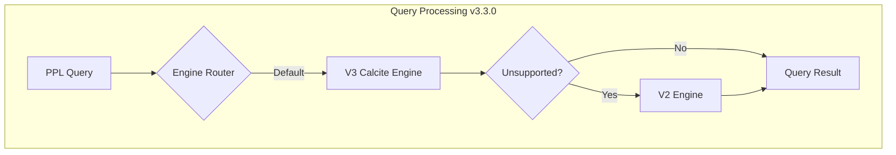

# SQL/PPL Calcite Engine

## Summary

OpenSearch v3.3.0 makes the Calcite query engine the default for PPL queries by setting `plugins.calcite.enabled` to `true`. This release also introduces implicit fallback to the V2 engine for unsupported commands, adds new PPL functions (`mvjoin`, `regex_match`), implements the `timechart` command, and includes significant query optimizer improvements for better performance.

## Details

### What's New in v3.3.0

This release marks a major milestone for the Calcite engine with several key changes:

1. **Calcite Enabled by Default**: The `plugins.calcite.enabled` setting now defaults to `true`, making Calcite the primary query engine for PPL
2. **Implicit Fallback**: Queries using unsupported commands automatically fall back to V2 engine without errors
3. **New Functions**: `mvjoin` for multi-value field concatenation and `regex_match` for pattern matching
4. **Timechart Command**: Full support for time-series visualization with aggregations
5. **Optimizer Enhancements**: Improved cost computing and project pushdown for better query performance

### Technical Changes

#### Architecture Changes



#### New Configuration

| Setting | Description | Default |
|---------|-------------|---------|
| `plugins.calcite.enabled` | Enable Calcite engine for PPL queries | `true` (changed from `false`) |

#### New Functions

| Function | Description | Syntax |
|----------|-------------|--------|
| `mvjoin` | Concatenates multi-value field elements into a single string | `mvjoin(multivalue_field, delimiter)` |
| `regex_match` | Returns TRUE if regex pattern matches any substring | `regex_match(string, pattern)` |

#### New Commands

| Command | Description | Parameters |
|---------|-------------|------------|
| `timechart` | Time-series aggregation with binning | `span`, `limit`, `useother`, aggregation function, `by` field |

### Usage Example

```ppl
# mvjoin - Concatenate array values
source=logs | eval joined_values = mvjoin(array('apple', 'banana', 'cherry'), ', ')
# Result: "apple, banana, cherry"

# regex_match - Pattern matching
source=employees | where regex_match(name, 'ES$') | fields name
source=logs | eval is_ip = regex_match(field, '^\d{1,3}\.\d{1,3}\.\d{1,3}\.\d{1,3}$')

# timechart - Time-series aggregation
source=events | timechart span=1m avg(cpu_usage)
source=events | timechart span=1h count() by host
source=events | timechart span=1m limit=3 avg(response_time) by host
source=events | timechart span=1m useother=f avg(response_time) by host
```

### Timechart Command Details

The `timechart` command creates time-series visualizations with the following features:

- **Time Binning**: Uses `span` parameter (e.g., `1s`, `1m`, `1h`) for time bucket size
- **Aggregation Functions**: Supports `count()`, `avg()`, `sum()`, `min()`, `max()`
- **Group By**: Optional `by` field for multi-series charts
- **Limit**: Controls number of series (default: 10), excess grouped into "OTHER"
- **UseOther**: Toggle OTHER grouping with `useother=t/f` (default: true)

### Performance Improvements

The optimizer enhancements in this release provide:

1. **Cost Computing Mechanism**: Split `computeSelfCost` from `estimateRowCount` for more accurate plan selection
2. **Script Cost Calculation**: Involves script count rather than just presence status
3. **OpenSearchRequestBuilder Caching**: Avoids duplicate builds for cheapest plan
4. **Project Pushdown**: Non-identity projections pushed into scan, enabling codegen skip optimization

Before v3.3.0:
```
EnumerableCalc(expr#0..1=[{inputs}], count()=[$t1], span(birthdate,1M)=[$t0])
  CalciteEnumerableIndexScan(...)
```

After v3.3.0:
```
CalciteEnumerableIndexScan(..., Project->[count(), span(birthdate,1M)])
```

### Migration Notes

- Calcite is now enabled by default; no action needed for new installations
- Existing clusters upgrading will automatically use Calcite for PPL queries
- Unsupported commands fall back to V2 automatically
- To disable Calcite: `PUT _cluster/settings {"transient": {"plugins.calcite.enabled": false}}`

## Limitations

- `timechart` does not support pivot formatting
- Only single aggregation function per `timechart` command
- `bins` parameter not supported (only `span`)
- Large datasets (>10K rows) may hit circuit breaker limits

## References

### Documentation
- [SQL Settings Documentation](https://docs.opensearch.org/3.0/search-plugins/sql/settings/): Configuration reference
- [SQL Limitations](https://docs.opensearch.org/3.0/search-plugins/sql/limitation/): V3 engine limitations

### Pull Requests
| PR | Description |
|----|-------------|
| [#4372](https://github.com/opensearch-project/sql/pull/4372) | Enable Calcite by default and implicit fallback for unsupported commands |
| [#4353](https://github.com/opensearch-project/sql/pull/4353) | Enhance cost computing mechanism and push down context |
| [#4279](https://github.com/opensearch-project/sql/pull/4279) | Push down project operator with non-identity projections into scan |
| [#4217](https://github.com/opensearch-project/sql/pull/4217) | `mvjoin` support in PPL Calcite |
| [#4092](https://github.com/opensearch-project/sql/pull/4092) | Add `regex_match` function for PPL with Calcite engine support |
| [#3993](https://github.com/opensearch-project/sql/pull/3993) | Support `timechart` command with Calcite |

### Issues (Design / RFC)
- [Issue #4314](https://github.com/opensearch-project/sql/issues/4314): Enable Calcite by default
- [Issue #4312](https://github.com/opensearch-project/sql/issues/4312): Cost computing enhancement
- [Issue #4230](https://github.com/opensearch-project/sql/issues/4230): Project pushdown
- [Issue #4146](https://github.com/opensearch-project/sql/issues/4146): mvjoin support
- [Issue #3965](https://github.com/opensearch-project/sql/issues/3965): timechart command

## Related Feature Report

- [Full feature documentation](../../../features/sql/calcite-query-engine.md)
