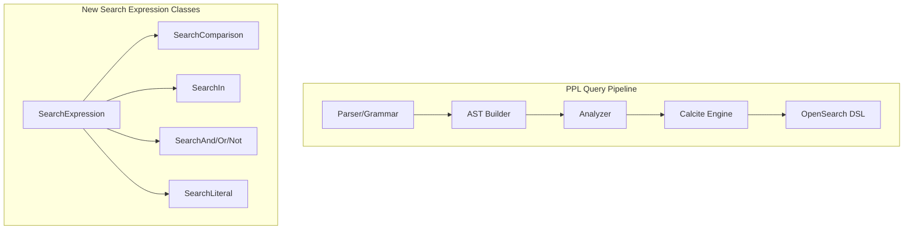

---
tags:
  - performance
  - search
  - sql
---

# SQL/PPL Query Enhancements

## Summary

OpenSearch v3.3.0 introduces significant enhancements to SQL and PPL query capabilities, including a revamped search command with full-text search support, time modifiers for temporal filtering, new date/time functions, enhanced JOIN operations, and additional aggregation and eval functions.

## Details

### What's New in v3.3.0

#### Search Command Revamp

The search command has been redesigned with well-defined full-text search functionality. It now supports search expressions that translate directly to OpenSearch's `query_string` DSL for optimal performance.


Supported search expressions:
- Field comparisons: `search source=logs status=200 AND method="GET"`
- Boolean operators: `AND`, `OR`, `NOT` with proper precedence
- IN operator: `search source=logs status IN (200, 201, 204)`
- Range queries: `search source=logs responseTime>100 AND responseTime<=500`
- Free text search: `search source=logs "error message"`

#### Time Modifiers in Search Command

New `earliest` and `latest` time modifiers enable temporal filtering directly in the search command:

| PPL Time Modifier | OpenSearch Date Math | Description |
|-------------------|----------------------|-------------|
| `'2023-01-01'` | `2023-01-01` | Absolute date |
| `now` | `now` | Current time |
| `-30m` | `now-30m` | 30 minutes ago |
| `-1d@d` | `now-1d/d` | 1 day ago, rounded to day |
| `@w1` | `/w` | Start of week (Monday) |

Example:
```
source=logs earliest=-7d latest=now
source=logs earliest='2020-12-10' latest='2025-09-10 13:00:12'
```

#### ISO8601 String Support

PPL now supports ISO8601-formatted strings for date/time operations, enabling standardized timestamp handling.

#### strftime Function

New `strftime` function for formatting Unix timestamps into human-readable date/time strings:

```
source=logs | eval formatted = strftime(1521467703, "%Y-%m-%d %H:%M:%S")
-- Result: "2018-03-19 13:55:03"

source=logs | eval current = strftime(now(), "%B %d, %Y")
-- Result: "September 02, 2025"
```

Supported input types:
- INTEGER/LONG: Unix timestamps in seconds or milliseconds (auto-detected)
- DOUBLE/FLOAT: Unix timestamps with fractional seconds
- TIMESTAMP: From functions like `now()`, `from_unixtime()`

#### count() Shortcut

Added `c()` as a shortcut for `count()` function for more concise queries.

#### JOIN Enhancements

New join options and field list support:

| Option | Description | Default |
|--------|-------------|---------|
| `type` | Join type (inner, left, right, full) | inner |
| `overwrite` | Overwrite duplicate fields | true |
| `max` | Maximum matches per row | unlimited |

Example with options:
```
source=state_country
| join type=inner overwrite=false max=1 name occupation
| stats avg(salary) by span(age, 10) as age_span, country
```

Example with subsearch:
```
source=state_country
| join type=left overwrite=true name [
    source=occupation
    | where salary > 0
    | fields name, country, salary
  ]
| stats avg(salary) by span(age, 10) as age_span, country
```

#### max/min Eval Functions

New `MAX` and `MIN` eval functions for comparing multiple values within a single row:

```
source=accounts | eval max_age = MAX(age, 30) | fields age, max_age
source=accounts | eval result = MIN(age, 35, firstname) | fields age, firstname, result
```

### Technical Changes

#### New Components

| Component | Description |
|-----------|-------------|
| `SearchExpression` | Base interface for search expressions |
| `SearchComparison` | Field comparison operators |
| `SearchIn` | IN operator implementation |
| `SearchAnd/Or/Not` | Boolean operators |
| `SearchLiteral` | Free text search support |
| `MaxFunction/MinFunction` | Calcite UDF for max/min eval |

#### Architecture Changes



## Limitations

- Time modifiers with chained offsets (e.g., `-1day@month+1h`) must be quoted
- `strftime` does not directly accept string inputs; use `unix_timestamp()` for conversion
- All timestamps in `strftime` are interpreted as UTC timezone

## References

### Documentation
- [PPL Documentation](https://docs.opensearch.org/3.0/search-plugins/sql/ppl/index/)
- [SQL and PPL API](https://docs.opensearch.org/3.0/search-plugins/sql/sql-ppl-api/)

### Pull Requests
| PR | Description | Author |
|----|-------------|--------|
| [#4378](https://github.com/opensearch-project/sql/pull/4378) | Change default search sort tiebreaker to `_shard_doc` for PIT search | LantaoJin |
| [#4375](https://github.com/opensearch-project/sql/pull/4375) | Support direct query data sources (experimental) | lezzago |
| [#4344](https://github.com/opensearch-project/sql/pull/4344) | Add error handling for known limitation of SQL JOIN | RyanL1997 |
| [#4337](https://github.com/opensearch-project/sql/pull/4337) | Optimize count aggregation performance using native doc_count in v3 | LantaoJin |
| [#4333](https://github.com/opensearch-project/sql/pull/4333) | Add max/min eval functions | ritvibhatt |
| [#4327](https://github.com/opensearch-project/sql/pull/4327) | Date/Time based Span aggregation should not present null bucket | LantaoJin |
| [#4281](https://github.com/opensearch-project/sql/pull/4281) | Add non-numeric field support for max/min functions | ritvibhatt |
| [#4276](https://github.com/opensearch-project/sql/pull/4276) | Add `values` stats function with UDAF | ps48 |
| [#4246](https://github.com/opensearch-project/sql/pull/4246) | Support ISO8601-formatted string in PPL | LantaoJin |
| [#4224](https://github.com/opensearch-project/sql/pull/4224) | Support time modifiers in search command | yuancu |
| [#4152](https://github.com/opensearch-project/sql/pull/4152) | Search command revamp | vamsimanohar |
| [#4142](https://github.com/opensearch-project/sql/pull/4142) | Add shortcut for count() | noCharger |
| [#4106](https://github.com/opensearch-project/sql/pull/4106) | strftime function implementation | vamsimanohar |
| [#3803](https://github.com/opensearch-project/sql/pull/3803) | Support join field list and join options | LantaoJin |

### Issues (Design / RFC)
- [Issue #4135](https://github.com/opensearch-project/sql/issues/4135): Time modifiers feature request
- [Issue #4007](https://github.com/opensearch-project/sql/issues/4007): Search command revamp request
- [Issue #3775](https://github.com/opensearch-project/sql/issues/3775): Join field list and options request
- [Issue #4341](https://github.com/opensearch-project/sql/issues/4341): max/min eval functions request

## Related Feature Report

- [Full feature documentation](../../../features/sql/ppl-opensearch-dashboards-query-enhancements.md)
