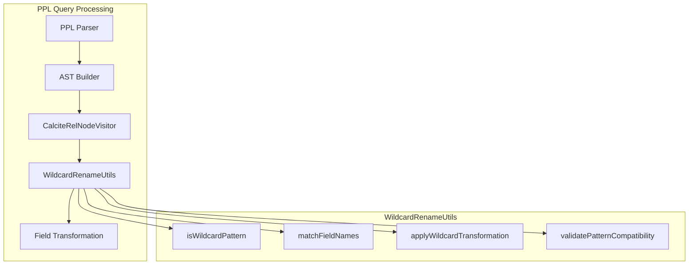

---
tags:
  - domain/search
  - component/server
  - search
  - sql
---
# SQL/PPL Rename Command - Wildcard Support

## Summary

OpenSearch v3.3.0 adds wildcard pattern support to the PPL `rename` command, enabling batch field renaming using `*` wildcards. This enhancement allows users to rename multiple fields at once using pattern matching, significantly improving productivity when working with datasets that have many similarly-named fields.

## Details

### What's New in v3.3.0

The `rename` command now supports wildcard patterns using `*` to match and transform multiple field names in a single operation. This feature requires the Calcite query engine to be enabled.

### Technical Changes

#### Architecture Changes



#### New Components

| Component | Description |
|-----------|-------------|
| `WildcardRenameUtils` | Utility class for wildcard pattern matching and field name transformation |
| `renameFieldExpression` | New grammar rule in PPL parser supporting wildcard expressions |

#### New Configuration

| Setting | Description | Default |
|---------|-------------|---------|
| `plugins.calcite.enabled` | Must be `true` to use wildcard rename | `false` |

#### Parser Changes

The PPL parser grammar was updated to:
- Accept `*` in rename field expressions
- Allow space-delimited rename clauses (comma is now optional)

#### Field Rename Behavior

| Scenario | Behavior |
|----------|----------|
| Non-existent → Non-existent | No change to result set |
| Non-existent → Existing | Target field is removed |
| Existing → Existing | Target field removed, source renamed to target |

### Usage Examples

**Basic wildcard rename:**
```ppl
source=accounts | rename *name as *_name
```
- `firstname` → `first_name`
- `lastname` → `last_name`

**Add prefix to all fields:**
```ppl
source=accounts | rename * as old_*
```
- `id` → `old_id`
- `email` → `old_email`

**Remove prefix:**
```ppl
source=data | rename old_* as *
```
- `old_name` → `name`
- `old_date` → `date`

**Multiple wildcards:**
```ppl
source=accounts | rename *_*_field as *_*
```
- `user_profile_field` → `user_profile`

**Chained renames:**
```ppl
source=accounts | rename *ame as *_ame, *_ame as *_AME
```
- `name` → `n_ame` → `n_AME`

### Migration Notes

- Wildcard rename only works with the Calcite query engine enabled
- Source and target patterns must have the same number of wildcards
- Literal asterisk (`*`) characters in field names cannot be matched as they are interpreted as wildcards

## Limitations

- Requires `plugins.calcite.enabled=true`
- Consecutive wildcards (e.g., `**`) in non-full patterns are not supported
- Cannot match literal `*` characters in field names
- The `rename` command is executed on the coordination node, not rewritten to OpenSearch DSL

## References

### Documentation
- [PPL Commands Documentation](https://docs.opensearch.org/3.0/search-plugins/sql/ppl/functions/): Official PPL commands reference

### Pull Requests
| PR | Description |
|----|-------------|
| [#4019](https://github.com/opensearch-project/sql/pull/4019) | Add wildcard support for rename command |

### Issues (Design / RFC)
- [Issue #4008](https://github.com/opensearch-project/sql/issues/4008): Feature request for wildcard rename support

## Related Feature Report

- Full feature documentation
