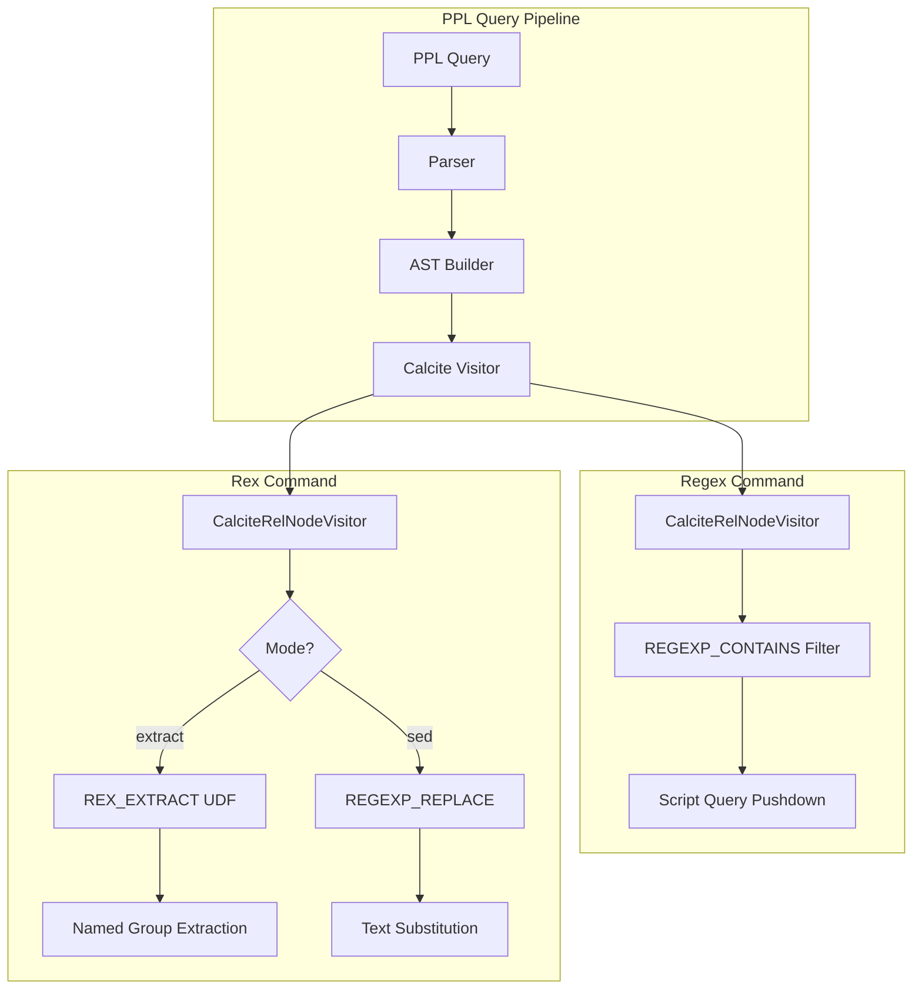

---
tags:
  - domain/search
  - component/server
  - observability
  - search
  - sql
---
# PPL Rex and Regex Commands

## Summary

OpenSearch v3.3.0 introduces two new PPL commands for regex-based text processing: `regex` for pattern-based filtering and `rex` for field extraction and text transformation. These commands enable powerful text processing capabilities within PPL pipelines, supporting log analysis, data parsing, and text transformation workflows.

## Details

### What's New in v3.3.0

This release adds comprehensive regex support to PPL through two complementary commands:

1. **`regex` command**: Filters records based on regex pattern matching
2. **`rex` command**: Extracts fields using named capture groups and performs text transformations

Both commands are implemented in the Calcite query engine and use Java's regex engine for consistent behavior.

### Technical Changes

#### Architecture Changes



#### New Components

| Component | Description |
|-----------|-------------|
| `Regex` AST Node | Represents regex filter command in AST |
| `Rex` AST Node | Represents rex extraction/transformation command |
| `RegexCommonUtils` | Shared utilities for pattern caching and named group extraction |
| `RexExtractFunction` | UDF for single-match field extraction |
| `RexExtractMultiFunction` | UDF for multi-match field extraction (returns arrays) |
| `RexOffsetFunction` | UDF for tracking match positions |

#### New Configuration

| Setting | Description | Default |
|---------|-------------|---------|
| `plugins.ppl.rex.max_match.limit` | Maximum allowed value for `max_match` parameter | 10 |

### Usage Examples

#### Regex Command - Pattern Filtering

```sql
-- Filter records where lastname matches pattern
source=accounts | regex lastname="^[A-Z][a-z]+$" | fields account_number, lastname

-- Negative matching - exclude records
source=accounts | regex lastname!=".*son$" | fields account_number, lastname

-- Email domain filtering
source=accounts | regex email="@pyrami\.com$" | fields account_number, email
```

#### Rex Command - Field Extraction

```sql
-- Extract username and domain from email
source=accounts | rex field=email "(?<username>[^@]+)@(?<domain>[^.]+)" 
| fields email, username, domain

-- Extract multiple matches as array
source=accounts | rex field=address "(?<words>[A-Za-z]+)" max_match=3 
| fields address, words

-- Track match positions
source=accounts | rex field=email "(?<user>[^@]+)" offset_field=positions 
| fields email, user, positions
```

#### Rex Command - Text Transformation (sed mode)

```sql
-- Replace email domain
source=accounts | rex field=email mode=sed "s/@.*/@company.com/" | fields email

-- Global replacement
source=logs | rex field=message mode=sed "s/ERROR/WARNING/g" | fields message

-- Character transliteration
source=data | rex field=title mode=sed "y/ /_/" | fields title
```

### Migration Notes

- Both commands require `plugins.calcite.enabled=true` (Calcite engine)
- Named capture groups must use Java regex syntax: `(?<name>pattern)`
- Group names cannot contain underscores due to Java regex limitations
- The `max_match=0` (unlimited) is automatically capped to the configured limit

## Limitations

- **Calcite Engine Only**: Commands are not available in the legacy SQL engine
- **Named Group Naming**: Group names must start with a letter and contain only alphanumeric characters (no underscores)
- **String Fields Only**: `regex` command only supports string field types
- **Max Match Limit**: `max_match` values exceeding the configured limit will throw an error

## References

### Documentation
- [Java Pattern Documentation](https://docs.oracle.com/javase/8/docs/api/java/util/regex/Pattern.html): Java regex syntax reference

### Pull Requests
| PR | Description |
|----|-------------|
| [#4083](https://github.com/opensearch-project/sql/pull/4083) | Implementation of `regex` command in PPL |
| [#4109](https://github.com/opensearch-project/sql/pull/4109) | Core implementation of `rex` command (extract mode) |
| [#4241](https://github.com/opensearch-project/sql/pull/4241) | Implementation of `sed` mode and `offset_field` in rex command |

### Issues (Design / RFC)
- [Issue #4082](https://github.com/opensearch-project/sql/issues/4082): RFC for regex command
- [Issue #4108](https://github.com/opensearch-project/sql/issues/4108): RFC for rex command

## Related Feature Report

- Full feature documentation
