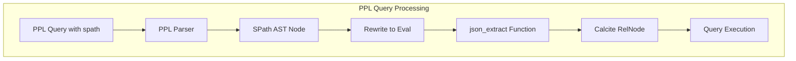

---
tags:
  - search
  - sql
---

# PPL Spath Command

## Summary

OpenSearch v3.3.0 introduces the `spath` command for PPL (Piped Processing Language), providing a simple and intuitive way to extract fields from structured JSON data stored in text fields. This command simplifies the extraction of nested data without requiring verbose function syntax.

## Details

### What's New in v3.3.0

The `spath` command is a new PPL command that allows users to extract fields from JSON documents using path-based syntax. It serves as a more user-friendly alternative to the existing `json_extract()` function.

### Technical Changes

#### Architecture Changes



#### New Components

| Component | Description |
|-----------|-------------|
| `SPath` | New AST node class representing the spath command |
| `visitSpath` | Visitor method in `AbstractNodeVisitor` for processing spath nodes |
| `CalcitePPLSpathCommandIT` | Integration tests for the spath command |

#### New Configuration

| Setting | Description | Default |
|---------|-------------|---------|
| `input` | The field to scan for JSON data | Required |
| `output` | The destination field for extracted data | Value of `path` |
| `path` | The JSON path of the data to extract | Required |

#### Syntax

```
spath input=<field> [output=<field>] [path=]<path>
```

### Usage Example

**Example 1: Simple Field Extraction**

Extract a single field from JSON data:

```sql
source=logs | spath input=doc n
```

Result:
```
+----------+---+
| doc      | n |
|----------+---|
| {"n": 1} | 1 |
| {"n": 2} | 2 |
| {"n": 3} | 3 |
+----------+---+
```

**Example 2: Nested Fields and Arrays**

Extract nested fields and array elements:

```sql
source=logs | spath input=doc output=first_element list{0} 
           | spath input=doc output=all_elements list{} 
           | spath input=doc output=nested nest_out.nest_in
```

**Example 3: With Aggregation**

Extract and aggregate inner values:

```sql
source=logs | spath input=doc n | eval n=cast(n as int) | stats sum(n)
```

### Implementation Details

The `spath` command is implemented as a lightweight conversion that rewrites to a `json_extract` eval expression internally:

```java
public Eval rewriteAsEval() {
    String outField = this.outField;
    if (outField == null) {
        outField = this.path;
    }
    return AstDSL.eval(
        this.child,
        AstDSL.let(
            AstDSL.field(outField),
            AstDSL.function("json_extract", AstDSL.field(inField), 
                           AstDSL.stringLiteral(this.path))));
}
```

## Limitations

- **No pushdown optimization**: The `spath` command does not support pushdown behavior for extraction, which may result in slower performance on large datasets
- **JSON only**: Currently only supports JSON data extraction (XML support planned for future releases)
- **String output**: Always returns strings for inner types; explicit casting is required for numeric operations
- **Indexing recommended**: For filtering on nested fields, it's generally better to index fields directly rather than using `spath`

## References

### Documentation
- [PPL Commands Documentation](https://docs.opensearch.org/3.3/search-plugins/sql/ppl/functions/): Official PPL commands reference
- [json_extract Function](https://github.com/opensearch-project/sql/blob/main/integ-test/src/test/java/org/opensearch/sql/calcite/remote/CalcitePPLJsonBuiltinFunctionIT.java): Related JSON extraction functionality

### Pull Requests
| PR | Description |
|----|-------------|
| [#4120](https://github.com/opensearch-project/sql/pull/4120) | Starter implementation for `spath` command |

### Issues (Design / RFC)
- [Issue #4119](https://github.com/opensearch-project/sql/issues/4119): RFC - Improved structured data extraction with `spath`

## Related Feature Report

- [Full feature documentation](../../../../features/sql/sql-ppl-spath-command.md)
