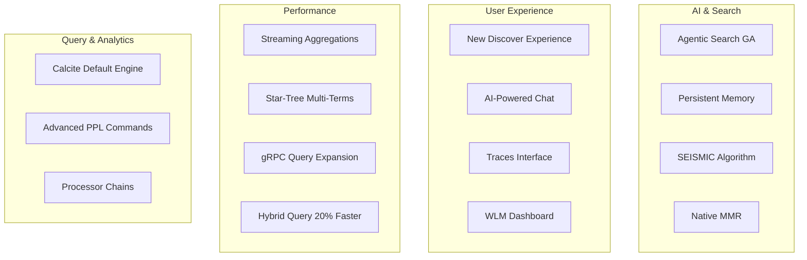

---
tags:
  - dashboards
  - ml
  - neural-search
  - performance
  - search
  - sql
---

# OpenSearch v3.3.0 Release Summary

## Summary

OpenSearch 3.3.0 delivers a comprehensive update focused on AI-powered experiences, query performance, and developer productivity. This release introduces a redesigned Discover experience with intelligent visualizations, makes Apache Calcite the default PPL engine, expands gRPC transport support to 15+ query types, and brings agentic search capabilities to general availability. Key performance improvements include streaming aggregations, star-tree multi-terms support, and hybrid query optimizations delivering up to 20% faster searches.

## Highlights

## New Features

| Feature | Description | Report |
|---------|-------------|--------|
| New Discover Experience | Redesigned interface unifying log analytics, tracing, and AI-powered visualizations | Details |
| Agentic Search (GA) | Natural language interactions with intelligent agents for query generation | Details |
| Persistent Agentic Memory | AI agents learn and remember across conversations with semantic fact extraction | Details |
| SEISMIC Algorithm | Sparse retrieval with up to 100x faster search latency, 90%+ recall | Details |
| Native MMR Support | Maximal Marginal Relevance for diverse, non-redundant search results | Details |
| Late Interaction Scoring | ColBERT-style multi-vector precision with single-vector efficiency | Details |
| Processor Chains | Flexible data transformation pipelines with 10 processor types | Details |
| Discover Traces Interface | Central interface for querying and exploring distributed traces | Details |
| Versioned Security Configuration | Experimental version management for security configurations | Details |
| Rule-based Auto-tagging | Automatic request labeling based on user attributes and index patterns | Details |

## Improvements

| Area | Description | Report |
|------|-------------|--------|
| Calcite Default Engine | Apache Calcite now default for PPL with implicit V2 fallback | Details |
| gRPC Transport Expansion | 15+ query types including Boolean, Geo, Nested, Script queries | Details |
| Star-Tree Multi-Terms | Multi-terms aggregations with up to 40x performance improvement | Details |
| Streaming Aggregations | Per-segment flushing for numeric terms and cardinality aggregations | Details |
| Hybrid Query Performance | QueryCollectorContextSpec delivers up to 20% faster hybrid searches | Details |
| Semantic Highlighting Batch | 2x-14x performance improvement with batch inference support | Details |
| Field Data Cache | Async clearing with O(keys) complexity, preventing node drops | Details |
| WLM Dashboard Integration | Bi-directional navigation between WLM and Live Queries | Details |
| Resource Sharing DLS | Automatic filtering using Document Level Security | Details |
| Skip List for Date Histogram | Major performance improvements for date/scaled_float/token_count fields | Details |

## Experimental Features

| Feature | Description | Report |
|---------|-------------|--------|
| AI-Powered Discover Tools | Conversational interface for query updates and visualization creation | Details |
| Apache Arrow Integration | High-performance streaming transport via Arrow Flight RPC | Details |
| Remote Model Streaming | Real-time SSE streaming for model prediction and agent execution | Details |

## Bug Fixes

| Fix | Description | PR |
|-----|-------------|-----|
| k-NN Filter Bug | Allow nullable k to fix filter issues | [#2836](https://github.com/opensearch-project/k-NN/issues/2836) |
| MMR Rerank Doc ID | Use unique doc ID for multi-shard MMR reranking | [#2911](https://github.com/opensearch-project/k-NN/pull/2911) |
| Semantic Field MultiFields | Fix indexing multiFields for rawFieldType | [#1572](https://github.com/opensearch-project/neural-search/pull/1572) |
| Cross-Cluster Replication | Fix 2GB size limit breach for large documents | [#1580](https://github.com/opensearch-project/cross-cluster-replication/pull/1580) |
| JWT Log Spam | Fix excessive logging with empty roles_key | [#5640](https://github.com/opensearch-project/security/pull/5640) |
| SQL Decimal Scale | Ensure positive scale for decimal literals in Calcite | [#4401](https://github.com/opensearch-project/sql/pull/4401) |

## Breaking Changes

| Change | Migration | Report |
|--------|-----------|--------|
| Calcite Default | PPL queries now use Calcite by default; set `plugins.calcite.enabled: false` to revert | Details |
| Streaming Setting | Feature flag replaced with dynamic cluster setting `search.stream.enabled` | Details |

## Dependencies

Notable dependency updates:

- **Lucene**: Updated to 10.3
- **opensearch-protobufs**: Updated to 0.19.0
- **Gradle 9**: Compatibility fixes across all plugins
- **JJWT**: Updated from 0.12.6 to 0.13.0
- **Spring**: Updated to 6.2.11
- **Guava**: Updated to 33.5.0-jre

## References

- [Official Release Notes](https://github.com/opensearch-project/opensearch-build/blob/main/release-notes/opensearch-release-notes-3.3.0.md)
- [OpenSearch Core Release Notes](https://github.com/opensearch-project/OpenSearch/blob/main/release-notes/opensearch.release-notes-3.3.0.md)
- [OpenSearch Dashboards Release Notes](https://github.com/opensearch-project/OpenSearch-Dashboards/blob/main/release-notes/opensearch-dashboards.release-notes-3.3.0.md)
- [Feature Reports](features/)
