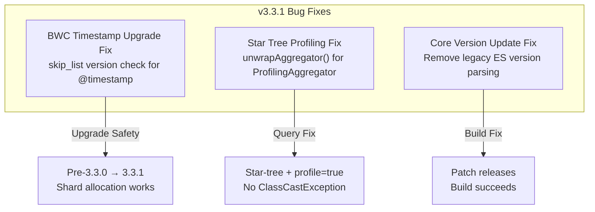

# OpenSearch v3.3.1 Release Summary

## Summary

OpenSearch v3.3.1 is a patch release focused entirely on bug fixes. It resolves a critical backward compatibility issue with `@timestamp` date fields during upgrades from pre-3.3.0 versions, fixes a `ClassCastException` in star-tree aggregations when search profiling is enabled, and addresses a build failure when bumping the core version to a non-zero patch number. No new features or breaking changes are included.

## Highlights

## New Features

No new features in this release.

## Improvements

No improvements in this release.

## Bug Fixes

| Bug Fix | Description | Report |
|---------|-------------|--------|
| BWC Timestamp Upgrade Fix | Adds version check so `skip_list` auto-enablement for `@timestamp` fields only applies to indices created on v3.3.0+, preventing `docValuesSkipIndexType` mismatch during upgrades from pre-3.3.0 | BWC Timestamp Upgrade Fix |
| Star Tree Profiling Fix | Introduces `unwrapAggregator()` on the base `Aggregator` class to safely unwrap `ProfilingAggregator` before casting to `StarTreePreComputeCollector`, fixing `ClassCastException` with `profile=true` | Star Tree Bug Fix: Sub-Aggregator Casting with Profile |
| Core Version Update Fix | Removes legacy `LegacyESVersion.java` reading from `resolveBwcVersions()` so patch releases (e.g., 3.3.1) no longer fail the 2-major-version validation | Core Version Update Fix |

## Breaking Changes

No breaking changes in this release.

## References

- [OpenSearch 3.3.1 Release Notes](https://github.com/opensearch-project/opensearch-build/blob/main/release-notes/opensearch-release-notes-3.3.1.md)
- [OpenSearch 3.3.1 Artifacts](https://opensearch.org/artifacts/by-version/#release-3-3-1)
- [#19671 — Fix bwc @timestamp upgrade issue](https://github.com/opensearch-project/OpenSearch/pull/19671)
- [#19652 — Fix sub-aggregator casting for search with profile=true](https://github.com/opensearch-project/OpenSearch/pull/19652)
- [#19377 — Fix issue with updating core with a patch number other than 0](https://github.com/opensearch-project/OpenSearch/pull/19377)
