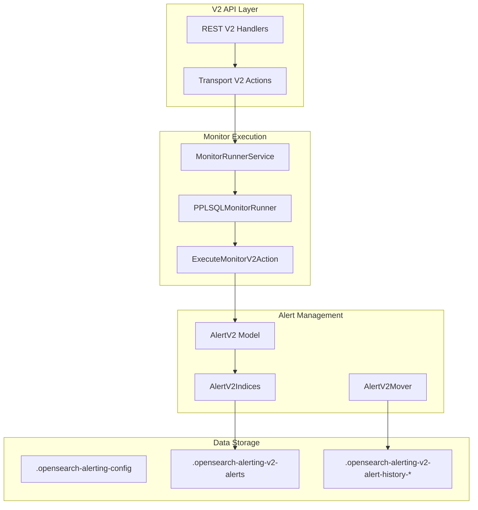

---
tags:
  - domain/observability
  - component/server
  - ml
  - observability
  - search
  - sql
---
# PPL Alerting

## Summary

PPL Alerting introduces a new V2 alerting API layer that enables users to create monitors using Piped Processing Language (PPL) queries. This feature provides a complete separation from the existing V1 alerting system, offering stateless alerts with automatic expiration, per-result and result-set trigger modes, and custom PPL conditions.

## Details

### What's New in v3.4.0

PPL Alerting is a major new feature that introduces:

- **V2 Monitor APIs**: Complete CRUD operations for PPL-based monitors via new `/v2/` endpoints
- **PPLSQLMonitor**: New monitor type supporting PPL query language
- **Stateless AlertV2**: Alerts with automatic expiration (no ACTIVE/COMPLETED state transitions)
- **Flexible Trigger Modes**: Per-result and result-set evaluation modes
- **Custom Conditions**: PPL eval statements for complex trigger logic

### Technical Changes

#### Architecture Changes



#### New Components

| Component | Description |
|-----------|-------------|
| PPLSQLMonitor | V2 monitor type supporting PPL queries |
| PPLSQLTrigger | Trigger with modes (result_set, per_result) and conditions (number_of_results, custom) |
| AlertV2 | Stateless alert model with automatic expiration |
| PPLSQLMonitorRunner | Core execution logic for PPL monitors (679 lines) |
| AlertV2Indices | Alert history index management for V2 alerts |
| AlertV2Mover | Handles expired alert migration to history indices |
| MonitorV2Runner | Interface for V2 monitor execution |

#### New V2 API Endpoints

| Endpoint | Method | Description |
|----------|--------|-------------|
| `/_plugins/_alerting/v2/monitors` | POST | Create V2 monitor |
| `/_plugins/_alerting/v2/monitors/{id}` | GET | Get V2 monitor |
| `/_plugins/_alerting/v2/monitors/{id}` | PUT | Update V2 monitor |
| `/_plugins/_alerting/v2/monitors/{id}` | DELETE | Delete V2 monitor |
| `/_plugins/_alerting/v2/monitors/_search` | POST | Search V2 monitors |
| `/_plugins/_alerting/v2/monitors/{id}/_execute` | POST | Execute V2 monitor |
| `/_plugins/_alerting/v2/alerts` | GET | Get V2 alerts |

#### New Configuration

| Setting | Description | Default |
|---------|-------------|---------|
| `plugins.alerting.v2.enabled` | Enable/disable Alerting V2 | true |
| `plugins.alerting.v2.alert_history_enabled` | Enable alert history | true |
| `plugins.alerting.v2.alert_history_rollover_period` | History rollover period | 12h |
| `plugins.alerting.v2.alert_history_max_age` | Max age for rollover | 30d |
| `plugins.alerting.v2.alert_history_max_docs` | Max docs for rollover | 1000 |
| `plugins.alerting.v2.alert_history_retention_period` | History retention | 60d |
| `plugins.alerting.v2.monitor.max_monitors` | Max V2 monitors | 1000 |
| `plugins.alerting.v2.monitor.max_throttle_duration` | Max throttle (minutes) | 7200 |
| `plugins.alerting.v2.monitor.max_expire_duration` | Max expire (minutes) | 43200 |
| `plugins.alerting.v2.monitor.max_look_back_window` | Max look back (minutes) | 10080 |
| `plugins.alerting.v2.monitor.max_query_length` | Max query length | 2000 |
| `plugins.alerting.v2.query_results_max_datarows` | Max data rows | 1000 |
| `plugins.alerting.v2.query_results_max_size` | Max results size | 3000 |
| `plugins.alerting.v2.per_result_trigger_max_alerts` | Max alerts per result | 10 |

### Usage Example

Creating a PPL monitor:

```json
POST /_plugins/_alerting/v2/monitors
{
  "monitor_v2": {
    "ppl_monitor": {
      "name": "high-error-rate-ppl",
      "enabled": true,
      "schedule": {
        "period": {
          "interval": 5,
          "unit": "MINUTES"
        }
      },
      "query_language": "PPL",
      "query": "source = logs-* | where level = 'ERROR' | stats count() as error_count",
      "look_back_window_minutes": 15,
      "timestamp_field": "@timestamp",
      "triggers": [
        {
          "name": "high-error-count",
          "severity": "high",
          "mode": "result_set",
          "type": "number_of_results",
          "num_results_condition": "GREATER_THAN",
          "num_results_value": 100,
          "throttle_minutes": 60,
          "expires_minutes": 120,
          "actions": [
            {
              "name": "notify-ops",
              "destination_id": "notification-channel-id",
              "subject_template": {
                "source": "High Error Rate Alert"
              },
              "message_template": {
                "source": "Detected {{ctx.results[0].error_count}} errors in the last 15 minutes"
              }
            }
          ]
        }
      ]
    }
  }
}
```

### Migration Notes

- V2 APIs are completely separate from V1 - existing monitors continue to work unchanged
- V2 monitors use different system indices (`.opensearch-alerting-v2-alerts`)
- Security roles need V2-specific permissions (e.g., `cluster:admin/opensearch/alerting/v2/monitor/*`)
- The security PR (#5747) for adding V2 roles was closed without merge - roles may need manual configuration

## Limitations

- PPL Alerting is a new feature in v3.4.0 - no migration path from V1 monitors
- Security roles for V2 APIs may require manual configuration
- AlertV2 is stateless - no ACTIVE/COMPLETED state transitions like V1
- Maximum 1000 V2 monitors by default

## References

### Documentation
- [Alerting Documentation](https://docs.opensearch.org/3.0/observing-your-data/alerting/index/): Official alerting documentation
- [PPL Documentation](https://docs.opensearch.org/3.0/search-plugins/sql/ppl/index/): PPL query language reference

### Pull Requests
| PR | Description |
|----|-------------|
| [alerting#1960](https://github.com/opensearch-project/alerting/pull/1960) | PPL Alerting: Execute Monitor and Monitor Stats |
| [alerting#1966](https://github.com/opensearch-project/alerting/pull/1966) | PPL Alerting: Get and Search Monitors |
| [alerting#1968](https://github.com/opensearch-project/alerting/pull/1968) | PPL Alerting: Delete Monitor, More V1/V2 Separation |
| [alerting#1972](https://github.com/opensearch-project/alerting/pull/1972) | PPL Alerting: Get Alerts and Alert Lifecycle |

### Issues (Design / RFC)
- [Issue alerting#1880](https://github.com/opensearch-project/alerting/issues/1880): RFC for Alerting V2

## Related Feature Report

- [Full feature documentation](../../../features/alerting/alerting-ppl-alerting.md)
