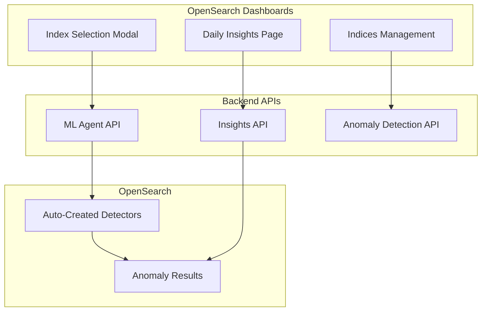

# Anomaly Detection Daily Insights

## Summary

Daily Insights is a new feature in the Anomaly Detection Dashboards plugin that provides automated anomaly detection management and AI-powered insights across multiple indices. It introduces a dedicated page that displays the top correlated anomaly events generated by an insights API, along with comprehensive indices management capabilities for configuring automated anomaly detection.

## Details

### What's New in v3.4.0

This release introduces the Daily Insights feature with three main components:

1. **Daily Insights Page** - A new dashboard page showing top 3 AI-generated insights about correlated anomalies
2. **Indices Management** - A table view for managing configured indices with auto-created detectors
3. **Index Selection Modal** - A paginated modal with search and multi-cluster support for selecting indices

### Technical Changes

#### Architecture Changes

#### New Components

| Component | Description |
|-----------|-------------|
| `DailyInsights` | Main container component displaying insights overview and correlated anomaly events |
| `IndicesManagement` | Table view showing configured indices with their auto-created detectors and status |
| `EnhancedSelectionModal` | Paginated modal for selecting indices with multi-cluster support |
| `DailyInsightsMain` | Router component handling navigation between Overview and Indices Management |

#### New Configuration

| Setting | Description | Default |
|---------|-------------|---------|
| `anomalyDetection:dailyInsightsEnabled` | UI setting to enable/disable Daily Insights feature | `false` |
| `plugins.anomaly_detection.insights_enabled` | Backend cluster setting to enable insights API | `false` |

#### API Endpoints

| Endpoint | Method | Description |
|----------|--------|-------------|
| `/_plugins/_anomaly_detection/insights/_start` | POST | Start the insights generation job |
| `/_plugins/_anomaly_detection/insights/_stop` | POST | Stop the insights generation job |
| `/_plugins/_anomaly_detection/insights/_status` | GET | Get current insights job status |
| `/_plugins/_anomaly_detection/insights/_results` | GET | Retrieve generated insights results |
| `/_plugins/_ml/agents/{agentId}/_execute` | POST | Execute ML agent for auto-creating detectors |

### Usage Example

1. Enable the feature in Advanced Settings:
   - Navigate to **Management → Advanced Settings**
   - Set `anomalyDetection:dailyInsightsEnabled` to `true`

2. Select indices to monitor:
   - Click "Select Indices to Monitor" on the Daily Insights page
   - Use the modal to search and select indices across clusters
   - Specify the ML Agent ID for auto-creating detectors

3. View insights:
   - The Daily Insights page displays top 3 correlated anomaly events
   - Click on events to view detailed information including affected entities

### Migration Notes

- This is a new feature with no migration required
- Requires both UI setting and backend cluster setting to be enabled
- Multi-Data Source (MDS) support is included for multi-cluster environments

## Limitations

- Feature is behind a feature flag and disabled by default
- Requires ML Commons agent to be configured for auto-creating detectors
- Insights are filtered to show only results from the most recent job execution window

## Related PRs

| PR | Description |
|----|-------------|
| [#1118](https://github.com/opensearch-project/anomaly-detection-dashboards-plugin/pull/1118) | Introduce Daily Insights Page |
| [#1119](https://github.com/opensearch-project/anomaly-detection-dashboards-plugin/pull/1119) | Adding Indices management and selection for daily insights |
| [#1120](https://github.com/opensearch-project/anomaly-detection-dashboards-plugin/pull/1120) | Adding data selector for index management |

## References

- [Anomaly Detection Documentation](https://docs.opensearch.org/3.0/observing-your-data/ad/index/)
- [Anomaly Detection API](https://docs.opensearch.org/3.0/observing-your-data/ad/api/)

## Related Feature Report

- [Full feature documentation](../../../../features/anomaly-detection-dashboards-plugin/anomaly-detection-daily-insights.md)
