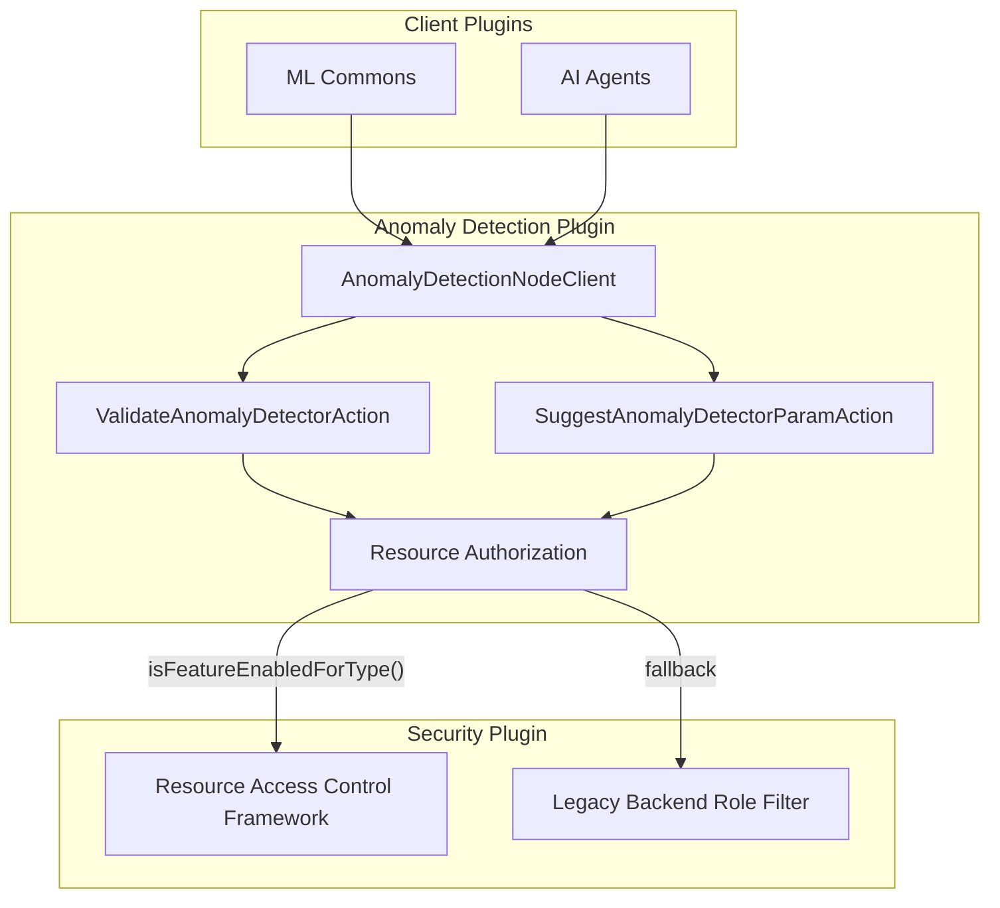

---
tags:
  - ml
  - search
  - security
---

# Anomaly Detection Enhancements

## Summary

OpenSearch v3.4.0 introduces several enhancements to the Anomaly Detection plugin focused on improved access control integration, expanded client API capabilities, and streamlined detector creation. These changes enable automatic fallback to legacy access control when model-group resources are excluded from protected resources, expose validate and suggest transport actions to other plugins via the node client, add an `auto_create` field for programmatic detector creation, and grant read-only users access to the suggest API.

## Details

### What's New in v3.4.0

#### Conditional Resource Sharing Access Control

The anomaly detection plugin now automatically switches to the legacy backend-role-based access control when model-group is excluded from the protected resources setting in the Security plugin. This provides backward compatibility and seamless operation in environments where the new Resource Access Control Framework is not fully enabled for all resource types.

Key changes:
- `ParseUtils.shouldUseResourceAuthz()` now accepts a `resourceType` parameter to check if the specific resource type is enabled for resource sharing
- Transport actions pass the appropriate resource type (`AD_RESOURCE_TYPE` or `FORECAST_RESOURCE_TYPE`) to determine authorization mode
- Search handlers dynamically determine authorization mode per request based on resource type

#### Client API Extensions for Validate and Suggest

The `AnomalyDetectionClient` interface and `AnomalyDetectionNodeClient` implementation now expose `validateAnomalyDetector()` and `suggestAnomalyDetector()` methods, enabling other plugins (such as ML Commons agents) to programmatically validate detector configurations and request parameter suggestions.

```java
// Validate a detector configuration
ValidateConfigRequest validateRequest = new ValidateConfigRequest(
    AnalysisType.AD,
    detector,
    "detector",
    maxSingleEntityAnomalyDetectors,
    maxMultiEntityAnomalyDetectors,
    maxAnomalyFeatures,
    requestTimeout,
    maxCategoricalFields
);
ValidateConfigResponse response = adClient.validateAnomalyDetector(validateRequest).actionGet();

// Get suggested parameters for a detector
SuggestConfigParamRequest suggestRequest = new SuggestConfigParamRequest(
    AnalysisType.AD,
    detector,
    "detection_interval",
    requestTimeout
);
SuggestConfigParamResponse suggestion = adClient.suggestAnomalyDetector(suggestRequest).actionGet();
```

#### Auto-Create Field for Detectors

A new optional `auto_create` boolean field has been added to the detector configuration. This field indicates whether a detector was created automatically (e.g., by an AI assistant or automation workflow) rather than manually by a user.

```json
POST _plugins/_anomaly_detection/detectors
{
  "name": "auto-generated-detector",
  "description": "Detector generated by OpenSearch Assistant",
  "time_field": "timestamp",
  "auto_create": true,
  "indices": ["sample-http-responses"],
  "feature_attributes": [...],
  "detection_interval": {
    "period": {
      "interval": 15,
      "unit": "Minutes"
    }
  }
}
```

#### Suggest API Read Access

The `anomaly_read_access` security role now includes permission for the suggest API endpoint (`cluster:admin/opendistro/ad/detector/suggest`), allowing read-only users to request configuration suggestions without requiring full access.

### Technical Changes

#### New Configuration

| Setting | Description | Default |
|---------|-------------|---------|
| `auto_create` | Indicates if detector was created automatically | `false` |

#### API Changes

| Endpoint | Change |
|----------|--------|
| `/_plugins/_anomaly_detection/detectors` | New optional `auto_create` field in request body |

#### Security Role Updates

| Role | Added Permission |
|------|------------------|
| `anomaly_read_access` | `cluster:admin/opendistro/ad/detector/suggest` |

### Architecture Changes



## Limitations

- The `auto_create` field is informational only and does not affect detector behavior
- Conditional resource sharing requires Security plugin with Resource Access Control Framework support
- Client API methods require proper NamedWriteableRegistry configuration for cross-plugin serialization

## References

### Documentation
- [Anomaly Detection API](https://docs.opensearch.org/3.0/observing-your-data/ad/api/): API reference
- [Anomaly Detection Security](https://docs.opensearch.org/3.0/observing-your-data/ad/security/): Security configuration
- [Resource Access Control Framework](../../../features/security/resource-access-control-framework.md): Resource sharing documentation

### Pull Requests
| PR | Description |
|----|-------------|
| [anomaly-detection#1569](https://github.com/opensearch-project/anomaly-detection/pull/1569) | Adds capability to automatically switch to old access-control if model-group is excluded from protected resources setting |
| [anomaly-detection#1605](https://github.com/opensearch-project/anomaly-detection/pull/1605) | Adding suggest and validate transport actions to node client |
| [anomaly-detection#1602](https://github.com/opensearch-project/anomaly-detection/pull/1602) | Adding auto create as an optional field on detectors |
| [security#5754](https://github.com/opensearch-project/security/pull/5754) | Add suggest api to ad read access role |

## Related Feature Report

- [Full feature documentation](../../../features/anomaly-detection/anomaly-detection.md)
