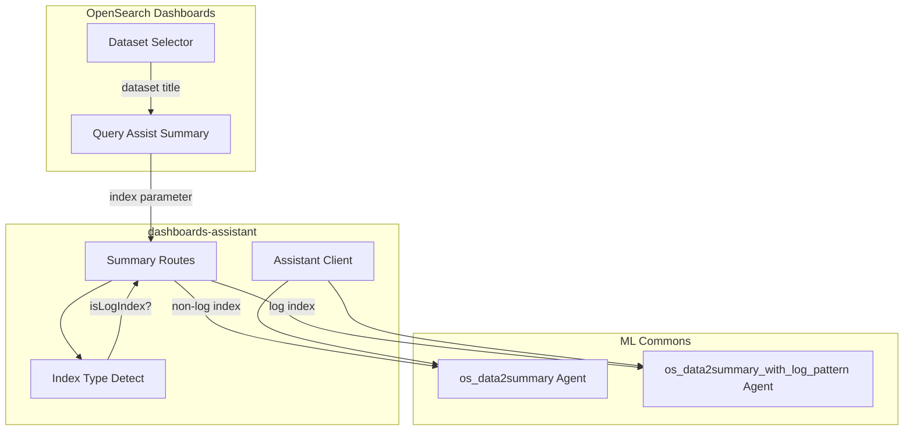

---
tags:
  - domain/ml
  - component/dashboards
  - dashboards
  - indexing
  - ml
  - search
---
# Discover Summary - Log Pattern Support

## Summary

This enhancement adds intelligent log pattern detection to the Discover Summary feature. When users query log indexes, the system automatically detects the index type and uses a specialized `os_data2summary_with_log_pattern` agent to generate more relevant summaries with log pattern analysis.

## Details

### What's New in v3.4.0

The Discover Summary feature now supports log pattern detection for improved AI-generated summaries:

- Automatic detection of log index patterns
- Dynamic agent selection based on index type
- Specialized log pattern agent (`os_data2summary_with_log_pattern`) for log data
- Graceful fallback to standard agent when log pattern agent is unavailable

### Technical Changes

#### Architecture Changes



#### New Components

| Component | Description |
|-----------|-------------|
| `LOG_PATTERN_DATA2SUMMARY_AGENT_CONFIG_ID` | New agent config ID `os_data2summary_with_log_pattern` for log pattern analysis |
| `detectAgentIdExist()` | Helper function to check if log pattern agent is configured |
| `index` parameter | New request parameter to pass dataset title for index type detection |

#### API Changes

The `/api/assistant/data2summary` endpoint now accepts an additional `index` parameter:

```json
POST /api/assistant/data2summary
{
  "sample_data": "...",
  "sample_count": 10,
  "total_count": 1000,
  "question": "Are there any errors in my logs?",
  "ppl": "source=logs | where status = 'error'",
  "index": "opensearch_dashboards_sample_data_logs"
}
```

### Usage Example

When querying a log index in Discover with PPL:

```
source=opensearch_dashboards_sample_data_logs | where response >= 400
```

The system will:
1. Detect that `opensearch_dashboards_sample_data_logs` is a log index
2. Check if `os_data2summary_with_log_pattern` agent exists
3. Use the log pattern agent for enhanced summary generation
4. Fall back to `os_data2summary` if log pattern agent is not configured

### Migration Notes

To enable log pattern summaries:

1. Configure the `os_data2summary_with_log_pattern` agent in ML Commons
2. Register it as a root agent configuration
3. No changes required to existing `os_data2summary` setup - fallback is automatic

## Limitations

- Log pattern agent must be separately configured in ML Commons
- Index type detection requires the index name to be passed from the UI
- Only works with PPL queries in Discover when query assist is enabled

## References

### Documentation
- [Data Summary Documentation](https://docs.opensearch.org/3.4/dashboards/dashboards-assistant/data-summary/): Official docs for data summary feature
- [Log Pattern Tool](https://docs.opensearch.org/3.4/ml-commons-plugin/agents-tools/tools/log-pattern-tool/): ML Commons log pattern tool documentation

### Pull Requests
| PR | Repository | Description |
|----|------------|-------------|
| [#550](https://github.com/opensearch-project/dashboards-assistant/pull/550) | dashboards-assistant | Support log pattern in discover summary |
| [#9693](https://github.com/opensearch-project/OpenSearch-Dashboards/pull/9693) | OpenSearch-Dashboards | Support log pattern agent in discover summary |

## Related Feature Report

- [Full feature documentation](../../../../features/opensearch-dashboards/opensearch-dashboards-discover.md)
