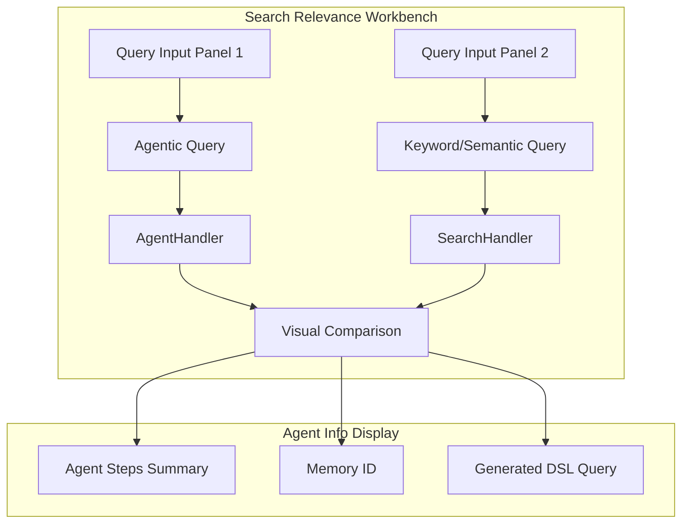

# Agentic Search

## Summary

OpenSearch v3.4.0 enhances the Agentic Search feature with significant improvements to the Search Relevance Workbench (SRW) UI and backend query handling. This release adds support for agentic search in pairwise comparison, MCP server integration, improved UX for test flows and form inputs, version filtering, and preservation of source parameters in agentic queries.

Key improvements:
- **Pairwise comparison support**: Compare agentic search results side-by-side with other search types
- **Conversational search UI**: Continue or clear conversations with memory ID management
- **Source parameter preservation**: Properly handle `_source.includes` and `_source.excludes` in agentic queries
- **MCP server support**: Connect to external Model Context Protocol servers from the dashboards
- **Improved UX**: Simplified form inputs, better test flow experience, and version filtering

## Details

### What's New in v3.4.0

#### Agentic Search in Pairwise Comparison

The Search Relevance Workbench now supports agentic search queries in pairwise comparison mode, allowing users to compare agentic search results against keyword, semantic, or other search types.



#### Technical Changes

##### New Components

| Component | Description |
|-----------|-------------|
| `AgentHandler` | Handles agentic query detection and execution |
| `AgentInfo` | React component displaying agent execution details |
| `SearchHandler` | Unified search execution handler |
| `ConversationHandlers` | Memory ID management for conversational search |

##### New UI Features

| Feature | Description |
|---------|-------------|
| Loading state | Spinner with "Searching" text during async agent search (up to 30+ seconds) |
| AgentInfo panel | Displays `memory_id`, `agent_steps_summary`, and generated `dsl_query` |
| Continue conversation | Auto-populates `memory_id` to continue conversational search |
| Clear conversation | Removes `memory_id` to start a new conversation |
| Version filtering | Filter agentic search use cases by OpenSearch version |

##### Backend Enhancement: Source Parameter Preservation

The `AgenticQueryTranslatorProcessor` now preserves `_source` field selection (includes/excludes) when translating agentic queries to DSL:

```java
// Preserve source field selection
if (originalSourceBuilder != null && originalSourceBuilder.fetchSource() != null) {
    newSourceBuilder.fetchSource(originalSourceBuilder.fetchSource());
}
```

This fixes an issue where `_source.excludes` (e.g., excluding embedding fields) was not applied to agentic query results.

### Usage Example

#### Agentic Query with Source Filtering

```json
POST products/_search?search_pipeline=agentic-pipeline
{
  "_source": {
    "excludes": ["description_embedding"]
  },
  "query": {
    "agentic": {
      "query_text": "Find products with smooth writing feel"
    }
  }
}
```

#### Conversational Search in SRW

1. Execute an agentic query in the Search Relevance Workbench
2. View the `memory_id` in the AgentInfo panel
3. Click "Continue conversation" to add the memory ID to your query
4. Ask follow-up questions that build on previous context
5. Click "Clear conversation" to start fresh

### Migration Notes

No migration required. The new features are backward compatible with existing agentic search configurations.

## Limitations

- Agent search is asynchronous and may take 30+ seconds to complete
- Memory ID management requires a conversational agent type
- Source parameter preservation only applies to the neural-search plugin's agentic query translator

## Related PRs

| PR | Repository | Description |
|----|------------|-------------|
| [#693](https://github.com/opensearch-project/dashboards-search-relevance/pull/693) | dashboards-search-relevance | Add support for agent search in pairwise comparison |
| [#802](https://github.com/opensearch-project/dashboards-search-relevance/pull/802) | dashboards-search-relevance | Add MCP server support |
| [#805](https://github.com/opensearch-project/dashboards-search-relevance/pull/805) | dashboards-search-relevance | Improve export / next steps UX |
| [#807](https://github.com/opensearch-project/dashboards-search-relevance/pull/807) | dashboards-search-relevance | Simplify form inputs |
| [#808](https://github.com/opensearch-project/dashboards-search-relevance/pull/808) | dashboards-search-relevance | Simplify form inputs II |
| [#812](https://github.com/opensearch-project/dashboards-search-relevance/pull/812) | dashboards-search-relevance | Improve Test Flow UX |
| [#813](https://github.com/opensearch-project/dashboards-search-relevance/pull/813) | dashboards-search-relevance | Add version filtering on agentic search use case |
| [#1669](https://github.com/opensearch-project/neural-search/pull/1669) | neural-search | Preserve source parameter for the query |

## References

- [Issue #1664](https://github.com/opensearch-project/neural-search/issues/1664): Agentic Search: Support of `_source.excludes`
- [Issue #677](https://github.com/opensearch-project/dashboards-search-relevance/issues/677): Agent search support tracking
- [Blog: Introducing agentic search in OpenSearch](https://opensearch.org/blog/introducing-agentic-search-in-opensearch-transforming-data-interaction-through-natural-language/): Official announcement
- [Agentic Search Documentation](https://docs.opensearch.org/latest/vector-search/ai-search/agentic-search/index/): Setup and usage guide

## Related Feature Report

- [Full feature documentation](../../../../features/neural-search/agentic-search.md)
