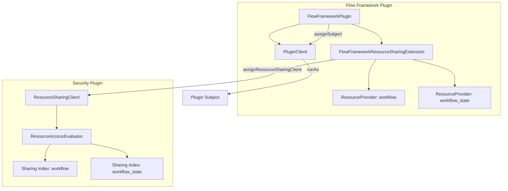

---
tags:
  - indexing
  - ml
  - security
---

# Flow Framework Access Control

## Summary

Flow Framework v3.4.0 integrates with OpenSearch's centralized Resource Sharing and Access Control framework, replacing the legacy backend-role-based access control with a more flexible, owner-controlled sharing model. This enables workflow owners to explicitly share workflows and workflow states with specific users or roles.

## Details

### What's New in v3.4.0

This release onboards the Flow Framework plugin to the Security plugin's Resource Sharing and Access Control framework introduced in OpenSearch 3.3. Key changes include:

- **Resource Type Registration**: Workflows (`workflow`) and workflow states (`workflow_state`) are now registered as protected resource types
- **Owner-Controlled Sharing**: Workflow owners can share resources with specific users or roles at different access levels
- **Automatic Access Evaluation**: Security plugin automatically evaluates access permissions via `ResourceAccessEvaluator`
- **Plugin Subject Support**: Flow Framework now implements `IdentityAwarePlugin` for secure plugin-level operations

### Technical Changes

#### Architecture Changes



#### New Components

| Component | Description |
|-----------|-------------|
| `FlowFrameworkResourceSharingExtension` | SPI implementation registering workflow and workflow_state as protected resource types |
| `ResourceSharingClientAccessor` | Singleton accessor for the ResourceSharingClient provided by Security plugin |
| `PluginClient` | FilterClient wrapper that executes transport actions as the plugin's system subject |
| `resource-action-groups.yml` | Defines access levels (read_only, read_write, full_access) for workflow resources |

#### New Configuration

| Setting | Description | Default |
|---------|-------------|---------|
| `plugins.security.experimental.resource_sharing.enabled` | Enable resource sharing framework | `false` |
| `plugins.security.experimental.resource_sharing.protected_types` | Resource types using resource-level authorization | `[]` |

To enable for Flow Framework:
```yaml
plugins.security.experimental.resource_sharing.enabled: true
plugins.security.experimental.resource_sharing.protected_types: ["workflow", "workflow_state"]
```

#### API Changes

Transport requests now implement `DocRequest` interface for automatic access evaluation:

| Request Class | Resource Type | Index |
|---------------|---------------|-------|
| `WorkflowRequest` | `workflow` | `.plugins-flow-framework-templates` |
| `GetWorkflowStateRequest` | `workflow_state` | `.plugins-flow-framework-state` |
| `ReprovisionWorkflowRequest` | `workflow` | `.plugins-flow-framework-templates` |

#### Access Levels

Defined in `resource-action-groups.yml`:

| Access Level | Allowed Actions |
|--------------|-----------------|
| `workflow_read_only` | `workflow/get`, `workflow/search` |
| `workflow_read_write` | `workflow/*`, `cluster:monitor/*` |
| `workflow_full_access` | `workflow/*`, `cluster:monitor/*`, `resource/share` |
| `workflow_state_read_only` | `workflow_state/get`, `workflow_state/search` |
| `workflow_state_read_write` | `workflow_state/*`, `cluster:monitor/*` |
| `workflow_state_full_access` | `workflow_state/*`, `cluster:monitor/*`, `resource/share` |

### Usage Example

#### Enable Resource Sharing (OpenSearch 3.4+)

```yaml
# opensearch.yml
plugins.security.experimental.resource_sharing.enabled: true
plugins.security.experimental.resource_sharing.protected_types: ["workflow", "workflow_state"]
```

#### Share a Workflow

```json
PUT /_plugins/_security/api/resource/share
{
  "resource_id": "workflow-123",
  "resource_type": "workflow",
  "share_with": {
    "workflow_read_only": {
      "users": ["alice"],
      "roles": ["data_analyst"]
    },
    "workflow_read_write": {
      "users": ["bob"]
    }
  }
}
```

#### Check Sharing Status

```http
GET /_plugins/_security/api/resource/share?resource_id=workflow-123&resource_type=workflow
```

### Migration Notes

- **Legacy Mode**: When `resource_sharing.enabled` is `false`, the plugin falls back to the legacy `filter_by_backend_roles` behavior
- **Automatic Fallback**: The `verifyResourceAccessAndProcessRequest()` utility automatically chooses the appropriate access control method
- **No Data Migration Required**: Existing workflows continue to work; sharing metadata is stored separately in Security plugin's backing indices

## Limitations

- Resource sharing is experimental and disabled by default
- Settings can only be changed via `opensearch.yml` in v3.3; dynamic updates available in v3.4+
- Sharing metadata is stored in Security plugin's indices, separate from workflow data

## References

### Documentation
- [Workflow Security Documentation](https://docs.opensearch.org/3.0/automating-configurations/workflow-security/): Official workflow security docs

### Blog Posts
- [Resource Sharing Blog](https://opensearch.org/blog/introducing-resource-sharing-a-new-access-control-model-for-opensearch/): Introducing resource sharing

### Pull Requests
| PR | Description |
|----|-------------|
| [#1251](https://github.com/opensearch-project/flow-framework/pull/1251) | Onboards flow-framework plugin to resource-sharing and access control framework |

### Issues (Design / RFC)
- [Issue #1250](https://github.com/opensearch-project/flow-framework/issues/1250): Feature request to onboard to centralized authz framework
- [Security Issue #4500](https://github.com/opensearch-project/security/issues/4500): Resource Permissions and Sharing design

## Related Feature Report

- [Full feature documentation](../../../../features/flow-framework/flow-framework-access-control.md)
