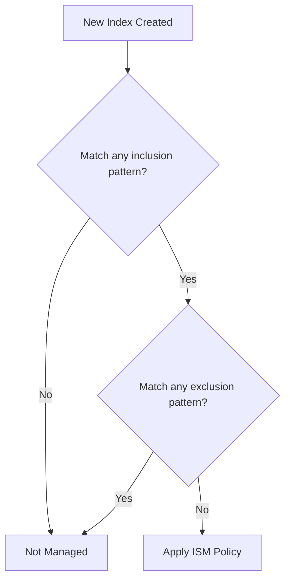

---
tags:
  - domain/data
  - component/server
  - indexing
  - search
---
# ISM Exclusion Pattern

## Summary

This release adds support for exclusion patterns in ISM (Index State Management) template index patterns using the `-` prefix. Users can now define broad inclusion patterns while excluding specific indices from automatic ISM policy management, similar to OpenSearch's native index pattern matching in search APIs.

## Details

### What's New in v3.4.0

ISM templates now support exclusion patterns prefixed with `-` in the `index_patterns` array. This allows users to:

- Match indices with broad patterns (e.g., `logs-*`)
- Exclude specific subsets (e.g., `-logs-test-*`, `-logs-*-debug-*`)
- Simplify index management without complex naming schemes

### Technical Changes

#### Pattern Matching Logic



The new `matchesIndexPatterns()` function in `ManagedIndexCoordinator`:
1. Separates patterns into inclusion (no prefix) and exclusion (`-` prefix) lists
2. Checks if the index matches at least one inclusion pattern
3. Checks if the index matches any exclusion pattern
4. Returns `true` only if included AND not excluded

#### Validation Rules

| Rule | Description |
|------|-------------|
| At least one inclusion pattern | Patterns cannot be all exclusions |
| Non-empty exclusion content | `-` alone is invalid; must have content after prefix |
| Standard pattern validation | Exclusion patterns follow same rules (no `#`, `:`, `_` prefix) |

### Usage Example

```json
PUT _plugins/_ism/policies/log_lifecycle
{
  "policy": {
    "description": "Manage production logs, exclude test and debug",
    "default_state": "hot",
    "states": [
      {
        "name": "hot",
        "transitions": [
          {
            "state_name": "warm",
            "conditions": { "min_index_age": "7d" }
          }
        ]
      },
      {
        "name": "warm",
        "actions": [{ "read_only": {} }],
        "transitions": [
          {
            "state_name": "delete",
            "conditions": { "min_index_age": "30d" }
          }
        ]
      },
      {
        "name": "delete",
        "actions": [{ "delete": {} }]
      }
    ],
    "ism_template": {
      "index_patterns": ["logs-*", "-logs-test-*", "-logs-*-debug-*"],
      "priority": 100
    }
  }
}
```

**Result:**
| Index | Managed | Reason |
|-------|---------|--------|
| `logs-production-001` | ✅ Yes | Matches `logs-*`, not excluded |
| `logs-staging-001` | ✅ Yes | Matches `logs-*`, not excluded |
| `logs-test-001` | ❌ No | Excluded by `-logs-test-*` |
| `logs-production-debug-001` | ❌ No | Excluded by `-logs-*-debug-*` |

### Migration Notes

- **Backward compatible**: Existing ISM templates without exclusion patterns continue to work unchanged
- **Consistent with OpenSearch**: Follows the same pattern matching convention used in search APIs (e.g., `GET /logs-*,-logs-test-*/_search`)

## Limitations

- Exclusion patterns only apply to ISM template matching, not to manual policy attachment
- At least one inclusion pattern is required; all-exclusion patterns are rejected

## References

### Documentation
- [Index State Management Documentation](https://docs.opensearch.org/3.0/im-plugin/ism/index/)
- [ISM API Documentation](https://docs.opensearch.org/3.0/im-plugin/ism/api/)

### Pull Requests
| PR | Description |
|----|-------------|
| [#1509](https://github.com/opensearch-project/index-management/pull/1509) | Supporting Exclusion pattern in index pattern in ISM |

### Issues (Design / RFC)
- [Issue #375](https://github.com/opensearch-project/index-management/issues/375): Original feature request

## Related Feature Report

- [Full Index Management documentation](../../../../features/index-management/index-management.md)
