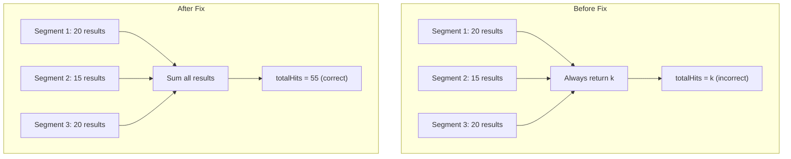
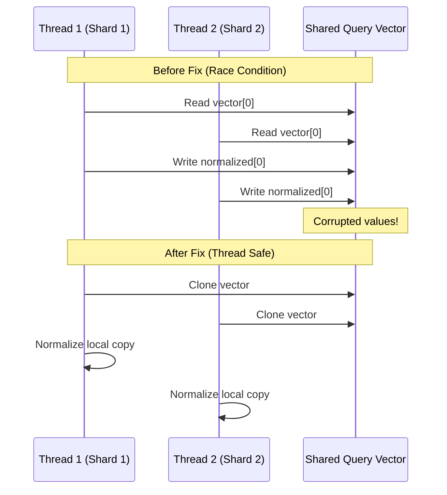

---
tags:
  - indexing
  - k-nn
  - performance
  - search
---

# k-NN Bugfixes

## Summary

OpenSearch v3.4.0 includes five critical bugfixes for the k-NN plugin addressing issues with memory-optimized search, cosine similarity scoring, inner product radial search, and backwards compatibility during cluster upgrades. These fixes improve stability and correctness for vector search operations.

## Details

### What's New in v3.4.0

This release addresses several bugs that could cause incorrect search results, NPE exceptions, or merge failures in specific scenarios.

### Technical Changes

#### Bug 1: Memory Optimized Search Blocked for Old Indices (PR #2918)

**Problem**: When indices created before OpenSearch 2.17 were upgraded to 3.1+ with memory-optimized search enabled, a NullPointerException occurred because the old codec lacked the `getVectorReader` implementation.

**Fix**: Added an index creation version check in `MemoryOptimizedSearchSupportSpec` to return `false` for indices created before 2.17, causing the system to fall back to the default C++ off-heap loading path.

```java
// Check added to MemoryOptimizedSearchSupportSpec
if (indexCreatedVersion.before(Version.V_2_17_0)) {
    return false; // Fallback to default path
}
```

#### Bug 2: Incorrect totalHits in Memory Optimized Search (PR #2965)

**Problem**: `NativeEngineKnnVectorQuery` always returned `k` as `totalHits`, regardless of actual results from each Lucene segment. This caused `hits.total` to be inconsistent between memory-optimized and non-memory-optimized search modes.

**Fix**: Modified `NativeEngineKnnVectorQuery` to pass all matched results to `DocsMatchQuery$Weight`, ensuring `hits.total` correctly reflects the sum of partial results from all segments.



#### Bug 3: Race Condition in KNNQueryBuilder (PR #2974)

**Problem**: When using cosine similarity with multiple shards on a single data node, inconsistent scores were returned. The root cause was a race condition where multiple threads shared the same `KNNQueryBuilder` instance and concurrently modified the query vector during L2 normalization.

**Fix**: The fix ensures thread-safe vector transformation by avoiding in-place modification of the shared query vector.



#### Bug 4: Faiss Inner Product Score-to-Distance Calculation (PR #2992)

**Problem**: Radial k-NN search with `innerproduct` space type incorrectly applied `min_score` filter. Documents with scores below the threshold were incorrectly returned.

**Fix**: Corrected the score-to-distance conversion formula for inner product space type in Faiss:

| Condition | Old Formula (Incorrect) | New Formula (Correct) |
|-----------|------------------------|----------------------|
| score > 1 | `1 - score` | `score - 1` |
| score ≤ 1 | `(1 / score) - 1` | `1 - (1 / score)` |

**Example**: For `min_score = 1.4`:
- Old: Calculated distance = -0.4, returned all vectors with inner product ≥ -0.4 (incorrect)
- New: Calculated distance = 0.4, correctly filters vectors

#### Bug 5: Backwards Compatibility for Disk-Based Vector Search (PR #2994)

**Problem**: Merging Lucene segments created with scalar quantization from pre-OpenSearch 3.2 to 3.2+ failed with `IllegalArgumentException: Invalid csv for quantization config`.

**Root Cause**: In OpenSearch 3.2, two new quantization features (ADC and random rotation) were added to `qframe_config`. Old segments had length-2 config, new segments had length-4. The BWC check incorrectly used the written segment version instead of the source segment version.

**Fix**: Changed the BWC detection to use the quantization config length as the version signal:
- Length 2: Old segment (disable ADC and random rotation)
- Length 4: New segment (read ADC and random rotation values)

### Migration Notes

- **Indices created before 2.17**: Memory-optimized search will automatically fall back to the default search path. No action required.
- **Upgrading from 2.19 to 3.3+**: Segment merges will now succeed without manual intervention.
- **Cosine similarity users**: Score consistency is now guaranteed across multi-shard searches.

## Limitations

- Memory-optimized search remains unavailable for indices created before OpenSearch 2.17
- Users must reindex to use memory-optimized search on legacy indices

## References

### Documentation
- [Memory-optimized vectors documentation](https://docs.opensearch.org/3.0/field-types/supported-field-types/knn-memory-optimized/)

### Pull Requests
| PR | Description |
|----|-------------|
| [#2918](https://github.com/opensearch-project/k-NN/pull/2918) | Block memory optimized search for old indices created before 2.18 |
| [#2965](https://github.com/opensearch-project/k-NN/pull/2965) | Fix NativeEngineKnnQuery to return correct totalHits |
| [#2974](https://github.com/opensearch-project/k-NN/pull/2974) | Fix race condition on transforming vector in KNNQueryBuilder |
| [#2992](https://github.com/opensearch-project/k-NN/pull/2992) | Fix Faiss IP score to distance calculation |
| [#2994](https://github.com/opensearch-project/k-NN/pull/2994) | Fix backwards compatibility for disk-based vector search segment merge |

### Issues (Design / RFC)
- [Issue #2917](https://github.com/opensearch-project/k-NN/issues/2917): Block using memory optimized search for indices created before 2.17
- [Issue #2962](https://github.com/opensearch-project/k-NN/issues/2962): Fix different hit counts when memory optimized search is enabled
- [Issue #2982](https://github.com/opensearch-project/k-NN/issues/2982): Radial kNN search with innerproduct space incorrectly applies min_score filter
- [Issue #2991](https://github.com/opensearch-project/k-NN/issues/2991): Disk Based BWC Issues for 2.19 -> 3.3 upgrade

## Related Feature Report

- [Full k-NN plugin documentation](../../../features/k-nn/k-nn-plugin.md)
