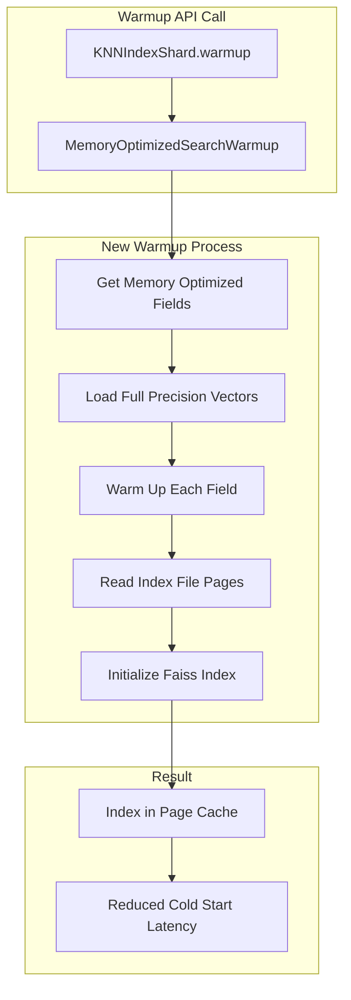
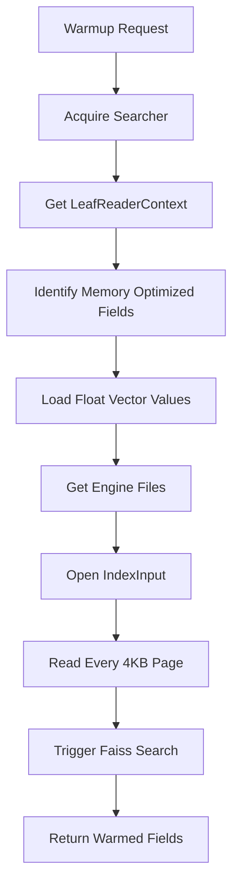

---
tags:
  - domain/search
  - component/server
  - indexing
  - k-nn
  - performance
  - search
---
# k-NN Memory Optimized Warmup

## Summary

This release introduces an optimized warmup procedure for memory-optimized search in the k-NN plugin. When memory-optimized search is enabled, the warmup API now performs a more effective index loading strategy that reduces cold start latency by pre-loading index files into the operating system's page cache.

## Details

### What's New in v3.4.0

Previously, when memory-optimized search was enabled, the warmup operation only performed a partial index load that determined the starting offset of each logical section within the index. This did not actually load data from the underlying file, meaning users still experienced cold start overhead on their first queries.

The new implementation introduces a comprehensive warmup strategy that:

1. **Touches entire index files** - Reads one byte from each 4KB page to trigger page faults, causing the kernel to load the full page into memory
2. **Pre-loads full precision vectors** - Iterates through all vector values to ensure they are cached
3. **Initializes the Faiss index** - Triggers a search operation to initialize internal Faiss structures

### Technical Changes

#### Architecture Changes



#### New Components

| Component | Description |
|-----------|-------------|
| `MemoryOptimizedSearchWarmup` | New class that encapsulates the warmup logic for memory-optimized search fields |
| `warmUp()` | Main method that orchestrates the warmup process for all eligible fields |
| `warmUpField()` | Warms up a single field by reading index pages and initializing Faiss |
| `loadFullPrecisionVectors()` | Pre-loads vector values into memory |

#### Data Flow



### Usage Example

The warmup API usage remains unchanged. Call the warmup endpoint on indexes with memory-optimized search enabled:

```bash
GET /_plugins/_knn/warmup/my-vector-index
```

Response:
```json
{
  "_shards": {
    "total": 6,
    "successful": 6,
    "failed": 0
  }
}
```

### Migration Notes

No migration is required. The warmup API automatically uses the new optimized strategy for indexes with memory-optimized search enabled.

## Limitations

- The warmup operation only benefits indexes using the Faiss engine with memory-optimized search enabled
- Warmup effectiveness depends on available system memory for the page cache
- Running merge operations during warmup may invalidate the cached segments

## References

### Documentation
- [k-NN Warmup API Documentation](https://docs.opensearch.org/3.0/vector-search/api/knn/#warmup-operation)
- [Memory-optimized vectors Documentation](https://docs.opensearch.org/3.0/field-types/supported-field-types/knn-memory-optimized/)

### Pull Requests
| PR | Description |
|----|-------------|
| [#2954](https://github.com/opensearch-project/k-NN/pull/2954) | Memory optimized search warmup |

### Issues (Design / RFC)
- [Issue #2939](https://github.com/opensearch-project/k-NN/issues/2939): Indirect loading Faiss index in warmup API when memory optimized search is enabled

## Related Feature Report

- [Full feature documentation](../../../../features/k-nn/k-nn-memory-optimized-warmup.md)
