---
tags:
  - domain/search
  - component/server
  - indexing
  - ml
  - neural-search
  - performance
  - search
---
# SEISMIC Nested Field Support

## Summary

This release adds nested field support to SEISMIC (Sparse ANN), enabling text chunking search workflows with the high-performance approximate nearest neighbor algorithm. Users can now combine the semantic granularity benefits of text chunking with the performance advantages of SEISMIC, achieving sub-12ms query latency on billion-scale datasets while maintaining 90%+ recall.

## Details

### What's New in v3.4.0

SEISMIC now supports nested `sparse_vector` fields, enabling common text chunking patterns where documents are split into smaller passages stored as nested objects. This addresses a key limitation where nested queries with SEISMIC previously did not work, while conventional neural sparse search (with `rank_features` fields) worked correctly.

### Technical Changes

#### Architecture Changes

```mermaid
graph TB
    subgraph "Nested Field Processing"
        D[Document with Chunks] --> TC[Text Chunking Processor]
        TC --> SE[Sparse Encoding Processor]
        SE --> NF[Nested Field Detection]
        NF --> TI[Token ID Inference<br/>Integer tokens]
        TI --> SV[sparse_vector Field]
    end
    
    subgraph "Query Processing"
        Q[Nested Query] --> NQ[NeuralSparseQueryBuilder]
        NQ --> NFD[Nested Field Detection]
        NFD --> TIQ[Token ID Inference]
        TIQ --> SEISMIC[SEISMIC ANN Search]
        SEISMIC --> SM[Score Mode: max]
        SM --> R[Results]
    end
```



#### Modified Components

| Component | Change |
|-----------|--------|
| `SparseFieldUtils.getSparseAnnFields()` | Recursively traverses index mapping to detect sparse vector fields within nested objects |
| `SparseFieldUtils.getMaxDepth()` | Retrieves maximum mapping depth from index settings |
| `SparseEncodingProcessor.splitProcessMap()` | Recursively splits process map for nested field handling |
| `SparseEncodingProcessor.isSparseAnnFieldByPath()` | Checks field paths including nested prefixes |
| `InferenceProcessor.listTypeNestedMapKey` | Changed to protected for nested field access |

#### Key Implementation Details

1. **Nested Field Detection**: The `SparseFieldUtils` now recursively collects sparse ANN fields from nested mappings. For nested fields like `passage_chunk_embedding.sparse_encoding`, it returns the full path.

2. **Depth Validation**: Uses `INDEX_MAPPING_DEPTH_LIMIT_SETTING` to prevent infinite recursion when traversing nested structures.

3. **Token ID Inference**: The sparse encoding processor correctly identifies nested `sparse_vector` fields and applies integer-token encoding instead of word-token encoding.

4. **Score Mode Support**: Phase 1 supports `score_mode: "max"` for nested queries. This works efficiently because SEISMIC finds top-K sub-documents and returns only those to the NestedQuery, which naturally aggregates using "max".

### Usage Example

#### Create Index with Nested SEISMIC Field

```json
PUT testindex
{
  "settings": {
    "index": {
      "sparse": true
    }
  },
  "mappings": {
    "properties": {
      "passage_chunk_embedding": {
        "type": "nested",
        "properties": {
          "sparse_encoding": {
            "type": "sparse_vector",
            "method": {
              "name": "seismic",
              "parameters": {
                "quantization_ceiling_search": 16,
                "quantization_ceiling_ingest": 16,
                "n_postings": 160,
                "cluster_ratio": 0.075,
                "summary_prune_ratio": 0.4,
                "approximate_threshold": 1
              }
            }
          }
        }
      }
    }
  }
}
```

#### Create Ingest Pipeline with Text Chunking

```json
PUT _ingest/pipeline/text-chunking-seismic-pipeline
{
  "description": "Text chunking and sparse encoding for SEISMIC",
  "processors": [
    {
      "text_chunking": {
        "algorithm": {
          "fixed_token_length": {
            "token_limit": 10,
            "overlap_rate": 0.2,
            "tokenizer": "standard"
          }
        },
        "field_map": {
          "passage_text": "passage_chunk"
        }
      }
    },
    {
      "sparse_encoding": {
        "model_id": "your-sparse-model-id",
        "field_map": {
          "passage_chunk": "passage_chunk_embedding"
        }
      }
    }
  ]
}
```

#### Ingest Document

```json
POST testindex/_doc?pipeline=text-chunking-seismic-pipeline
{
  "passage_text": "This is an example document to be chunked. The document contains a single paragraph, two sentences and 24 tokens by standard tokenizer in OpenSearch."
}
```

#### Search with Nested Query

```json
GET testindex/_search
{
  "query": {
    "nested": {
      "score_mode": "max",
      "path": "passage_chunk_embedding",
      "query": {
        "neural_sparse": {
          "passage_chunk_embedding.sparse_encoding": {
            "query_text": "document",
            "model_id": "your-sparse-model-id"
          }
        }
      }
    }
  }
}
```

### Migration Notes

No migration required. Existing SEISMIC indexes without nested fields continue to work unchanged. To use nested fields:

1. Create a new index with nested `sparse_vector` field mapping
2. Configure an ingest pipeline with text chunking and sparse encoding processors
3. Use nested queries with `score_mode: "max"` for searching

## Limitations

- **Score Mode**: Only `score_mode: "max"` is supported in Phase 1. Other score modes (`sum`, `avg`, `min`) are planned for Phase 2.
- **Inner Hits**: Returns only the top-K child documents found by SEISMIC, not all scored children.
- **Approximate Threshold**: Counts child documents, not parent documents.

## References

### Documentation
- [Text Chunking Documentation](https://docs.opensearch.org/latest/vector-search/ingesting-data/text-chunking/)
- [Neural Sparse Search Documentation](https://docs.opensearch.org/3.0/vector-search/ai-search/neural-sparse-search/)

### Pull Requests
| PR | Description |
|----|-------------|
| [#1678](https://github.com/opensearch-project/neural-search/pull/1678) | Support nested field ingestion and query for SEISMIC |

### Issues (Design / RFC)
- [Issue #1666](https://github.com/opensearch-project/neural-search/issues/1666): Feature request for text chunking search with Sparse ANN
- [Issue #1671](https://github.com/opensearch-project/neural-search/issues/1671): Design document for nested field support

## Related Feature Report

- [Full SEISMIC feature documentation](../../../features/neural-search/neural-search-seismic-sparse-ann.md)
