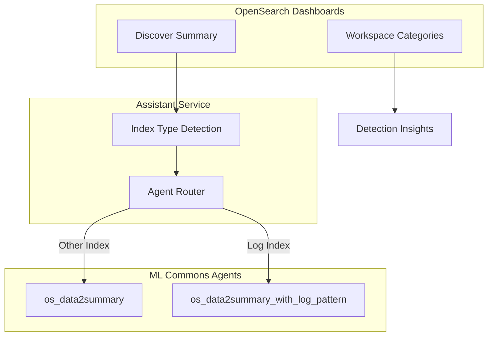

---
tags:
  - domain/core
  - component/dashboards
  - dashboards
  - indexing
  - ml
  - observability
---
# Dashboards AI Insights

## Summary

OpenSearch Dashboards v3.4.0 enhances the AI-powered assistant capabilities with two key improvements: a new Detection Insights workspace category for Anomaly Detection AI Insights, and log pattern agent support in Discover summary for improved log data analysis.

## Details

### What's New in v3.4.0

#### Detection Insights Workspace Category

A new "Detection Insights" category has been added to the Observability workspace in OpenSearch Dashboards. This category provides a dedicated space for AI-powered anomaly detection insights, making it easier for users to access and manage detection-related features.

#### Log Pattern Agent Support in Discover Summary

The Discover summary feature now intelligently detects log-type indexes and routes summarization requests to a specialized log pattern agent (`os_data2summary_with_log_pattern`). This provides more accurate and contextual summaries for log data.

### Technical Changes

#### Architecture Changes



#### New Components

| Component | Description |
|-----------|-------------|
| `detectionInsights` | New workspace category for AD AI Insights with order 7000 |
| `detectIndexType` | Function to determine if an index contains log data |
| `LOG_PATTERN_DATA2SUMMARY_AGENT_CONFIG_ID` | Config ID for log pattern summary agent |

#### New Configuration

| Setting | Description | Default |
|---------|-------------|---------|
| `detectionInsights.id` | Category identifier | `detectionInsights` |
| `detectionInsights.label` | Display label | `Detection Insights` |
| `detectionInsights.order` | Menu order priority | `7000` |

### Usage Example

The log pattern agent is automatically selected when:
1. The query includes an `index` parameter
2. The index is detected as a log-type index
3. The `os_data2summary_with_log_pattern` agent is configured

```typescript
// Request to data2summary API with index parameter
POST /api/assistant/data2summary
{
  "sample_data": "[log entries...]",
  "sample_count": 10,
  "total_count": 1000,
  "question": "Are there any errors in my logs?",
  "ppl": "source=opensearch_dashboards_sample_data_logs | head 10",
  "index": "opensearch_dashboards_sample_data_logs"
}
```

### Migration Notes

- The Detection Insights category appears automatically in the Observability workspace
- Log pattern agent support requires the `os_data2summary_with_log_pattern` agent to be configured in ML Commons
- Falls back to standard `os_data2summary` agent if log pattern agent is not available

## Limitations

- Log pattern detection requires the index name to be passed in the request
- The `os_data2summary_with_log_pattern` agent must be pre-configured for log pattern summaries to work
- Detection Insights category is only visible in the Observability workspace

## References

### Documentation
- [OpenSearch Assistant Documentation](https://docs.opensearch.org/3.0/dashboards/dashboards-assistant/index/)
- [Data Summary Documentation](https://docs.opensearch.org/3.0/dashboards/dashboards-assistant/data-summary/)
- [Log Pattern Tool](https://docs.opensearch.org/3.0/ml-commons-plugin/agents-tools/tools/log-pattern-tool/)

### Pull Requests
| PR | Description |
|----|-------------|
| [#10848](https://github.com/opensearch-project/OpenSearch-Dashboards/pull/10848) | Add Detection Insights category for AD AI Insights |
| [#9693](https://github.com/opensearch-project/OpenSearch-Dashboards/pull/9693) | Support log pattern agent in discover summary |
| [#550](https://github.com/opensearch-project/dashboards-assistant/pull/550) | Support log pattern in discover summary (dashboards-assistant) |

## Related Feature Report

- Full feature documentation
