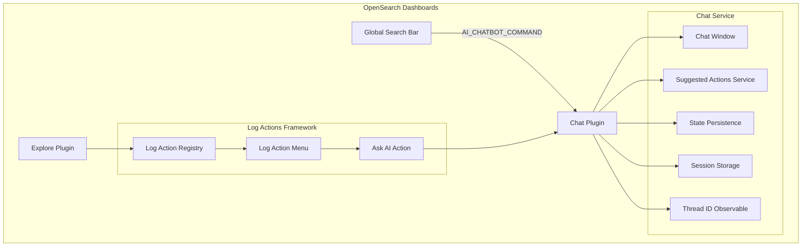

---
tags:
  - domain/core
  - component/dashboards
  - dashboards
  - search
---
# Dashboards Chat

## Summary

OpenSearch Dashboards v3.4.0 introduces significant enhancements to the AI Chat feature, focusing on improved integration, state persistence, and extensibility. Key additions include global search integration for initiating chat from the search bar, a suggestion system allowing plugins to provide contextual suggestions, state persistence across page navigation, and session storage for conversation continuity.

## Details

### What's New in v3.4.0

This release enhances the experimental AI Chat feature with:

1. **Global Search Integration**: Users can now initiate AI conversations directly from the global search bar
2. **Suggestion System**: Extensible framework for plugins to provide contextual suggestions based on conversation history
3. **State Persistence**: Chatbot window state (open/closed, layout mode, size) persists in localStorage
4. **Session Storage**: Chat history and thread continuity maintained across page navigation
5. **Explore Integration**: "Ask AI" action available on log entries in the Explore plugin
6. **UI Improvements**: Close button added to chatbot header, observable thread ID for plugin integration

### Technical Changes

#### Architecture Changes



#### New Components

| Component | Description |
|-----------|-------------|
| `SuggestedActionsService` | Registry for suggestion providers with priority-based ordering |
| `ChatSuggestions` | UI component displaying contextual suggestions as interactive bubbles |
| `LogActionRegistry` | Centralized registry for log entry actions in Explore |
| `LogActionMenu` | Dropdown interface showing available actions for log entries |
| `CurrentChatState` | Interface for session storage persistence |

#### New Configuration

| Setting | Description | Default |
|---------|-------------|---------|
| `localStorage.chatbot.state` | Persisted chatbot window state (open, layout, size) | - |
| `sessionStorage.chat.state` | Current chat thread ID and messages | - |

#### API Changes

**SuggestedActionsProvider Interface**:
```typescript
interface SuggestedActionsProvider {
  id: string;
  priority: number;
  getSuggestions: (context: ChatContext) => Promise<Suggestion[]>;
  isEnabled?: () => boolean;
}
```

**LogActionDefinition Interface**:
```typescript
interface LogActionDefinition {
  id: string;
  displayName: string;
  iconType: string;
  order: number;
  isCompatible: (context: LogActionContext) => boolean;
  component: React.ComponentType<LogActionItemProps>;
}
```

**ChatService Extensions**:
```typescript
// New methods in ChatService
getThreadId$(): Observable<string | undefined>;
saveCurrentChatState(): void;
loadCurrentChatState(): CurrentChatState | null;
clearCurrentChatState(): void;
startNewConversation(initialContent?: string): void;
```

### Usage Example

**Registering a suggestion provider**:
```typescript
// In plugin setup()
chat.suggestedActions.registerProvider({
  id: 'my-plugin-suggestions',
  priority: 100,
  getSuggestions: async (context: ChatContext) => {
    if (context.messageHistory.some(msg => 
      msg.content.includes('visualization'))) {
      return [{
        actionType: 'customize',
        message: 'Create a visualization from this data',
        action: async () => {
          application.navigateToApp('visualize');
          return true;
        }
      }];
    }
    return [];
  },
  isEnabled: () => true
});
```

**Using global search to start chat**:
Users can type a question in the global search bar and press Enter. The chat window opens with the query pre-populated, enabling seamless AI interaction.

**Observing thread changes**:
```typescript
// Other plugins can observe thread ID changes
chatService.getThreadId$().subscribe(threadId => {
  console.log('Chat thread changed:', threadId);
});
```

### Migration Notes

No migration required. New features are additive and backward compatible with existing chat functionality.

## Limitations

- Suggestion providers must be registered during plugin setup phase
- Log actions framework currently only available in Explore plugin
- Session storage cleared when browser tab is closed
- Global search integration requires chat plugin to be enabled

## References

### Documentation
- [OpenSearch Assistant Documentation](https://docs.opensearch.org/3.4/dashboards/dashboards-assistant/index/)

### Pull Requests
| PR | Description |
|----|-------------|
| [#10824](https://github.com/opensearch-project/OpenSearch-Dashboards/pull/10824) | Register chat as the global search command |
| [#10834](https://github.com/opensearch-project/OpenSearch-Dashboards/pull/10834) | Add AI related actions in Explore with log actions framework |
| [#10863](https://github.com/opensearch-project/OpenSearch-Dashboards/pull/10863) | Add suggestion system for chat with provider registry |
| [#10895](https://github.com/opensearch-project/OpenSearch-Dashboards/pull/10895) | Persist chatbot state in localStorage |
| [#10916](https://github.com/opensearch-project/OpenSearch-Dashboards/pull/10916) | Add session storage persistence for chat history |
| [#10924](https://github.com/opensearch-project/OpenSearch-Dashboards/pull/10924) | Add close button for chatbot header |
| [#10934](https://github.com/opensearch-project/OpenSearch-Dashboards/pull/10934) | Add getThreadId$ observable in chat service |

## Related Feature Report

- [Full feature documentation](../../../features/opensearch-dashboards/opensearch-dashboards-ai-chat.md)
