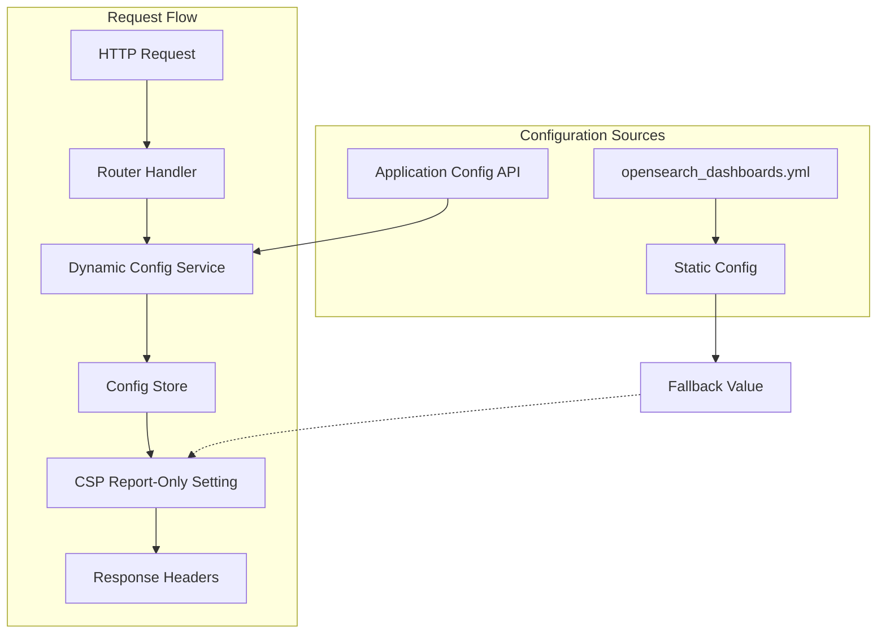

---
tags:
  - dashboards
  - security
---

# Dashboards CSP Dynamic Configuration

## Summary

This release adds dynamic configuration support for the Content-Security-Policy-Report-Only (CSP-RO) header in OpenSearch Dashboards. Administrators can now enable or disable CSP report-only mode at runtime without restarting the server, providing greater flexibility for security monitoring and policy testing.

## Details

### What's New in v3.4.0

The `csp-report-only` configuration can now be dynamically toggled through the `applicationConfig` plugin. This allows administrators to:

- Enable/disable CSP violation reporting without server restarts
- Test CSP policies in report-only mode before enforcement
- Dynamically respond to security monitoring needs

### Technical Changes

#### Architecture Changes



#### Modified Components

| Component | Description |
|-----------|-------------|
| `HttpResourcesService` | Now fetches CSP-RO setting from dynamic config before falling back to static config |
| `CoreRouteHandlerContext` | Added `createStoreFromRequest` method to create async local storage context from requests |
| `ui_render_mixin.js` | Updated to use dynamic config for CSP-RO header emission |
| `RequestHandlerContext` | Extended interface to include `createStoreFromRequest` function |

#### New Configuration

| Setting | Description | Default |
|---------|-------------|---------|
| `csp-report-only.isEmitting` | Controls whether CSP-Report-Only header is emitted | Falls back to static `csp.report_only` setting |

### Usage Example

Enable CSP report-only mode dynamically via the Application Config API:

```bash
# Enable CSP report-only
curl '{osd-endpoint}/api/appconfig/csp-report-only' \
  -X POST \
  -H 'Content-Type: application/json' \
  -H 'osd-xsrf: osd-fetch' \
  --data-raw '{"newValue":{"isEmitting": true}}'

# Disable CSP report-only
curl '{osd-endpoint}/api/appconfig/csp-report-only' \
  -X POST \
  -H 'Content-Type: application/json' \
  -H 'osd-xsrf: osd-fetch' \
  --data-raw '{"newValue":{"isEmitting": false}}'

# Get current setting
curl '{osd-endpoint}/api/appconfig/csp-report-only'
```

### Migration Notes

- No migration required - existing static configuration continues to work as fallback
- Dynamic configuration takes precedence over YAML configuration when set
- Requires `application_config.enabled: true` and `csp_handler.enabled: true` in `opensearch_dashboards.yml`

## Limitations

- Only the `isEmitting` property of CSP-Report-Only is dynamically configurable
- The actual CSP directives and reporting endpoints remain statically configured
- Requires appropriate permissions to access the `.opensearch_dashboards_config` index when Security plugin is enabled

## References

### Documentation
- [CSP Dynamic Configuration Documentation](https://docs.opensearch.org/3.0/dashboards/csp/csp-dynamic-configuration/)
- [applicationConfig Plugin](https://github.com/opensearch-project/OpenSearch-Dashboards/blob/main/src/plugins/application_config/README.md)
- [cspHandler Plugin](https://github.com/opensearch-project/OpenSearch-Dashboards/blob/main/src/plugins/csp_handler/README.md)

### Pull Requests
| PR | Description |
|----|-------------|
| [#10877](https://github.com/opensearch-project/OpenSearch-Dashboards/pull/10877) | Add dynamic config support to CSP report only |

## Related Feature Report

- [Full feature documentation](../../../../features/opensearch-dashboards/opensearch-dashboards-dashboards-csp.md)
