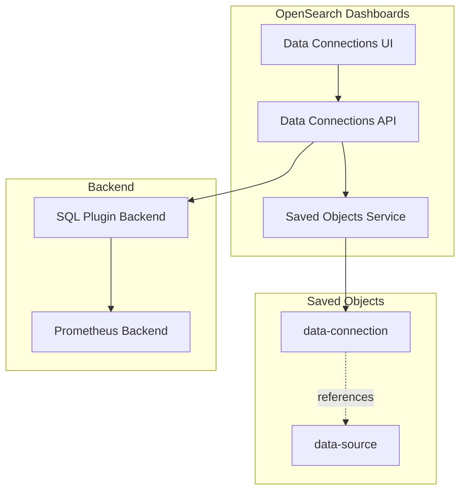
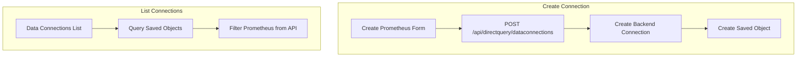

---
tags:
  - domain/core
  - component/dashboards
  - dashboards
  - search
  - security
  - sql
---
# Dashboards Data Connections

## Summary

OpenSearch Dashboards v3.4.0 introduces saved object support for Prometheus data connections. Prometheus connections are now stored as `data-connection` saved objects, enabling better metadata persistence and integration with Multi-Data Source (MDS) environments. This change allows Prometheus to be managed alongside other data sources in the Dashboards Management interface.

## Details

### What's New in v3.4.0

- Prometheus data connections are now stored as `data-connection` saved objects
- Added "No Auth" authentication option for Prometheus connections
- MDS (Multi-Data Source) support for associating Prometheus connections with specific OpenSearch clusters
- Server-side routes automatically create/delete saved objects alongside backend data connections
- Prometheus connections are filtered from direct query API responses (now retrieved from saved objects)

### Technical Changes

#### Architecture Changes



#### Saved Object Structure

Prometheus connections are stored with the following saved object format:

```json
{
  "data-connection": {
    "connectionId": "my_prometheus",
    "type": "Prometheus"
  },
  "references": [
    {
      "id": "<mds-datasource-id>",
      "type": "data-source",
      "name": "dataSource"
    }
  ]
}
```

#### New Components

| Component | Description |
|-----------|-------------|
| `DataConnectionType.Prometheus` | New enum value for Prometheus connection type |
| Prometheus Saved Object Handler | Server-side logic to create/delete saved objects |
| MDS Prometheus Selector | Frontend component for MDS selection |

#### Authentication Options

| Option | Description |
|--------|-------------|
| No Auth | Connect without authentication (new in v3.4.0) |
| Basic Auth | Username/password authentication |
| AWS Signature Version 4 | AWS IAM-based authentication |

### Data Flow



### Usage Example

Creating a Prometheus data connection:

1. Navigate to **Management > Dashboards Management > Data sources**
2. Select **Direct Query Connections** tab
3. Click **Create data connection**
4. Select **Prometheus** as the data source type
5. Configure connection:
   - **Connection name**: Unique identifier
   - **Prometheus URI**: Endpoint URL
   - **Authentication**: No Auth, Basic Auth, or AWS SigV4
   - **Associated OpenSearch cluster** (MDS mode): Select target cluster

### Migration Notes

- Existing Prometheus connections created before v3.4.0 may need to be recreated to benefit from saved object storage
- The saved object approach enables better integration with Dashboards features like access control and multi-tenancy

## Limitations

- Prometheus connections require the SQL plugin backend to be configured
- MDS support for Prometheus may be simplified in future releases (see PR #11154)
- Saved objects are stored in the local OpenSearch cluster, not in remote MDS clusters

## References

### Documentation
- [Data Sources Documentation](https://docs.opensearch.org/3.0/dashboards/management/data-sources/): Official documentation
- [Multi-Data Sources Documentation](https://docs.opensearch.org/3.0/dashboards/management/multi-data-sources/): Configuring multiple data sources

### Pull Requests
| PR | Description |
|----|-------------|
| [#10968](https://github.com/opensearch-project/OpenSearch-Dashboards/pull/10968) | Create saved object for prometheus data-connection |
| [#11154](https://github.com/opensearch-project/OpenSearch-Dashboards/pull/11154) | Remove MDS support for Prometheus (follow-up) |

### Issues (Design / RFC)
- [Issue #1741](https://github.com/tkykenmt/opensearch-feature-explorer/issues/1741): Feature tracking issue
- [RFC #9535](https://github.com/opensearch-project/OpenSearch-Dashboards/issues/9535): Prometheus as first-class datasource proposal

## Related Feature Report

- [Full feature documentation](../../../../features/opensearch-dashboards/opensearch-dashboards-data-connections.md)
