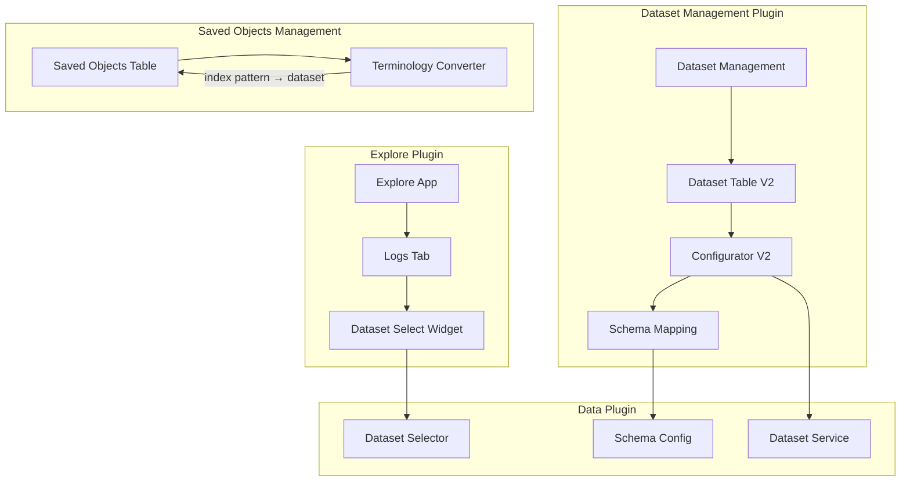

---
tags:
  - domain/core
  - component/dashboards
  - dashboards
  - indexing
---
# Dashboards Dataset Management

## Summary

OpenSearch Dashboards v3.4.0 introduces significant enhancements to the Dataset Management feature, providing a comprehensive UI for creating, editing, and managing datasets. Key improvements include wildcard prefix support for index datasets, schema mapping for OTel data, multiple log dataset support, and dynamic terminology conversion between "index pattern" and "dataset" based on plugin enablement.

## Details

### What's New in v3.4.0

This release transforms the dataset management experience with:

1. **Enhanced Dataset Creation Flow** - New V2 configurator with save-on-create capability
2. **Schema Mapping** - Map data fields to UI-required attributes (OTel support)
3. **Wildcard Prefix Support** - Create index datasets with wildcard patterns
4. **Multiple Log Datasets** - Display and manage multiple log datasets with accordion UI
5. **Improved Dataset Table** - New columns for display name, signal type, and description
6. **Dynamic Terminology** - Automatic "index pattern" → "dataset" text conversion

### Technical Changes

#### Architecture Changes



#### New Components

| Component | Description |
|-----------|-------------|
| `ConfiguratorV2` | Enhanced dataset configurator with save-on-create |
| `DatasetTableV2` | Redesigned table with display name, signal type, description columns |
| `SchemaMapping` | Maps data fields to UI attributes (OTel schema support) |
| `SaveAsDatasetOption` | Checkbox component for saving dataset during creation |
| `DatasetMetadataFields` | Input fields for dataset name and description |
| `useDatasetFields` | Hook for field fetching with infinite loop prevention |
| `useDatasetTableData` | Hook for loading datasets, sources, and creation options |
| `useDatasetSelector` | Hook for managing dataset selector modal and creation flow |
| `DatasetTableHeader` | Header component with title, description, and create button |
| `DataScopeCell` | Cell component displaying data source + title with icon |
| `CorrelationEmptyState` | Empty state component for logs datasets list |
| `convertIndexPatternToDataset` | Utility for terminology conversion with case preservation |

#### New Configuration

| Setting | Description | Default |
|---------|-------------|---------|
| `schemaMappings` | Schema mappings stored with dataset | `{}` |
| `displayName` | Human-readable dataset name | - |
| `description` | Dataset description | - |

#### Schema Mapping Format

```json
{
  "schemaMappings": {
    "<schemaName>": {
      "<attributeName>": "<fieldName>"
    }
  }
}
```

Schema attributes are defined in `src/plugins/data/public/ui/dataset_selector/configurator/schema_config.ts`.

### Usage Example

#### Creating Dataset with Schema Mapping

```typescript
// Dataset with OTel schema mapping
const dataset = {
  title: 'otel-logs-*',
  timeFieldName: '@timestamp',
  displayName: 'OpenTelemetry Logs',
  description: 'Logs collected via OpenTelemetry',
  schemaMappings: {
    otel: {
      timestamp: '@timestamp',
      traceId: 'trace.id',
      spanId: 'span.id',
      message: 'body'
    }
  }
};
```

#### Terminology Conversion Utility

```typescript
import { convertIndexPatternToDataset } from '@opensearch-project/opensearch-dashboards/utils';

// Converts with case preservation
convertIndexPatternToDataset('Index Pattern');  // → 'Dataset'
convertIndexPatternToDataset('INDEX PATTERNS'); // → 'DATASETS'
convertIndexPatternToDataset('index-pattern');  // → 'dataset'
```

### Migration Notes

- Existing index patterns continue to work without changes
- Enable `datasetManagement.enabled: true` to use new features
- Schema mappings are optional and backward compatible
- Terminology conversion is automatic when dataset plugin is enabled

## Limitations

- Schema mapping UI only supports OTel schema initially
- Terminology conversion uses MutationObserver for portal content (performance consideration)
- Display name and description require dataset management plugin enabled

## References

### Documentation
- [Index Patterns Documentation](https://docs.opensearch.org/3.0/dashboards/management/index-patterns/)
- [Dashboards Management](https://docs.opensearch.org/3.0/dashboards/management/management-index/)

### Pull Requests
| PR | Description |
|----|-------------|
| [#10623](https://github.com/opensearch-project/OpenSearch-Dashboards/pull/10623) | Add wildcard prefix support for creating index dataset |
| [#10690](https://github.com/opensearch-project/OpenSearch-Dashboards/pull/10690) | Allow saving dataset from dataset configurator |
| [#10703](https://github.com/opensearch-project/OpenSearch-Dashboards/pull/10703) | Redesigned logs tab with accordion and expandable rows |
| [#10704](https://github.com/opensearch-project/OpenSearch-Dashboards/pull/10704) | Update dataset management dataset creation flow |
| [#10714](https://github.com/opensearch-project/OpenSearch-Dashboards/pull/10714) | Introduce schema mapping with OTel support |
| [#10716](https://github.com/opensearch-project/OpenSearch-Dashboards/pull/10716) | Support for multiple log datasets |
| [#10737](https://github.com/opensearch-project/OpenSearch-Dashboards/pull/10737) | Add data scope and schema mapping on edit page |
| [#10776](https://github.com/opensearch-project/OpenSearch-Dashboards/pull/10776) | Dataset table with display name and description |
| [#10779](https://github.com/opensearch-project/OpenSearch-Dashboards/pull/10779) | Display dataset display name and description on edit page |
| [#10781](https://github.com/opensearch-project/OpenSearch-Dashboards/pull/10781) | Empty state component for logs datasets |
| [#10791](https://github.com/opensearch-project/OpenSearch-Dashboards/pull/10791) | Dynamic index pattern → dataset terminology conversion |
| [#10572](https://github.com/opensearch-project/OpenSearch-Dashboards/pull/10572) | Fix dataset filter based on signal type |
| [#10692](https://github.com/opensearch-project/OpenSearch-Dashboards/pull/10692) | Restrict patterns tab to default datasets |

## Related Feature Report

- [Full feature documentation](../../../features/opensearch-dashboards/opensearch-dashboards-dataset-management.md)
