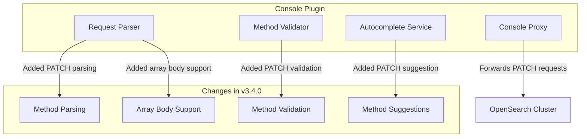

---
tags:
  - dashboards
  - security
---

# Dashboards Dev Tools - PATCH Method Support

## Summary

This release adds support for the HTTP PATCH method in the OpenSearch Dashboards Dev Tools console. Previously, users could only execute GET, POST, PUT, DELETE, and HEAD requests. With this change, users can now execute PATCH API calls directly from the console, which is essential for working with OpenSearch Security plugin APIs that use JSON Patch operations.

## Details

### What's New in v3.4.0

The Dev Tools console now supports the PATCH HTTP method, enabling users to:
- Execute PATCH API calls for Security plugin operations (role mappings, users, roles, etc.)
- Use JSON Patch array syntax in request bodies
- Get autocomplete suggestions for PATCH method

### Technical Changes

#### Architecture Changes



#### Modified Components

| Component | File | Change |
|-----------|------|--------|
| Request Parser | `worker.js` | Added PATCH method parsing and array body support |
| Row Parser | `row_parser.ts` | Updated to handle JSON array bodies for PATCH requests |
| Autocomplete | `autocomplete.ts` | Added PATCH to method suggestions |
| URL Pattern Matcher | `url_pattern_matcher.ts` | Added PATCH to supported methods |
| Proxy Validation | `validation_config.ts` | Added PATCH to accepted HTTP verbs |
| HTTP Method Type | `osd_client_requester.ts`, `osd_server.ts` | Added PATCH to method type definitions |

#### New Supported Methods

| Method | Status |
|--------|--------|
| GET | Existing |
| POST | Existing |
| PUT | Existing |
| DELETE | Existing |
| HEAD | Existing |
| PATCH | **New in v3.4.0** |

### Usage Example

```
PATCH _plugins/_security/api/internalusers/admin
[
  { "op": "replace", "path": "/attributes", "value": { "department": "engineering" } }
]
```

```
PATCH _plugins/_security/api/roles/my_role
[
  { "op": "replace", "path": "/index_permissions/0/fls", "value": ["field1", "field2"] },
  { "op": "remove", "path": "/index_permissions/0/dls" }
]
```

### Migration Notes

No migration required. PATCH method support is automatically available after upgrading to v3.4.0.

## Limitations

- PATCH requests require the request body to be a JSON array (JSON Patch format)
- Autocomplete for PATCH-specific API endpoints may be limited

## References

### Documentation
- [Security API Documentation](https://docs.opensearch.org/latest/security/access-control/api/): OpenSearch Security plugin PATCH APIs

### Pull Requests
| PR | Description |
|----|-------------|
| [#10361](https://github.com/opensearch-project/OpenSearch-Dashboards/pull/10361) | Support PATCH calls from dev tools |

### Issues (Design / RFC)
- [Issue #10105](https://github.com/opensearch-project/OpenSearch-Dashboards/issues/10105): Bug report - PATCH API calls not supported in DevTools console
- [Issue #2343](https://github.com/opensearch-project/OpenSearch-Dashboards/issues/2343): Feature request - Dev Tools should support PATCH method

## Related Feature Report

- [Full feature documentation](../../../../features/opensearch-dashboards/dashboards-console.md)
