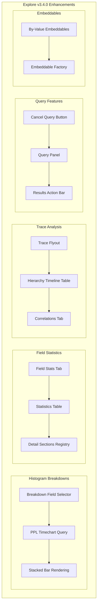

---
tags:
  - dashboards
  - observability
  - search
  - sql
---

# Dashboards Explore

## Summary

OpenSearch Dashboards v3.4.0 brings significant enhancements to the Explore plugin, introducing a comprehensive set of new features for data exploration and observability. Key additions include histogram breakdowns for subdividing time-series visualizations by categorical fields, a Field Statistics tab for data profiling, trace analysis improvements with flyout panels and hierarchy timeline tables, correlations support for linking traces and logs, query cancellation, and by-value embeddables for dashboard integration without stored saved objects.

## Details

### What's New in v3.4.0

#### Histogram Breakdowns
Users can now subdivide histogram visualizations by categorical field values, displaying the top 4 values as stacked bars with color-coded series. This provides deeper insights into how different categorical values contribute to overall time-series patterns.

- New "Breakdown" field selector in histogram header
- Multi-colored stacked bars with legend panel
- PPL `timechart` command integration with `limit=4` for top values
- Error handling with graceful fallback to standard histogram

#### Field Statistics Tab (Experimental)
A new tab providing comprehensive statistical analysis of fields in indices, enabling quick data profiling without writing complex queries.

| Feature | Description |
|---------|-------------|
| Field Statistics Table | Sortable table showing field name, type, document count, and distinct value count |
| Expandable Row Details | Type-specific statistics (top values, numeric summaries, date ranges, examples) |
| Lazy Loading | Details fetched only when rows are expanded |
| Field Filtering | Automatically excludes meta fields, multi-fields, and scripted fields |

#### Trace Analysis Improvements
- Trace flyout panel replacing expandable rows for trace details
- Hierarchy timeline table with waterfall bars replacing Gantt chart
- Span kind column for enhanced trace information
- Correlations tab for linking trace and logs datasets

#### Query Enhancements
- Cancel query feature with timeout-based UI (appears after 50ms)
- Query panel display in traces and metrics even without datasets
- Results action bar slot for plugin extensibility
- Log action menu support for non-filterable time columns

#### Embeddable Improvements
- By-value explore embeddables without stored saved objects
- Support for PromQL and PPL visualizations via JSON input

### Technical Changes

#### Architecture Changes



#### New Components

| Component | Description |
|-----------|-------------|
| `BreakdownFieldSelector` | UI for selecting breakdown field in histogram header |
| `FieldStatsContainer` | Data fetching and state management for field statistics |
| `FieldStatsTable` | Sortable table with expandable rows |
| `TraceFlyout` | Flyout panel for trace details |
| `SpanHierarchyTable` | Hierarchy view with timeline waterfall bars |
| `SpanListTable` | Flat list view with filtering and sorting |
| `CorrelationsTab` | UI for linking trace and logs datasets |
| `QueryCancelButton` | Cancel button for running queries |

#### New Configuration

| Setting | Description | Default |
|---------|-------------|---------|
| `explore.experimental` | Enable experimental features (Histogram Breakdowns, Field Statistics) | `false` |

### Usage Example

```ppl
# Histogram with breakdown by status field
source = logs | timechart span=1h limit=4 count() by status

# Standard histogram without breakdown
source = logs | stats count() by span(@timestamp, 1h)
```

### By-Value Embeddable Example

```tsx
const factory = DepsStart.embeddable.getEmbeddableFactory('explore')!;

const pplInput = {
  id: 'explore-demo-ppl-' + Date.now(),
  timeRange: { from: 'now-15m', to: 'now' },
  attributes: {
    title: 'Demo Visualization',
    visualization: JSON.stringify({
      chartType: 'bar',
      axesMapping: { x: 'referer', y: 'count()' },
    }),
    kibanaSavedObjectMeta: {
      searchSourceJSON: JSON.stringify({
        query: {
          language: 'PPL',
          query: 'source = logs | stats count() by referer',
        },
      }),
    },
  },
};

<EmbeddableRenderer factory={factory} input={pplInput} />
```

## Limitations

- Histogram Breakdowns and Field Statistics are behind experimental feature flag
- Breakdown selector only visible when `@timestamp` is the DataView's time field
- Field Statistics supports PPL as the default query language
- Correlations limited to 1 trace per correlation and max 5 logs datasets per correlation

## References

### Pull Requests
| PR | Description |
|----|-------------|
| [#10558](https://github.com/opensearch-project/OpenSearch-Dashboards/pull/10558) | Add timefield and currentTime to prompt |
| [#10563](https://github.com/opensearch-project/OpenSearch-Dashboards/pull/10563) | Add state timeline visualization |
| [#10606](https://github.com/opensearch-project/OpenSearch-Dashboards/pull/10606) | Add time zoom in interaction to explore vis |
| [#10629](https://github.com/opensearch-project/OpenSearch-Dashboards/pull/10629) | Improve timeline loading state with spinner |
| [#10655](https://github.com/opensearch-project/OpenSearch-Dashboards/pull/10655) | Implement trace flyout |
| [#10657](https://github.com/opensearch-project/OpenSearch-Dashboards/pull/10657) | Add span kind column |
| [#10663](https://github.com/opensearch-project/OpenSearch-Dashboards/pull/10663) | Discover Histogram Breakdowns |
| [#10676](https://github.com/opensearch-project/OpenSearch-Dashboards/pull/10676) | Replace Timeline gantt chart with hierarchy timeline table |
| [#10713](https://github.com/opensearch-project/OpenSearch-Dashboards/pull/10713) | Show query panel in traces and metrics without datasets |
| [#10723](https://github.com/opensearch-project/OpenSearch-Dashboards/pull/10723) | Field Statistics Tab |
| [#10727](https://github.com/opensearch-project/OpenSearch-Dashboards/pull/10727) | Add cancel query feature to discover |
| [#10729](https://github.com/opensearch-project/OpenSearch-Dashboards/pull/10729) | Add correlations tab for trace and logs linking |
| [#10764](https://github.com/opensearch-project/OpenSearch-Dashboards/pull/10764) | Histogram Breakdowns enable timechart for every dataset |
| [#10799](https://github.com/opensearch-project/OpenSearch-Dashboards/pull/10799) | Experimental Explore feature flag |
| [#10842](https://github.com/opensearch-project/OpenSearch-Dashboards/pull/10842) | Add resultsActionBar slot to explore plugin |
| [#10927](https://github.com/opensearch-project/OpenSearch-Dashboards/pull/10927) | Log action menu support for non-filterable time columns |
| [#10970](https://github.com/opensearch-project/OpenSearch-Dashboards/pull/10970) | Support by-value explore embeddables |
| [#10513](https://github.com/opensearch-project/OpenSearch-Dashboards/pull/10513) | Split Aggregations Query from Logs Query |
| [#10574](https://github.com/opensearch-project/OpenSearch-Dashboards/pull/10574) | Fix field formatter not applied to explore query result |
| [#10582](https://github.com/opensearch-project/OpenSearch-Dashboards/pull/10582) | Fix column focus issue |
| [#10597](https://github.com/opensearch-project/OpenSearch-Dashboards/pull/10597) | Clear editor after dataset change |
| [#10661](https://github.com/opensearch-project/OpenSearch-Dashboards/pull/10661) | Add backticks to explore's data source command |

### Issues (Design / RFC)
- [RFC #10619](https://github.com/opensearch-project/OpenSearch-Dashboards/issues/10619): Histogram Breakdowns RFC
- [RFC #10614](https://github.com/opensearch-project/OpenSearch-Dashboards/issues/10614): Field Statistics RFC
- [Issue #10386](https://github.com/opensearch-project/OpenSearch-Dashboards/issues/10386): Correlations feature request

## Related Feature Report

- [Full feature documentation](../../../features/opensearch-dashboards/explore.md)
