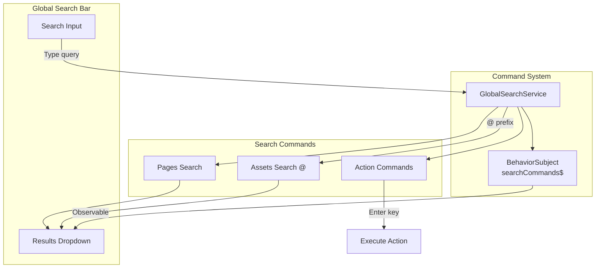

---
tags:
  - dashboards
  - search
---

# Dashboards Global Search

## Summary

OpenSearch Dashboards v3.4.0 enhances the global search functionality with two key capabilities: **Assets Search** for finding dashboards and visualizations directly from the search bar using the `@` prefix, and **Submit Commands** that execute custom actions when users press Enter. These enhancements improve navigation efficiency and enable extensible interactions like AI chatbot integration.

## Details

### What's New in v3.4.0

This release introduces significant enhancements to the global search bar:

1. **Assets Search Command**: Search for saved objects (dashboards, visualizations) using the `@` prefix
2. **Enhanced Command Interface**: Extended `GlobalSearchCommand` with `action` property for Enter-key triggered actions
3. **Observable-based Architecture**: Commands now use RxJS observables for reactive updates

### Technical Changes

#### Architecture Changes



#### New Components

| Component | Description |
|-----------|-------------|
| `searchAssets` | Function to search dashboards and visualizations via saved objects API |
| `GlobalSearchCommandRunOptions` | Interface with `abortSignal` for cancellable search operations |
| `ACTIONS` command type | New search command type for Enter-key triggered actions |
| `AssetType` enum | Defines supported asset types (`Dashboard`, `Visualization`) |

#### New Configuration

| Setting | Description | Default |
|---------|-------------|---------|
| `inputPlaceholder` | Custom placeholder text for search input | `"Search menu or assets"` |
| `action` | Callback function executed on Enter key press | `undefined` |

#### API Changes

**Extended GlobalSearchCommand Interface**:

```typescript
export interface GlobalSearchCommand {
  id: string;
  type: 'PAGES' | 'SAVED_OBJECTS' | 'ACTIONS';
  inputPlaceholder?: string;
  run(
    value: string,
    callback?: () => void,
    options?: GlobalSearchCommandRunOptions
  ): Promise<ReactNode[]>;
  action?: (payload: { content: string }) => void;
}
```

**New Observable API**:

```typescript
// Start contract now includes observable
getAllSearchCommands$: () => Observable<GlobalSearchCommand[]>;
registerSearchCommand(searchCommand: GlobalSearchCommand): void;
```

### Usage Example

**Registering an Assets Search Command**:

```typescript
chrome.globalSearch.registerSearchCommand({
  id: 'assetsSearch',
  type: 'SAVED_OBJECTS',
  run: async (query, callback, options) => {
    const response = await http.get(
      '/api/opensearch-dashboards/management/saved_objects/_find',
      {
        query: {
          type: ['dashboard', 'visualization'],
          search: `*${query}*`,
          perPage: 10,
          workspaces: currentWorkspaceId ? [currentWorkspaceId] : [],
        },
        signal: options?.abortSignal,
      }
    );
    // Return React elements for display
    return response.saved_objects.map(asset => (
      <EuiSimplifiedBreadcrumbs
        breadcrumbs={[
          { text: asset.type },
          { text: asset.meta.title, href: assetUrl, onClick: callback }
        ]}
      />
    ));
  }
});
```

**Registering an Action Command (e.g., AI Chatbot)**:

```typescript
chrome.globalSearch.registerSearchCommand({
  id: 'openChatbot',
  type: 'ACTIONS',
  run: async () => [],
  action: ({ content }) => {
    chatbot.open({ initialMessage: content });
  }
});
```

### Search Behavior

| Search Pattern | Behavior |
|----------------|----------|
| `dashboard` | Searches pages only |
| `@sales` | Searches assets (dashboards, visualizations) containing "sales" |
| Press Enter | Executes all registered action commands with search query |

### Migration Notes

- The `globalSearchCommands` prop is now `globalSearchCommands$` (Observable)
- Search command `run` method now accepts an optional `options` parameter with `abortSignal`
- Previous search requests are automatically cancelled when new searches are triggered

## Limitations

- Assets search currently supports only `dashboard` and `visualization` types
- Action commands receive only the search query text, not page context
- The `@` prefix is required to search assets; default search only queries pages

## References

### Pull Requests
| PR | Description |
|----|-------------|
| [#10789](https://github.com/opensearch-project/OpenSearch-Dashboards/pull/10789) | Add assets search command and enhance search commands |

### Issues (Design / RFC)
- [Issue #10741](https://github.com/opensearch-project/OpenSearch-Dashboards/issues/10741): RFC - Global Search Enhancements for New Home

## Related Feature Report

- [Full feature documentation](../../../../features/opensearch-dashboards/global-search.md)
