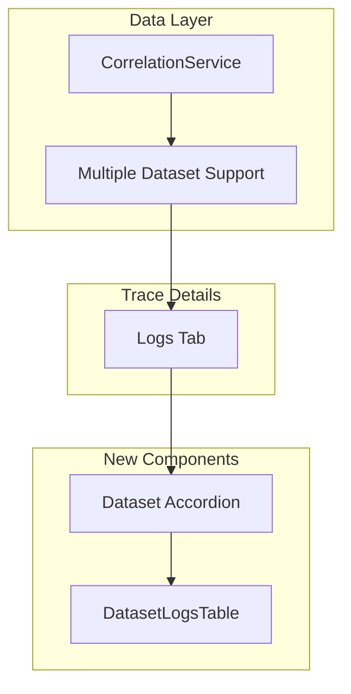

---
tags:
  - dashboards
  - observability
---

# Dashboards Logs View

## Summary

This release enhances the Logs tab in Trace Details with a redesigned UI featuring expandable log rows, accordion-based dataset grouping, and support for multiple log datasets. Users can now view logs from multiple correlated datasets simultaneously, with each dataset displayed in a collapsible accordion showing the 10 most recent results.

## Details

### What's New in v3.4.0

- Redesigned logs table component with expandable rows for detailed message viewing
- Accordion-based UI for organizing logs by dataset
- Support for multiple log datasets instead of just one
- Code block display for log messages with copy functionality
- Configurable display limit of 10 logs per dataset
- Improved "View in Discover Logs" button placement within each dataset accordion

### Technical Changes

#### Architecture Changes



#### New Components

| Component | Description |
|-----------|-------------|
| `DatasetLogsTable` | New table component with expandable rows and code block message display |
| Dataset Accordion | Collapsible accordion for each log dataset with title and result count |

#### New Configuration

| Setting | Description | Default |
|---------|-------------|---------|
| `LOGS_DATA` | Maximum number of logs displayed per dataset | 10 |

#### API Changes

The `CorrelationService.checkCorrelationsAndFetchLogs` method now returns an additional `datasetLogs` property:

```typescript
// Before
Promise<{ logDatasets: Dataset[]; logs: LogHit[] }>

// After
Promise<{ 
  logDatasets: Dataset[]; 
  logs: LogHit[]; 
  datasetLogs: Record<string, LogHit[]> 
}>
```

### Usage Example

```
1. Navigate to Trace Details page
2. Click on the "Logs" tab
3. View logs organized by dataset in collapsible accordions
4. Click the expand icon (arrow) on any log row to see full message
5. Expanded messages display in a code block with copy functionality
6. Click "View in Discover Logs" to open full log view for a specific dataset
```

### Migration Notes

No migration required. The new UI is automatically available when viewing trace logs.

## Limitations

- Maximum of 10 logs displayed per dataset
- Log correlation requires pre-configured correlation saved objects
- Empty datasets show "No logs found for this dataset" message

## References

### Documentation
- [PR #10703](https://github.com/opensearch-project/OpenSearch-Dashboards/pull/10703): Initial redesign implementation
- [PR #10716](https://github.com/opensearch-project/OpenSearch-Dashboards/pull/10716): Multiple dataset support

### Pull Requests
| PR | Description |
|----|-------------|
| [#10703](https://github.com/opensearch-project/OpenSearch-Dashboards/pull/10703) | Redesigned logs tab with accordion and expandable rows |
| [#10716](https://github.com/opensearch-project/OpenSearch-Dashboards/pull/10716) | Added support for multiple log datasets with accordion display |

## Related Feature Report

- [Explore Traces](../../../../features/opensearch-dashboards/opensearch-dashboards-explore-traces.md)
