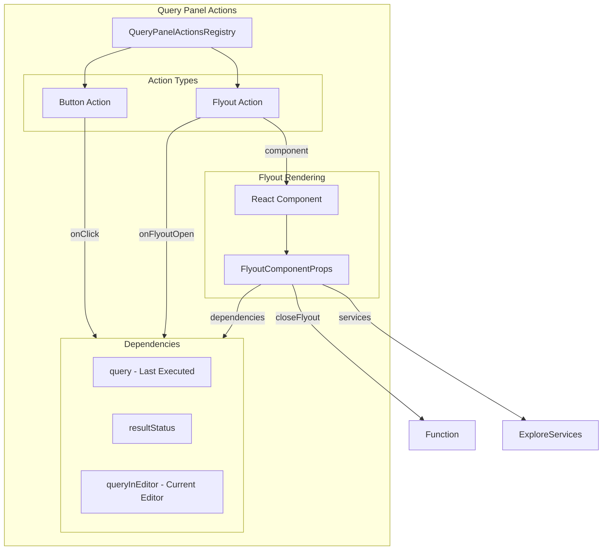

---
tags:
  - dashboards
  - search
---

# Dashboards Query Action Service

## Summary

This release enhances the Query Panel Actions Registry in the Explore plugin to support flyout registration, enabling external plugins to render inline flyout panels directly from the query panel actions dropdown. Additionally, it introduces `queryInEditor` to provide access to the current editor content (pre-transformed with source clause) and comprehensive documentation for the Explore plugin's component architecture.

## Details

### What's New in v3.4.0

The Query Panel Actions Registry now supports two action types:
- **Button actions**: Execute an onClick callback (existing behavior)
- **Flyout actions**: Render a React component in an inline flyout panel (new)

External plugins can now register flyout actions that open inline panels for complex workflows like creating monitors, alerts, or other integrations without navigating away from the Explore page.

### Technical Changes

#### Architecture Changes



#### New Components

| Component | Description |
|-----------|-------------|
| `FlyoutActionConfig` | Configuration interface for flyout-type actions |
| `FlyoutComponentProps` | Props interface passed to flyout React components |
| `useQueryPanelActionDependencies` | Hook to gather all dependencies for query panel actions |
| `explore-plugin-components.md` | Comprehensive architecture documentation |

#### New Configuration

| Setting | Description | Default |
|---------|-------------|---------|
| `actionType` | Discriminator for action type (`'button'` or `'flyout'`) | Required |
| `component` | React component to render in flyout (flyout actions only) | Required for flyout |
| `onFlyoutOpen` | Optional callback when flyout opens | `undefined` |

#### API Changes

**QueryPanelActionDependencies** (enhanced):
```typescript
interface QueryPanelActionDependencies {
  query: QueryWithQueryAsString;    // Last executed query (pre-transformed)
  resultStatus: QueryResultStatus;  // Query execution status
  queryInEditor: string;            // Current editor content (pre-transformed)
}
```

**FlyoutActionConfig** (new):
```typescript
interface FlyoutActionConfig {
  id: string;
  actionType: 'flyout';
  order: number;
  getIsEnabled?(deps: QueryPanelActionDependencies): boolean;
  getLabel(deps: QueryPanelActionDependencies): string;
  getIcon?(deps: QueryPanelActionDependencies): IconType;
  component: React.ComponentType<FlyoutComponentProps>;
  onFlyoutOpen?(deps: QueryPanelActionDependencies): void;
}
```

**FlyoutComponentProps** (new):
```typescript
interface FlyoutComponentProps {
  closeFlyout: () => void;
  dependencies: QueryPanelActionDependencies;
  services: ExploreServices;
}
```

### Usage Example

```tsx
// Register a flyout action in your plugin
export class MyPlugin {
  public setup(core: CoreSetup, { explore }: MyPluginSetupDependencies) {
    explore.queryPanelActionsRegistry.register({
      id: 'create-monitor-flyout',
      actionType: 'flyout',
      order: 2,
      getIsEnabled: (deps) => deps.resultStatus.status === QueryExecutionStatus.READY,
      getLabel: () => 'Create Monitor',
      getIcon: () => 'bell',
      component: CreateMonitorFlyout,
      onFlyoutOpen: (deps) => {
        console.log('Opening flyout with query:', deps.queryInEditor);
      }
    });
  }
}

// Flyout component
const CreateMonitorFlyout: React.FC<FlyoutComponentProps> = ({
  closeFlyout,
  dependencies,
  services,
}) => {
  return (
    <EuiFlyout onClose={closeFlyout} size="m">
      <EuiFlyoutHeader hasBorder>
        <EuiTitle size="m"><h2>Create Monitor</h2></EuiTitle>
      </EuiFlyoutHeader>
      <EuiFlyoutBody>
        <p>Query: {dependencies.queryInEditor}</p>
        <p>Language: {dependencies.query.language}</p>
      </EuiFlyoutBody>
    </EuiFlyout>
  );
};
```

### Migration Notes

- Existing button actions continue to work without changes (backward compatible)
- Legacy actions without `actionType` are automatically converted to button actions
- The `queryInEditor` field is now available in dependencies for all action types
- Both `query.query` and `queryInEditor` are pre-transformed with the `source = <dataset>` clause

## Limitations

- Flyout components must render the complete `EuiFlyout` structure
- Only one flyout can be open at a time
- Dependencies are not memoized to ensure fresh editor content is always passed

## References

### Documentation
- [Query Panel Actions Documentation](https://github.com/opensearch-project/OpenSearch-Dashboards/blob/main/docs/plugins/explore/query-panel-actions.md): Official API documentation
- [PR #10849](https://github.com/opensearch-project/OpenSearch-Dashboards/pull/10849): Main implementation
- [Explore Plugin Components Architecture](https://github.com/opensearch-project/OpenSearch-Dashboards/blob/main/docs/plugins/explore/explore-plugin-components.md): Comprehensive architecture guide

### Pull Requests
| PR | Description |
|----|-------------|
| [#10849](https://github.com/opensearch-project/OpenSearch-Dashboards/pull/10849) | Enhance query action service to allow flyout registration |

## Related Feature Report

- [Full feature documentation](../../../../features/opensearch-dashboards/opensearch-dashboards-explore.md)
