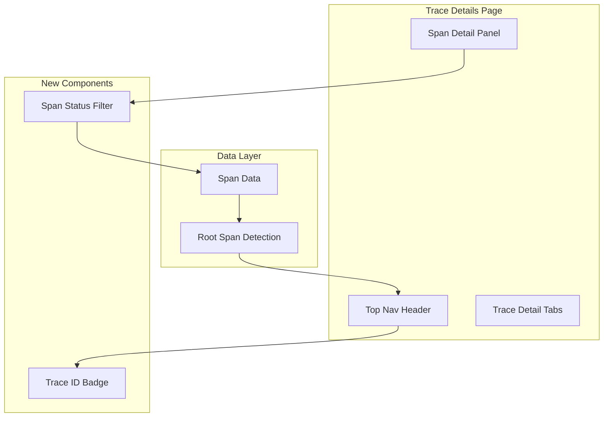

# Dashboards Traces

## Summary

This release introduces span status filters and multiple UX improvements to the Trace Details page in OpenSearch Dashboards. Users can now filter spans by status (Error, OK, Unset), the page header always displays the root span's service name and operation, and the trace ID is shown as a copyable badge. Additional bug fixes improve scrollbar behavior and remove duplicate columns.

## Details

### What's New in v3.4.0

The Trace Details page receives significant usability enhancements:

1. **Span Status Filters**: New filter component allowing users to filter spans by status (Error, OK, Unset)
2. **Improved Page Header**: Header now always shows root span information (service name: operation) instead of trace ID
3. **Copyable Trace ID Badge**: Trace ID displayed as a clickable badge that copies to clipboard
4. **UI Polish**: Removed duplicate service.name column, fixed scrollbar positioning in code blocks

### Technical Changes

#### Architecture Changes



#### New Components

| Component | Description |
|-----------|-------------|
| `SpanStatusFilter` | Popover-based filter for span status (Error, OK, Unset) |
| `TraceIdBadge` | Clickable badge displaying trace ID with copy functionality |
| `getServiceInfo()` | Helper function to extract service name and operation from root span |

#### New Configuration

| Setting | Description | Default |
|---------|-------------|---------|
| Span Status Filter | Filter spans by status code | All statuses shown |

#### API Changes

New utility functions added:

- `isSpanOk(span)`: Determines if a span has OK status (not error)
- `isStatusMatch(span, field, value)`: Matches span against status filter criteria
- `getServiceInfo(selectedSpan, traceId)`: Returns formatted service info string

### Usage Example

#### Filtering Spans by Status

```
1. Navigate to Trace Details page
2. Click "Filter by status" button in the span hierarchy table toolbar
3. Select one or more status options:
   - Error: Shows spans with error status
   - OK: Shows spans with successful status
   - Unset: Shows spans with unset/unknown status
4. Selected filters appear as badges and persist across navigation
```

#### Copying Trace ID

```
1. Open Trace Details page
2. Locate the "Trace ID: {id}" badge in the header
3. Click the badge to copy the trace ID to clipboard
4. A tooltip confirms the copy action
```

### Migration Notes

No migration required. Changes are backward compatible.

## Limitations

- Span status filter state is stored in session storage and resets on browser close
- Root span detection falls back to earliest span if no span without parent is found

## References

### Documentation
- [Trace Analytics Documentation](https://docs.opensearch.org/3.0/observing-your-data/trace/ta-dashboards/): Official trace analytics guide
- [OpenTelemetry Trace Specification](https://opentelemetry.io/docs/concepts/signals/traces/): OTEL trace concepts

### Pull Requests
| PR | Description |
|----|-------------|
| [#10745](https://github.com/opensearch-project/OpenSearch-Dashboards/pull/10745) | Add span status filters to trace details. Combine bug fixes. |
| [#10630](https://github.com/opensearch-project/OpenSearch-Dashboards/pull/10630) | Fix trace details page header to always show root span |
| [#10651](https://github.com/opensearch-project/OpenSearch-Dashboards/pull/10651) | Traces code block scrollbar to scroll on edge |
| [#10698](https://github.com/opensearch-project/OpenSearch-Dashboards/pull/10698) | Remove service.name column from traces table |

## Related Feature Report

- [Full feature documentation](../../../../features/opensearch-dashboards/explore-traces.md)
