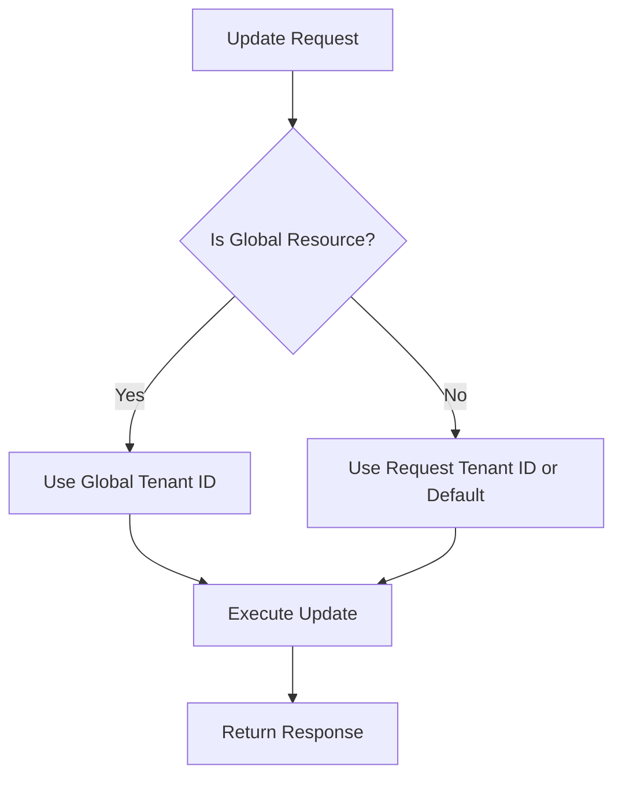

# Remote Model Bugfixes

## Summary

This release fixes a bug in the OpenSearch Remote Metadata SDK that caused errors when updating global model status in DynamoDB-backed deployments. The fix ensures proper tenant ID handling for global resources during update operations.

## Details

### What's New in v3.4.0

This bugfix addresses an error that occurred when deploying global models with DynamoDB as the remote metadata store. While the error did not impact model predictions, it produced misleading error logs during the first model deployment.

### Technical Changes

#### Bug Description

When updating a global model's status in DynamoDB, the SDK failed with a `NullPointerException`:

```
[ERROR][o.o.m.m.MLModelManager] Failed to update ML model with ID olly2-t2ppl-model-id.
Details: java.lang.NullPointerException: Cannot invoke
"software.amazon.awssdk.services.dynamodb.model.AttributeValue.m()"
because the return value of "java.util.Map.get(Object)" is null
```

#### Root Cause

The `updateDataObjectAsync` method in `DDBOpenSearchClient` did not check whether the resource being updated was a global resource. For global resources, the tenant ID must be set to the global tenant ID, but the code was using the request's tenant ID directly without this check.

#### Fix Implementation

The fix introduces a new `isGlobalResource` check before performing updates:



| Component | Change |
|-----------|--------|
| `DDBOpenSearchClient.updateDataObjectAsync()` | Added `isGlobalResource` check before update |
| `DDBOpenSearchClient.updateItem()` | New private method extracted for update logic |

### Usage Example

No changes required for users. The fix is transparent and automatically handles global resource updates correctly.

### Migration Notes

No migration required. This is a transparent bug fix.

## Limitations

- The fix requires the cluster manager to ensure `_seq_no` exists in global resources if they may be updated
- The `_seq_no` value must come from either the update request or the DDB item source

## References

### Documentation
- [PR #291](https://github.com/opensearch-project/opensearch-remote-metadata-sdk/pull/291): Fix error when updating model status
- [opensearch-remote-metadata-sdk Repository](https://github.com/opensearch-project/opensearch-remote-metadata-sdk): Source repository

### Pull Requests
| PR | Description |
|----|-------------|
| [#291](https://github.com/opensearch-project/opensearch-remote-metadata-sdk/pull/291) | Fix error when updating model status |

## Related Feature Report

- [Full feature documentation](../../../../features/opensearch-remote-metadata-sdk/remote-metadata-sdk.md)
