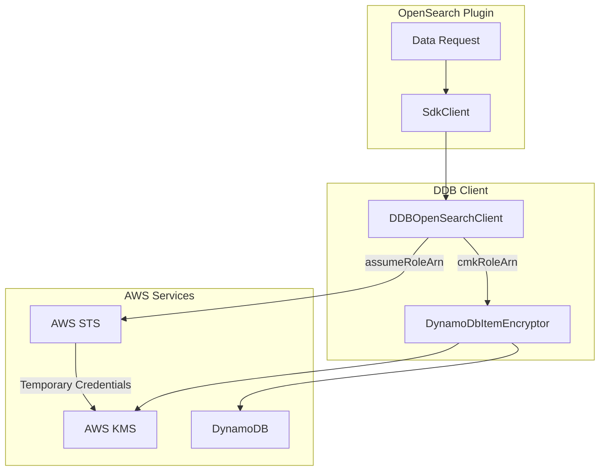

---
tags:
  - domain/core
  - component/server
  - search
---
# Remote Store CMK Support

## Summary

OpenSearch Remote Metadata SDK v3.4.0 adds Customer Master Key (CMK) support for encrypting and decrypting customer data stored in DynamoDB. This enhancement enables application-level encryption using AWS KMS keys, with support for cross-account access through IAM role assumption.

## Details

### What's New in v3.4.0

This release introduces two key capabilities:

1. **CMK Encryption Support** (PR #271): Enables encryption/decryption of customer data using AWS KMS Customer Master Keys
2. **Assume Role for CMK** (PR #295): Adds STS role assumption support for cross-account CMK access

### Technical Changes

#### Architecture Changes



#### New Components

| Component | Description |
|-----------|-------------|
| `cmkRoleArn` | Request parameter for specifying the KMS key ARN for encryption/decryption |
| `assumeRoleArn` | Request parameter for specifying an IAM role to assume for CMK access |
| `FixedCredsKmsClientSupplier` | Internal class that provides KMS client with specified credentials and region |
| `getEncryptorForTable()` | Method to create DynamoDB item encryptor with KMS keyring |

#### New Configuration

| Setting | Description | Default |
|---------|-------------|---------|
| `cmkRoleArn` | AWS KMS key ARN for encrypting/decrypting data | `null` (no encryption) |
| `assumeRoleArn` | IAM role ARN to assume for CMK access | `null` (use default credentials) |

#### API Changes

The following request classes now support CMK parameters:

- `DataObjectRequest` - Base class with `cmkRoleArn()` and `assumeRoleArn()` methods
- `GetDataObjectRequest` - Supports CMK decryption on read
- `PutDataObjectRequest` - Supports CMK encryption on write
- `WriteDataObjectRequest` - Base write class with CMK support

### Usage Example

```java
// Put request with CMK encryption
PutDataObjectRequest putRequest = PutDataObjectRequest.builder()
    .index("my-index")
    .id("doc-id")
    .tenantId("tenant-1")
    .dataObject(myDataObject)
    .cmkRoleArn("arn:aws:kms:us-east-1:123456789012:key/my-key-id")
    .assumeRoleArn("arn:aws:iam::123456789012:role/cmk-access-role")
    .build();

// Get request with CMK decryption
GetDataObjectRequest getRequest = GetDataObjectRequest.builder()
    .index("my-index")
    .id("doc-id")
    .tenantId("tenant-1")
    .cmkRoleArn("arn:aws:kms:us-east-1:123456789012:key/my-key-id")
    .assumeRoleArn("arn:aws:iam::123456789012:role/cmk-access-role")
    .build();
```

### Encryption Details

The implementation uses AWS Database Encryption SDK for DynamoDB with the following characteristics:

- **Encryption Scope**: Only the `SOURCE` field (document content) is encrypted
- **Signed Fields**: `HASH_KEY`, `RANGE_KEY`, and `SEQ_NO_KEY` are signed but not encrypted
- **Keyring Type**: AWS KMS Multi-Region Key (MRK) keyring for cross-region support
- **Credential Chain**: Supports default credentials or STS assume role for cross-account access

### Dependencies Added

| Dependency | Version | Purpose |
|------------|---------|---------|
| `aws-cryptographic-material-providers` | 1.11.0 | Cryptographic material providers for encryption |
| `aws-database-encryption-sdk-dynamodb` | 3.9.0 | DynamoDB encryption SDK |
| `software.amazon.awssdk:kms` | (AWS SDK version) | KMS client for key operations |
| `software.amazon.awssdk:sts` | 2.39.0 | STS client for role assumption |

### Migration Notes

To use CMK encryption:

1. Create a KMS key in your AWS account
2. Configure IAM permissions for the OpenSearch cluster to access the KMS key
3. (Optional) Create an IAM role for cross-account access if the KMS key is in a different account
4. Pass `cmkRoleArn` and optionally `assumeRoleArn` in your data requests

## Limitations

- CMK encryption is only supported for the DynamoDB backend (`ddb-client`)
- Encryption is applied at the application level, not at the DynamoDB table level
- Existing unencrypted data cannot be read with CMK parameters enabled
- Cross-region KMS access requires Multi-Region Keys (MRK)

## References

### Documentation
- [AWS Database Encryption SDK](https://docs.aws.amazon.com/database-encryption-sdk/latest/devguide/what-is-database-encryption-sdk.html): AWS documentation for database encryption
- [AWS KMS Multi-Region Keys](https://docs.aws.amazon.com/kms/latest/developerguide/multi-region-keys-overview.html): Multi-region key documentation
- [Release Notes v3.4.0](https://github.com/opensearch-project/opensearch-remote-metadata-sdk/blob/main/release-notes/opensearch-opensearch-remote-metadata-sdk.release-notes-3.4.0.0.md): Official release notes

### Pull Requests
| PR | Description |
|----|-------------|
| [#271](https://github.com/opensearch-project/opensearch-remote-metadata-sdk/pull/271) | Add CMK support to accept CMK to encrypt/decrypt customer data |
| [#295](https://github.com/opensearch-project/opensearch-remote-metadata-sdk/pull/295) | Add assume role for CMK |

## Related Feature Report

- [Full feature documentation](../../../features/opensearch-remote-metadata-sdk/opensearch-remote-metadata-sdk-remote-metadata-sdk.md)
