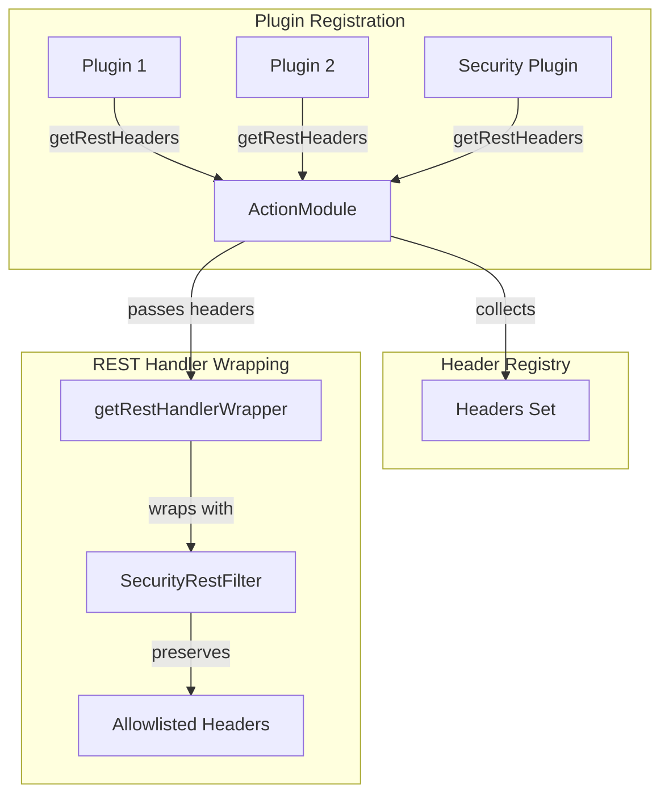

# ActionPlugin Enhancements

## Summary

This release enhances the `ActionPlugin.getRestHandlerWrapper` method by passing the registry of REST headers to the wrapper function. This enables plugins (particularly the Security plugin) to efficiently access allowlisted headers when wrapping REST handlers, fixing a bug where custom headers registered via `ActionPlugin.getRestHeaders` were being dropped by the Security plugin.

## Details

### What's New in v3.4.0

The `ActionPlugin.getRestHandlerWrapper` method signature has been updated to include a `Set<RestHeaderDefinition>` parameter containing all headers registered by plugins via `getRestHeaders()`. This allows REST handler wrappers to know which headers are explicitly allowlisted for propagation through the transport layer.

### Technical Changes

#### API Changes

The `ActionPlugin` interface now has an updated method signature:

```java
// Before (deprecated)
default UnaryOperator<RestHandler> getRestHandlerWrapper(ThreadContext threadContext) {
    return null;
}

// After (new signature)
default UnaryOperator<RestHandler> getRestHandlerWrapper(
    ThreadContext threadContext, 
    Set<RestHeaderDefinition> headersToCopy) {
    return this.getRestHandlerWrapper(threadContext);
}
```

#### Changed Files

| File | Change |
|------|--------|
| `ActionPlugin.java` | Added new method signature with `headersToCopy` parameter |
| `ActionModule.java` | Updated to pass headers set to `getRestHandlerWrapper` |
| `ShiroIdentityPlugin.java` | Updated to implement new method signature |

### Architecture



### Usage Example

```java
@Override
public UnaryOperator<RestHandler> getRestHandlerWrapper(
        ThreadContext threadContext, 
        Set<RestHeaderDefinition> headersToCopy) {
    return originalHandler -> (request, channel, client) -> {
        // Can now iterate through headersToCopy to preserve allowlisted headers
        for (RestHeaderDefinition header : headersToCopy) {
            String value = threadContext.getHeader(header.getName());
            if (value != null) {
                // Process or preserve the header
            }
        }
        originalHandler.handleRequest(request, channel, client);
    };
}
```

### Migration Notes

- The old single-parameter method is deprecated but still functional
- Plugins implementing `getRestHandlerWrapper` should migrate to the new two-parameter signature
- The new signature provides access to the complete set of allowlisted headers

## Limitations

- Only one plugin may implement `getRestHandlerWrapper` per cluster
- The old method signature is deprecated and will be removed in a future release

## Related PRs

| PR | Description |
|----|-------------|
| [#19875](https://github.com/opensearch-project/OpenSearch/pull/19875) | Pass registry of headers from ActionPlugin.getRestHeaders to ActionPlugin.getRestHandlerWrapper |

## References

- [Issue #4799](https://github.com/opensearch-project/security/issues/4799): SecurityRestFilter drops headers from ThreadContext
- [Security PR #5396](https://github.com/opensearch-project/security/pull/5396): Related fix in Security plugin

## Related Feature Report

- [Full feature documentation](../../../features/opensearch/actionplugin-rest-handler-wrapper.md)
