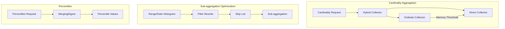

---
tags:
  - domain/core
  - component/server
  - performance
---
# Aggregation Optimizations

## Summary

OpenSearch v3.4.0 introduces significant performance improvements for multiple aggregation types. These optimizations deliver up to 10x performance gains for sub-aggregations with filter rewrite and skip list, 80% speedup for matrix_stats aggregation, and substantial latency improvements for percentiles and cardinality aggregations.

## Details

### What's New in v3.4.0

This release adds five major aggregation optimizations:

1. **Hybrid Cardinality Collector** - Dynamically switches between OrdinalsCollector and DirectCollector based on memory usage
2. **Filter Rewrite + Skip List for Sub-aggregations** - Combines multi-range traversal with skip list optimization for up to 10x improvement
3. **Percentiles MergingDigest Implementation** - Switches from AVLTreeDigest to faster MergingDigest algorithm
4. **Matrix Stats Primitive Arrays** - Replaces Map<String, Double> with primitive arrays to eliminate boxing overhead
5. **Auto Date Histogram Skip List** - Extends skip list optimization to auto_date_histogram aggregation

### Technical Changes

#### Architecture Changes



#### New Components

| Component | Description |
|-----------|-------------|
| `HybridCardinalityCollector` | Collector that starts with OrdinalsCollector and switches to DirectCollector when memory threshold is exceeded |
| `MergingDigest` | Faster t-digest implementation replacing AVLTreeDigest for percentiles |
| `RunningStats` (optimized) | Uses primitive double[]/long[] arrays instead of Map<String, Double/Long> |
| `AutoDateHistogramSkipList` | Skip list support for auto_date_histogram with dynamic rounding |

#### New Configuration

| Setting | Description | Default |
|---------|-------------|---------|
| `search.aggregations.cardinality.hybrid_collector.enabled` | Enable hybrid cardinality collector | `true` |
| `search.aggregations.cardinality.hybrid_collector.memory_threshold` | Memory threshold for switching collectors | Dynamic |

### Usage Example

```json
// Hybrid cardinality collector is automatically used
GET /logs/_search
{
  "size": 0,
  "aggs": {
    "unique_users": {
      "cardinality": {
        "field": "user_id.keyword"
      }
    }
  }
}

// Sub-aggregation with filter rewrite + skip list (automatic)
GET /metrics/_search
{
  "size": 0,
  "aggs": {
    "by_hour": {
      "date_histogram": {
        "field": "@timestamp",
        "fixed_interval": "1h"
      },
      "aggs": {
        "avg_value": { "avg": { "field": "value" } }
      }
    }
  }
}

// Percentiles with MergingDigest (automatic)
GET /response_times/_search
{
  "size": 0,
  "aggs": {
    "latency_percentiles": {
      "percentiles": {
        "field": "latency",
        "percents": [50, 95, 99]
      }
    }
  }
}
```

### Performance Improvements

| Optimization | Benchmark | Improvement |
|--------------|-----------|-------------|
| Filter Rewrite + Skip List | big5 workload | Up to 10x faster |
| Percentiles (MergingDigest) | http_logs @timestamp | 13s → 6.3s (52% faster) |
| Percentiles (MergingDigest) | http_logs status (low cardinality) | 197s → 6.2s (97% faster) |
| Matrix Stats | nyc_taxis | 15.6s → 3.1s (80% faster) |

### Migration Notes

All optimizations are enabled by default and require no configuration changes. The improvements are transparent to existing queries.

## Limitations

- Hybrid cardinality collector memory threshold is dynamically calculated based on available heap
- Filter rewrite + skip list optimization requires data sorted on the aggregation field for maximum benefit
- Auto date histogram skip list currently only works when auto_date_histogram is root or within range filter rewrite context

## References

### Documentation
- [Cardinality Aggregation Documentation](https://docs.opensearch.org/3.0/aggregations/metric/cardinality/)
- [Percentile Aggregation Documentation](https://docs.opensearch.org/3.0/aggregations/metric/percentile/)
- [Date Histogram Documentation](https://docs.opensearch.org/3.0/aggregations/bucket/date-histogram/)

### Pull Requests
| PR | Description |
|----|-------------|
| [#19524](https://github.com/opensearch-project/OpenSearch/pull/19524) | Add Hybrid Cardinality collector to prioritize Ordinals Collector |
| [#19573](https://github.com/opensearch-project/OpenSearch/pull/19573) | Combining filter rewrite and skip list to optimize sub aggregation |
| [#19648](https://github.com/opensearch-project/OpenSearch/pull/19648) | Change implementation for percentiles aggregation for latency improvement |
| [#19989](https://github.com/opensearch-project/OpenSearch/pull/19989) | Improve performance of matrix_stats aggregation |
| [#20057](https://github.com/opensearch-project/OpenSearch/pull/20057) | Add skiplist optimization to auto_date_histogram aggregation |

### Issues (Design / RFC)
- [Issue #19260](https://github.com/opensearch-project/OpenSearch/issues/19260): Auto Select Ordinals cardinality collector for high cardinality queries
- [Issue #18122](https://github.com/opensearch-project/OpenSearch/issues/18122): Speed up percentile aggregation by switching implementation
- [Issue #19741](https://github.com/opensearch-project/OpenSearch/issues/19741): Remove maps from hot loop in matrix_stats agg for performance
- [Issue #19827](https://github.com/opensearch-project/OpenSearch/issues/19827): Add skip_list logic to auto date histogram
- [Issue #17447](https://github.com/opensearch-project/OpenSearch/pull/17447): Support sub agg in filter rewrite optimization

## Related Feature Report

- [Full feature documentation](../../../features/opensearch/opensearch-aggregation-optimizations.md)
