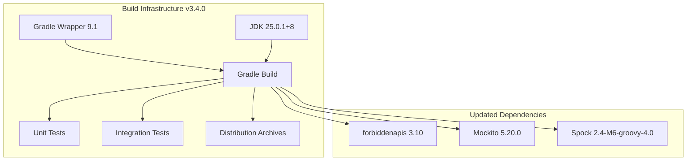

# Build Tool Upgrades

## Summary

OpenSearch v3.4.0 upgrades the build infrastructure with Gradle 9.1 and bundles JDK 25 as the default runtime. These updates bring modern build tooling, improved performance, and access to the latest Java features and optimizations.

## Details

### What's New in v3.4.0

- **Gradle 9.1**: Major upgrade from Gradle 8.x series, bringing improved build performance and new features
- **JDK 25**: Bundled JDK updated from JDK 24 to JDK 25.0.1+8 (Adoptium Temurin)
- **Dependency Updates**: Related tooling updates including forbiddenapis 3.10 and Mockito 5.20.0

### Technical Changes

#### Architecture Changes



#### Key File Changes

| File | Change |
|------|--------|
| `gradle/wrapper/gradle-wrapper.properties` | Updated to Gradle 9.1.0 |
| `gradle/libs.versions.toml` | JDK version 24.0.2+12 → 25.0.1+8 |
| `buildSrc/build.gradle` | Spock 2.3-groovy-3.0 → 2.4-M6-groovy-4.0 |
| `buildSrc/.../ThirdPartyAuditPrecommitPlugin.java` | forbiddenapis 3.8 → 3.10 |
| `buildSrc/.../DistroTestPlugin.java` | System/Gradle JDK 24.0.2+12 → 25.0.1+8 |

#### New Configuration

| Setting | Description | New Value |
|---------|-------------|-----------|
| `bundled_jdk` | Bundled JDK version | 25.0.1+8 |
| `bundled_jdk_vendor` | JDK vendor | adoptium |
| Gradle version | Build tool version | 9.1.0 |
| forbiddenapis | API checking tool | 3.10 |
| mockito | Mocking framework | 5.20.0 |

### Usage Example

```properties
# gradle/wrapper/gradle-wrapper.properties
distributionUrl=https\://services.gradle.org/distributions/gradle-9.1.0-all.zip
distributionSha256Sum=b84e04fa845fecba48551f425957641074fcc00a88a84d2aae5808743b35fc85
```

```toml
# gradle/libs.versions.toml
bundled_jdk_vendor = "adoptium"
bundled_jdk = "25.0.1+8"
mockito = "5.20.0"
```

### Migration Notes

1. **Gradle 9 Compatibility**: Build scripts using `$System.env.VARIABLE` syntax must be updated to `System.getenv("VARIABLE")` (already addressed in v3.3.0 across plugins)
2. **Groovy 4.0**: Spock framework updated to use Groovy 4.0, which may affect custom test code
3. **Warning Mode**: Gradle warning mode temporarily changed from `fail` to `all` pending Protobuf plugin update

### Build Verification

```bash
# Verify Gradle version
./gradlew --version

# Run full build with new tooling
./gradlew assemble

# Run tests with JDK 25
./gradlew test
```

## Limitations

- Gradle warning mode set to `all` instead of `fail` due to pending Protobuf Gradle plugin update
- Some third-party dependencies may require updates for full JDK 25 compatibility
- HDFS repository plugin requires additional Kerberos file permission for JDK 25

## Related PRs

| PR | Description |
|----|-------------|
| [#19575](https://github.com/opensearch-project/OpenSearch/pull/19575) | Update to Gradle 9.1 |
| [#19698](https://github.com/opensearch-project/OpenSearch/pull/19698) | Update bundled JDK to JDK-25 |

## References

- [Issue #19314](https://github.com/opensearch-project/OpenSearch/issues/19314): Update bundled JDK to JDK25
- [Gradle 9.1 Release Notes](https://docs.gradle.org/9.1/release-notes.html): Official Gradle documentation
- [Adoptium JDK 25](https://adoptium.net/): Eclipse Temurin JDK distribution
- [OpenSearch Releases](https://opensearch.org/releases/): Official release schedule

## Related Feature Report

- [Full feature documentation](../../../../features/multi-plugin/build-infrastructure-gradle-jdk.md)
