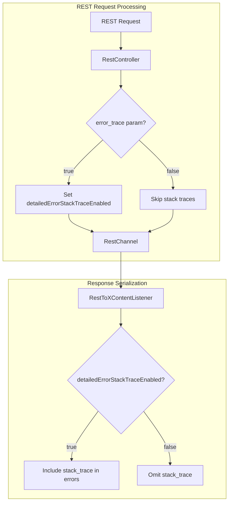

# Bulk API Enhancements

## Summary

This release adds proper support for the `error_trace` query parameter in Bulk HTTP APIs (`_bulk`, `_msearch`, `_mget`, `_mtermvectors`). Previously, the `error_trace` parameter was ignored for bulk operations when individual items failed, even though it worked correctly when the entire request failed. Now, detailed stack traces are consistently included in error responses when `error_trace=true` is specified.

## Details

### What's New in v3.4.0

The `error_trace` parameter now works consistently across all REST APIs, including bulk operations. When `error_trace=true` is set and `http.detailed_errors.enabled=true`, failed items in bulk responses will include the `stack_trace` field with detailed exception information.

### Technical Changes

#### Architecture Changes



#### New Components

| Component | Description |
|-----------|-------------|
| `RestChannel.detailedErrorStackTraceEnabled()` | New method to check if stack traces should be included |
| `AbstractRestChannel.detailedErrorStackTraceRequested` | Field to track `error_trace` parameter value |

#### Modified Components

| Component | Change |
|-----------|--------|
| `RestToXContentListener` | Added `getRequestParams()` method that injects `REST_EXCEPTION_SKIP_STACK_TRACE=false` when error traces are enabled |
| `RestStatusToXContentListener` | Updated to use `getRequestParams()` for consistent behavior |
| `RestController` | Added `detailedErrorStackTraceEnabled()` delegation in wrapper classes |
| `TraceableRestChannel` | Added `detailedErrorStackTraceEnabled()` delegation |

### Root Cause

The issue occurred because bulk API responses are serialized differently from regular error responses:

1. When a bulk request succeeds (HTTP 200) but contains failed items, the response serialization didn't use the `error_trace` parameter
2. The `rest.exception.stacktrace.skip` parameter defaulted to `true` (skip stack traces) during item serialization
3. The fix properly transforms `error_trace=true` to `rest.exception.stacktrace.skip=false` for all response serialization

### Usage Example

```bash
# Request with error_trace enabled
POST _bulk?error_trace=true
{ "update": { "_index": "movies", "_id": "nonexistent" } }
{ "doc": { "field": "value" } }

# Response now includes stack_trace for failed items
{
  "took": 2,
  "errors": true,
  "items": [
    {
      "update": {
        "_index": "movies",
        "_id": "nonexistent",
        "status": 404,
        "error": {
          "type": "document_missing_exception",
          "reason": "[nonexistent]: document missing",
          "index": "movies",
          "shard": "0",
          "index_uuid": "...",
          "stack_trace": "[movies/...][[movies][0]] DocumentMissingException[[nonexistent]: document missing]\n\tat org.opensearch.action.update.UpdateHelper..."
        }
      }
    }
  ]
}
```

### Affected APIs

- `_bulk` - Bulk indexing/update/delete operations
- `_msearch` - Multi-search operations
- `_mget` - Multi-get operations
- `_mtermvectors` - Multi-term vectors operations

### Prerequisites

- `http.detailed_errors.enabled` must be `true` (default) for stack traces to be included
- If `http.detailed_errors.enabled=false`, using `error_trace=true` returns HTTP 400

## Limitations

- Stack traces can significantly increase response size for bulk operations with many failures
- Stack traces are only included when `http.detailed_errors.enabled=true`

## References

### Documentation
- [Common REST Parameters](https://docs.opensearch.org/3.0/api-reference/common-parameters/): Documentation for error_trace parameter

### Pull Requests
| PR | Description |
|----|-------------|
| [#19985](https://github.com/opensearch-project/OpenSearch/pull/19985) | Implement error_trace parameter for HTTP Bulk requests |

### Issues (Design / RFC)
- [Issue #19945](https://github.com/opensearch-project/OpenSearch/issues/19945): Bug report - Bulk API ignores error_trace query parameter

## Related Feature Report

- [Full Bulk API documentation](../../../features/opensearch/bulk-api.md)
