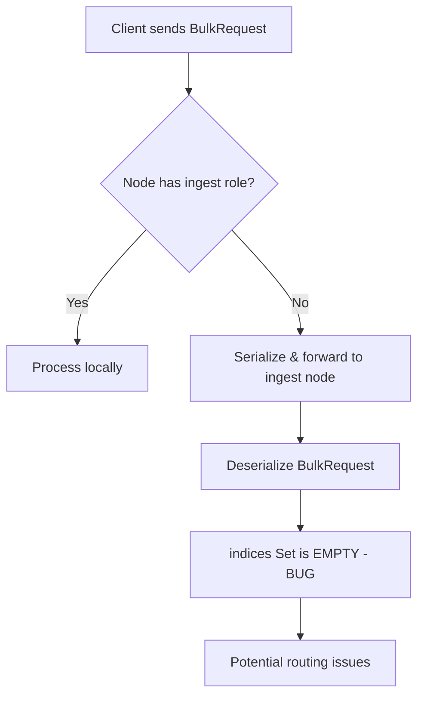

---
tags:
  - indexing
---

# Bulk Request Bugfixes

## Summary

This release fixes a bug in `BulkRequest` where the `indices` property was not properly initialized during deserialization from a `TransportRequest` stream. The fix ensures that the `getIndices()` method returns the correct set of index names after a bulk request is serialized and deserialized, which is critical for proper request routing when ingest pipelines are involved.

## Details

### What's New in v3.4.0

Fixed the handling of the `indices` property in `BulkRequest` during deserialization. Previously, the `indices` Set was empty after deserialization because it was neither serialized nor reconstructed from the request items.

### Technical Changes

#### The Problem

The `BulkRequest` class maintains an `indices` property that provides a shortcut to retrieve all index names referenced in bulk items. This Set is populated when documents are added via `add()` methods. However:

1. The `indices` property was not serialized in `writeTo()`
2. The deserialization constructor did not reconstruct the `indices` Set from the request items
3. After serialization/deserialization, `getIndices()` returned an empty Set

#### When This Occurs

This bug manifests in specific scenarios involving ingest pipelines:



The issue occurs when:
1. A bulk request is sent to a node without the "ingest" role
2. The request is serialized and forwarded to an ingest node
3. After deserialization, the `indices` property is empty

#### The Fix

A single line was added to the `BulkRequest` deserialization constructor to reconstruct the `indices` Set:

```java
public BulkRequest(StreamInput in) throws IOException {
    super(in);
    waitForActiveShards = ActiveShardCount.readFrom(in);
    requests.addAll(in.readList(i -> DocWriteRequest.readDocumentRequest(null, i)));
    refreshPolicy = RefreshPolicy.readFrom(in);
    timeout = in.readTimeValue();
    if (in.getVersion().onOrAfter(Version.V_2_14_0) && in.getVersion().before(Version.V_3_0_0)) {
        in.readInt(); // formerly batch_size
    }
    // NEW: Reconstruct indices Set from deserialized requests
    requests.stream().map(DocWriteRequest::index).forEach(indices::add);
}
```

### Usage Example

After this fix, the following behavior is guaranteed:

```java
// Create bulk request
BulkRequest bulkRequest = new BulkRequest()
    .add(new IndexRequest("index1").id("1").source(Map.of("field", "value")))
    .add(new IndexRequest("index2").id("2").source(Map.of("field", "value")));

// Serialize
BytesStreamOutput out = new BytesStreamOutput();
bulkRequest.writeTo(out);

// Deserialize
BulkRequest deserializedRequest = new BulkRequest(out.bytes().streamInput());

// Now correctly returns {"index1", "index2"}
Set<String> indices = deserializedRequest.getIndices();
```

### Migration Notes

No migration required. This is a transparent bug fix that ensures correct behavior.

## Limitations

- This fix only affects the deserialization path; the `indices` property is still not explicitly serialized (it's reconstructed from the request items)

## References

### Documentation
- [Bulk API Documentation](https://docs.opensearch.org/3.0/api-reference/document-apis/bulk/): Official documentation
- [TransportBulkAction.java](https://github.com/opensearch-project/OpenSearch/blob/main/server/src/main/java/org/opensearch/action/bulk/TransportBulkAction.java): Code showing when serialization occurs

### Pull Requests
| PR | Description |
|----|-------------|
| [#20132](https://github.com/opensearch-project/OpenSearch/pull/20132) | Fixed handling of property index in BulkRequest during deserialization |

## Related Feature Report

- [Full Bulk API documentation](../../../features/opensearch/bulk-api.md)
