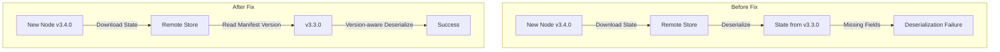

# Cluster State & Allocation Bugfixes

## Summary

This release item includes two important bugfixes that improve cluster stability and reliability:

1. **Concurrent Modification Fix in Allocation Filters**: Fixes a potential `ConcurrentModificationException` when updating allocation filters in `DiscoveryNodeFilters`, along with null-pointer safety improvements in `FilterAllocationDecider`.

2. **Remote State Version Compatibility Fix**: Adds version-aware serialization/deserialization for remote cluster state entities, fixing version incompatibility issues during cluster upgrades when using remote publication mode.

## Details

### What's New in v3.4.0

#### Fix 1: Concurrent Modification in DiscoveryNodeFilters

The `DiscoveryNodeFilters.buildOrUpdateFromKeyValue()` method was sharing the internal filters map between the original and updated instances. This could cause `ConcurrentModificationException` when one thread reads filters while another thread updates them.

**Technical Changes:**

- `DiscoveryNodeFilters`: Now creates a defensive copy of the filters map when building from an existing instance
- `FilterAllocationDecider`: Copies volatile fields to local variables before null-checking to prevent race conditions

```java
// Before (vulnerable to concurrent modification)
updated = new DiscoveryNodeFilters(original.opType, original.filters);

// After (thread-safe)
updated = new DiscoveryNodeFilters(original.opType, new HashMap<>(original.filters));
```

#### Fix 2: Remote State Version Compatibility

Remote publication entities using bytestream serialization were not setting the OpenSearch version in the bytestream. This caused failures during version upgrades when new nodes tried to deserialize cluster state that didn't include new attributes added in later versions.

**Technical Changes:**

- `ChecksumWritableBlobStoreFormat`: Added `opensearchVersion` field and constructor overload to support version-aware deserialization
- Remote state entities now pass the manifest's OpenSearch version during deserialization:
  - `RemoteClusterBlocks`
  - `RemoteDiscoveryNodes`
  - `RemoteHashesOfConsistentSettings`
  - `RemoteClusterStateCustoms`
  - `RemoteIndexRoutingTable`
  - `RemoteRoutingTableDiff`



### Components Changed

| Component | Description |
|-----------|-------------|
| `DiscoveryNodeFilters` | Defensive copy of filters map to prevent concurrent modification |
| `FilterAllocationDecider` | Local variable caching for volatile fields |
| `ChecksumWritableBlobStoreFormat` | Version-aware serialization/deserialization |
| `RemoteClusterStateService` | Passes manifest version to remote entity readers |
| Remote state entities | Accept version parameter for deserialization |

### Migration Notes

These are bugfixes with no migration required. The changes are backward compatible and will automatically take effect after upgrading to v3.4.0.

## Limitations

- The remote state version fix requires all nodes in the cluster to be upgraded to benefit from the improved version handling during mixed-version rolling upgrades.

## References

### Documentation
- [Remote Cluster State Documentation](https://docs.opensearch.org/3.0/tuning-your-cluster/availability-and-recovery/remote-store/remote-cluster-state/): Official documentation

### Pull Requests
| PR | Description |
|----|-------------|
| [#19701](https://github.com/opensearch-project/OpenSearch/pull/19701) | Fix potential concurrent modification exception in DiscoveryNodeFilters |
| [#20080](https://github.com/opensearch-project/OpenSearch/pull/20080) | Adding version checks to remote entities using bytestream ser/de |

### Issues (Design / RFC)
- [Issue #19843](https://github.com/opensearch-project/OpenSearch/issues/19843): BUG - Modification to ClusterState Object lacks backward compatibility in remote publication mode

## Related Feature Report

- [Full feature documentation](../../../features/opensearch/cluster-state-allocation.md)
