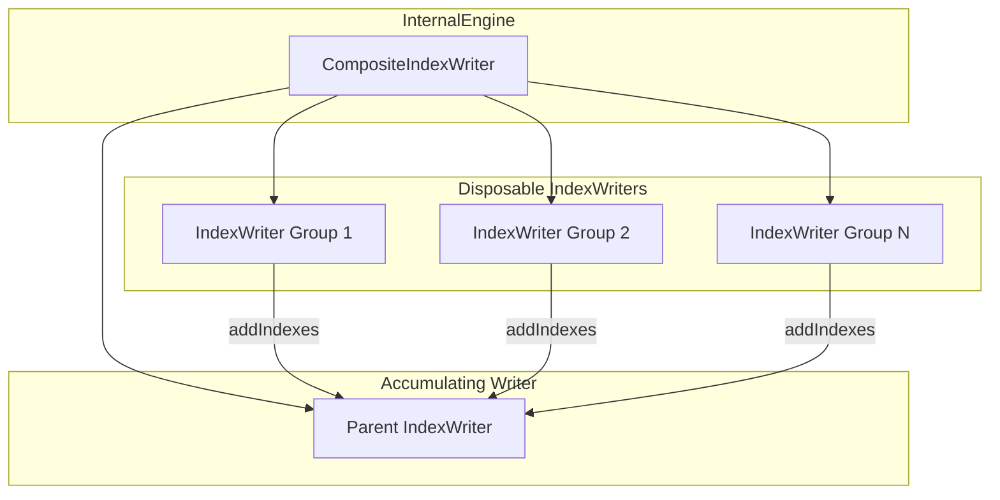

---
tags:
  - indexing
  - performance
  - search
---

# Context Aware Segments

## Summary

Context Aware Segments is a new indexing optimization feature that collocates related documents into the same segments based on a grouping criteria function. This enables more efficient query execution by ensuring that documents frequently queried together reside in the same segments, significantly improving query performance for workloads with predictable access patterns like log analytics.

## Details

### What's New in v3.4.0

This release introduces the foundational implementation of Context Aware Segments, including:

- **CompositeIndexWriter**: A new wrapper class that manages multiple group-specific IndexWriters
- **Disposable IndexWriters**: Pool of group-specific IndexWriters modeled after Lucene's DWPTs
- **CriteriaBasedMergePolicy**: Ensures segments from the same group are merged together
- **CriteriaBasedCodec**: Attaches bucket attributes to segments for group identification
- **Feature flag**: `opensearch.experimental.feature.context_aware.migration.enabled`

### Technical Changes

#### Architecture Changes



#### New Components

| Component | Description |
|-----------|-------------|
| `CompositeIndexWriter` | Unified interface for coordinating write operations with group-specific IndexWriters |
| `DisposableIndexWriter` | Group-specific IndexWriter with three states: Active, Mark for Refresh, Close |
| `CriteriaBasedIndexWriterLookup` | Lookup map for managing IndexWriters per refresh cycle |
| `LiveIndexWriterDeletesMap` | Tracks updates/deletions using refresh-rotating map structure |
| `CriteriaBasedMergePolicy` | Merge policy ensuring same-group segments merge together |
| `CriteriaBasedCodec` | Codec attaching bucket attributes to segments |
| `DocumentIndexWriter` | Interface abstracting IndexWriter operations |
| `LuceneIndexWriter` | Standard IndexWriter wrapper for non-CAS indices |
| `LookupMapLockAcquisitionException` | Exception for lock acquisition failures |

#### New Configuration

| Setting | Description | Default |
|---------|-------------|---------|
| `index.context_aware.enabled` | Enable context aware segments for the index | `false` |
| `index.context_aware.max_retry_on_lookup_map_acquisition_exception` | Max retries on lock acquisition failure | `15` |

#### Feature Flag

| Flag | Description | Default |
|------|-------------|---------|
| `opensearch.experimental.feature.context_aware.migration.enabled` | Enable context aware segments feature | `false` |

### Usage Example

```yaml
# Enable feature flag at node startup
opensearch.experimental.feature.context_aware.migration.enabled: true
```

```json
// Create index with context aware segments enabled
PUT /my-logs-index
{
  "settings": {
    "index.context_aware.enabled": true
  }
}
```

### How It Works

1. **Indexing**: Documents are routed to group-specific IndexWriters based on a grouping criteria function
2. **Refresh**: Group-specific writers are synced with the parent accumulating IndexWriter via `addIndexes` API
3. **Version Resolution**: Version map maintained per refresh cycle; lookups check version map then parent IndexWriter
4. **Updates/Deletes**: Tracked in `LiveIndexWriterDeletesMap`; previous versions soft-deleted during refresh
5. **Merging**: `CriteriaBasedMergePolicy` ensures segments from the same group merge together

### Migration Notes

- This is an experimental feature behind a feature flag
- Requires node restart to enable the feature flag
- Index setting `index.context_aware.enabled` is final (cannot be changed after index creation)
- Search idle is automatically disabled for context-aware indices

## Limitations

- Experimental feature - not recommended for production use
- Updates to document fields that determine grouping criteria are not supported
- Search idle is disabled for context-aware indices to ensure periodic sync between child and parent IndexWriters
- Blocking refresh is always used when context aware is enabled

## References

### Pull Requests
| PR | Description |
|----|-------------|
| [#19098](https://github.com/opensearch-project/OpenSearch/pull/19098) | Add support for context aware segments |

### Issues (Design / RFC)
- [Issue #19530](https://github.com/opensearch-project/OpenSearch/issues/19530): LLD for Context Aware Segments
- [RFC #18576](https://github.com/opensearch-project/OpenSearch/issues/18576): Context Aware Segments RFC

## Related Feature Report

- [Full feature documentation](../../../features/opensearch/opensearch-context-aware-segments.md)
