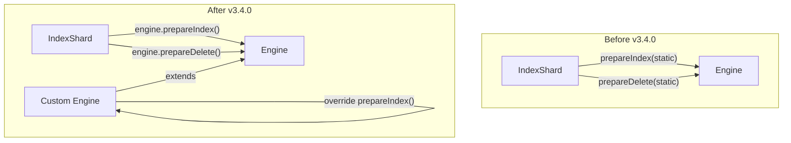

# Engine Refactoring

## Summary

OpenSearch v3.4.0 introduces engine refactoring changes that improve extensibility for custom engine implementations. The changes move document preparation methods (`prepareIndex`, `prepareDelete`) from `IndexShard` to the `Engine` class and make `NoOpResult` constructors public, enabling plugins to implement custom storage engines that can bypass the default mapping framework.

## Details

### What's New in v3.4.0

This release includes three key refactoring changes to the Engine layer:

1. **Moved `prepareIndex` and `prepareDelete` to Engine class** - These methods are now instance methods on the `Engine` class instead of static methods on `IndexShard`, allowing custom engines to override document preparation logic.

2. **Made `Engine#loadHistoryUUID()` protected** - Enables subclasses to access history UUID loading functionality.

3. **Made `Origin#isFromTranslog()` public** - Allows custom engines to check if an operation originated from translog replay.

4. **Made `NoOpResult` constructors public** - Custom engine implementations can now create `NoOpResult` instances when overriding the `noOp()` method.

### Technical Changes

#### Architecture Changes



#### New Methods in Engine Class

| Method | Description | Visibility |
|--------|-------------|------------|
| `prepareIndex()` | Prepares an index operation by parsing source document | `public` |
| `prepareDelete()` | Prepares a delete operation | `public` |
| `loadHistoryUUID()` | Loads history UUID from commit data | `protected` |

#### Visibility Changes

| Class/Method | Before | After |
|--------------|--------|-------|
| `NoOpResult(long term, long seqNo)` | package-private | `public` |
| `NoOpResult(long term, long seqNo, Exception failure)` | package-private | `public` |
| `Origin#isFromTranslog()` | package-private | `public` |
| `Engine#loadHistoryUUID()` | private | `protected` |

### Usage Example

Custom engine implementations can now override document preparation:

```java
public class CustomEngine extends Engine {
    
    @Override
    public Engine.Index prepareIndex(
        DocumentMapperForType docMapper,
        SourceToParse source,
        long seqNo,
        long primaryTerm,
        long version,
        VersionType versionType,
        Engine.Operation.Origin origin,
        long autoGeneratedIdTimestamp,
        boolean isRetry,
        long ifSeqNo,
        long ifPrimaryTerm
    ) {
        // Custom document parsing logic
        // Can bypass default mapping framework for specialized use cases
        long startTime = System.nanoTime();
        ParsedDocument doc = customParse(source);
        Term uid = new Term(IdFieldMapper.NAME, Uid.encodeId(doc.id()));
        return new Engine.Index(uid, doc, seqNo, primaryTerm, version, 
            versionType, origin, startTime, autoGeneratedIdTimestamp, 
            isRetry, ifSeqNo, ifPrimaryTerm);
    }
    
    @Override
    public NoOpResult noOp(NoOp noOp) {
        // Can now create NoOpResult directly
        return new NoOpResult(noOp.primaryTerm(), noOp.seqNo());
    }
}
```

### Migration Notes

The static methods on `IndexShard` are now deprecated:

```java
// Deprecated (v3.4.0)
@Deprecated(since = "3.4.0", forRemoval = true)
public static Engine.Index IndexShard.prepareIndex(...)

@Deprecated(since = "3.4.0", forRemoval = true)  
public static Engine.Delete IndexShard.prepareDelete(...)

// New approach
engine.prepareIndex(...)
engine.prepareDelete(...)
```

Existing code using the static methods will continue to work but should migrate to the instance methods on Engine.

## Limitations

- Custom engines must properly handle all parameters passed to `prepareIndex()` and `prepareDelete()`
- Overriding these methods requires understanding of the document lifecycle and translog integration
- The deprecated static methods will be removed in a future release

## Related PRs

| PR | Description |
|----|-------------|
| [#19551](https://github.com/opensearch-project/OpenSearch/pull/19551) | Refactor to move prepareIndex and prepareDelete methods to Engine class |
| [#19950](https://github.com/opensearch-project/OpenSearch/pull/19950) | Update NoOpResult constructors in the Engine to be public |

## References

- [Issue #19550](https://github.com/opensearch-project/OpenSearch/issues/19550): Feature request for custom document parsing
- [Issue #19949](https://github.com/opensearch-project/OpenSearch/issues/19949): Feature request for public NoOpResult constructors
- [Introduction to OpenSearch Plugins](https://opensearch.org/blog/plugins-intro/): Blog post explaining Engine Plugin interface

## Related Feature Report

- [Full feature documentation](../../../../features/opensearch/engine-api.md)
