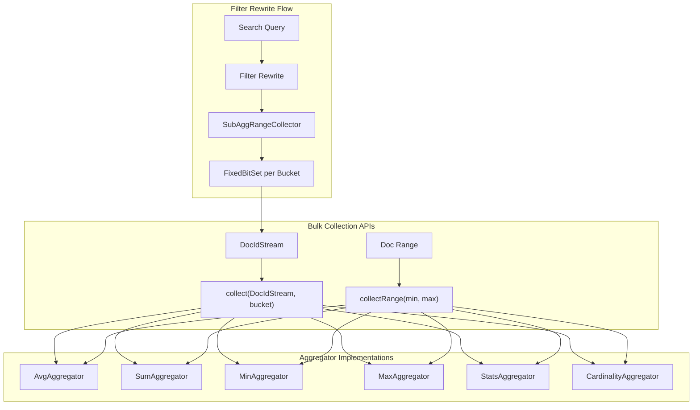

# Filter Rewrite Optimization

## Summary

OpenSearch v3.4.0 introduces bulk collection APIs for filter rewrite sub-aggregation optimization. These changes enable more efficient document collection by processing multiple documents at once instead of individually, delivering up to 20% performance improvement for cardinality aggregations and significant gains for other metrics aggregations.

## Details

### What's New in v3.4.0

This release adds four key improvements to the filter rewrite optimization:

1. **Deleted Documents Handling** - Filter rewrite sub-aggregation optimization now works with segments containing deleted documents
2. **Bulk Collect API** - New `collect(DocIdStream, long)` method for batch document collection
3. **collectRange API** - New `collectRange(int min, int max)` method leveraging Lucene's DocValuesSkipper for pre-aggregated data
4. **Metrics/Cardinality Bulk Collection** - Specific implementations for avg, sum, min, max, stats, and cardinality aggregations

### Technical Changes

#### Architecture Changes



#### New Components

| Component | Description |
|-----------|-------------|
| `DocIdStreamHelper` | Helper class for creating BitSetDocIdStream from FixedBitSet (Lucene package-private access) |
| `LeafBucketCollector.collect(DocIdStream, long)` | Bulk collection API for processing multiple doc IDs into a bucket |
| `LeafBucketCollector.collectRange(int, int)` | Range collection API leveraging DocValuesSkipper pre-aggregated data |
| `SubAggRangeCollector` | Updated to use bulk collection instead of iterator-based collection |

#### API Changes

New methods added to `LeafBucketCollector`:

```java
// Bulk-collect doc IDs within owningBucketOrd
@ExperimentalApi
public void collect(DocIdStream stream, long owningBucketOrd) throws IOException {
    stream.forEach((doc) -> collect(doc, owningBucketOrd));
}

// Collect a range of doc IDs using pre-aggregated data from DocValuesSkipper
@Override
public void collectRange(int min, int max) throws IOException {
    for (int docId = min; docId < max; docId++) {
        collect(docId, 0);
    }
}
```

### Usage Example

```json
// Range aggregation with sub-aggregations benefits from bulk collection
GET /metrics/_search
{
  "size": 0,
  "aggs": {
    "by_range": {
      "range": {
        "field": "value",
        "ranges": [
          { "from": 0, "to": 100 },
          { "from": 100, "to": 500 },
          { "from": 500, "to": 1000 }
        ]
      },
      "aggs": {
        "avg_metric": { "avg": { "field": "metric" } },
        "unique_users": { "cardinality": { "field": "user_id" } }
      }
    }
  }
}

// Date histogram with metrics sub-aggregations
GET /logs/_search
{
  "size": 0,
  "aggs": {
    "by_hour": {
      "date_histogram": {
        "field": "@timestamp",
        "fixed_interval": "1h"
      },
      "aggs": {
        "stats": { "stats": { "field": "response_time" } },
        "unique_ips": { "cardinality": { "field": "client_ip" } }
      }
    }
  }
}
```

### Performance Improvements

| Aggregation Type | Improvement |
|------------------|-------------|
| Cardinality | Up to 20% faster |
| Avg/Sum/Min/Max | Reduced virtual call overhead |
| Stats | Batch processing of values |

### Migration Notes

All optimizations are enabled by default and require no configuration changes. The improvements are transparent to existing queries.

## Limitations

- Bulk collection benefits are most significant when filter rewrite optimization is triggered
- `collectRange` API requires queries that rewrite to MatchAllDocsQuery, PointRangeQuery on fully matching segments, or doc-value range queries
- Performance gains depend on data distribution and aggregation complexity

## References

### Documentation
- [Lucene PR #14401](https://github.com/apache/lucene/pull/14401): Enable collectors to take advantage of pre-aggregated data

### Pull Requests
| PR | Description |
|----|-------------|
| [#19643](https://github.com/opensearch-project/OpenSearch/pull/19643) | Handle deleted documents for filter rewrite sub-aggregation optimization |
| [#19933](https://github.com/opensearch-project/OpenSearch/pull/19933) | Add bulk collect API for filter rewrite sub-aggregation optimization |
| [#20009](https://github.com/opensearch-project/OpenSearch/pull/20009) | Allow collectors take advantage of preaggregated data using collectRange API |
| [#20067](https://github.com/opensearch-project/OpenSearch/pull/20067) | Bulk collection logic for metrics and cardinality aggregations |

### Issues (Design / RFC)
- [Issue #19642](https://github.com/opensearch-project/OpenSearch/issues/19642): Handle deleted documents for filter rewrite subaggregation optimization
- [Issue #19324](https://github.com/opensearch-project/OpenSearch/issues/19324): [META] Use Lucene bulk collection API to speed up aggregation
- [Issue #20031](https://github.com/opensearch-project/OpenSearch/issues/20031): [META] Advanced Query Engine Performance Optimizations in OpenSearch

## Related Feature Report

- [Full feature documentation](../../../features/opensearch/filter-rewrite-optimization.md)
