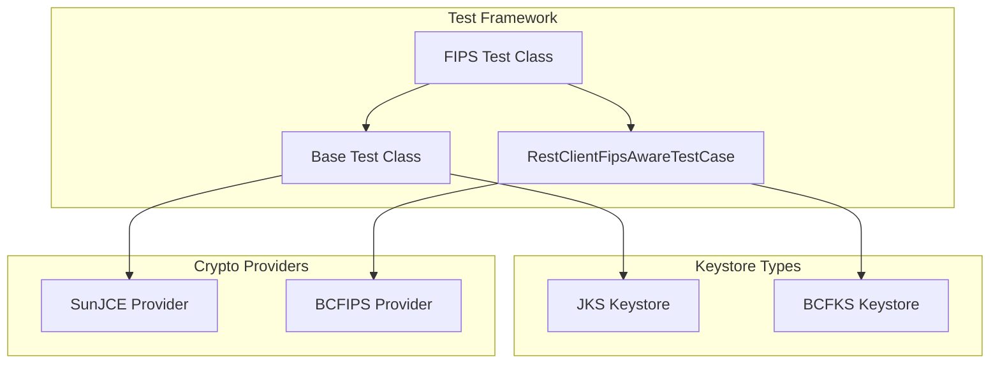

# FIPS Compliance

## Summary

OpenSearch v3.4.0 adds comprehensive FIPS 140-3 compliance support for the test suite, enabling developers to build and test OpenSearch under FIPS-compliant JVM environments. This change allows the entire test suite to run with FIPS-approved cryptographic algorithms using the Bouncy Castle FIPS (BC-FIPS) provider.

## Details

### What's New in v3.4.0

This release makes the OpenSearch test suite fully runnable under FIPS 140-3 compliance mode by:

1. Adding FIPS-aware test variants that use BCFKS keystores instead of JKS
2. Introducing `RestClientFipsAwareTestCase` interface for SSL context handling
3. Creating separate FIPS test classes that extend base tests with FIPS-specific behavior
4. Adding BC-FIPS dependencies to test runtime configurations

### Technical Changes

#### Architecture Changes



#### New Components

| Component | Description |
|-----------|-------------|
| `RestClientFipsAwareTestCase` | Interface providing FIPS-aware SSL context creation |
| `*FipsTests` classes | FIPS-specific test variants (e.g., `KeyStoreWrapperFipsTests`) |
| `fips.gradle` | Gradle configuration for FIPS test dependencies |
| `.bcfks` keystores | BCFKS format keystores for FIPS-compliant testing |

#### New Configuration

| Setting | Description | Default |
|---------|-------------|---------|
| `-Pcrypto.standard=FIPS-140-3` | Gradle parameter to enable FIPS mode | Not set |
| `testFipsRuntimeOnly` | Gradle configuration for FIPS test dependencies | N/A |

### Usage Example

To run tests in FIPS mode:

```bash
# Build and test with FIPS compliance
./gradlew test -Pcrypto.standard=FIPS-140-3
```

The `RestClientFipsAwareTestCase` interface automatically selects the appropriate keystore type:

```java
interface RestClientFipsAwareTestCase {
    default SSLContext getSslContext(boolean server) throws Exception {
        if (inFipsJvm()) {
            return getSslContext(server, "BCFKS", 
                SecureRandom.getInstance("DEFAULT", "BCFIPS"), ".bcfks");
        }
        return getSslContext(server, "JKS", new SecureRandom(), ".jks");
    }
}
```

### Migration Notes

For test developers:
- Extend `*FipsTests` classes for FIPS-specific test behavior
- Use `assumeFalse("Can't use empty password in a FIPS JVM", inFipsJvm())` to skip tests incompatible with FIPS
- Provide `.bcfks` keystore files alongside `.jks` files for SSL tests

## Limitations

- Empty keystore passwords are not allowed in FIPS mode
- Legacy keystore formats (v1, v2) cannot be loaded in FIPS JVM due to PBE unavailability
- Some tests are skipped in FIPS mode due to algorithm restrictions

## References

### Pull Requests
| PR | Description |
|----|-------------|
| [#18491](https://github.com/opensearch-project/OpenSearch/pull/18491) | Make test-suite runnable under FIPS compliance support |
| [#18921](https://github.com/opensearch-project/OpenSearch/pull/18921) | Add build-tooling to run in FIPS environment |
| [#14912](https://github.com/opensearch-project/OpenSearch/pull/14912) | Original FIPS compliance PR (predecessor) |

### Issues (Design / RFC)
- [RFC #4254](https://github.com/opensearch-project/security/issues/4254): FIPS-140 Compliance Roadmap for OpenSearch
- [Issue #17634](https://github.com/opensearch-project/OpenSearch/issues/17634): META - Replace Bouncycastle dependencies with FIPS counterparts
- [Issue #18324](https://github.com/opensearch-project/OpenSearch/issues/18324): Documentation for FIPS configuration

## Related Feature Report

- [Full feature documentation](../../../../features/opensearch/fips-compliance.md)
