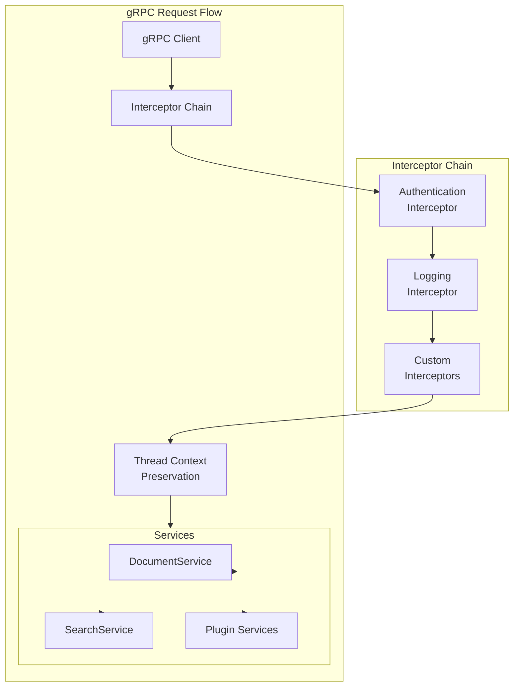

---
tags:
  - search
  - security
---

# GRPC Transport

## Summary

OpenSearch v3.4.0 significantly enhances the gRPC transport layer with expanded query support, pluggable interceptors, thread context preservation, binary document format support, and improved error handling. These changes make gRPC a more robust and extensible alternative to HTTP REST APIs.

## Details

### What's New in v3.4.0

This release focuses on three major areas: extensibility through interceptors and custom services, expanded search query support, and improved developer experience.

### Technical Changes

#### Architecture Changes



#### New Components

| Component | Description |
|-----------|-------------|
| `GrpcInterceptorProvider` | Interface for plugins to provide custom gRPC interceptors with explicit ordering |
| `ContextPreservingServerCallListener` | Preserves ThreadContext across gRPC async callbacks |
| `GrpcServiceFactory` | Extension point for plugins to register custom BindableService implementations |
| `MediaTypeRegistry.mediaTypeFromBytes` | Auto-detects document format (JSON, CBOR, SMILE, YAML) from binary content |

#### New Configuration

| Setting | Description | Default |
|---------|-------------|---------|
| N/A | Interceptors are discovered via plugin SPI | - |

#### API Changes

**New Query Types Supported:**

| Category | Query Types |
|----------|-------------|
| Full-text | `match`, `match_bool_prefix`, `match_phrase_prefix`, `prefix` |
| Compound | `constant_score`, `function_score` |
| Term-level | `fuzzy` |
| Search Features | `highlight`, `sort` |

**Bulk API Enhancements:**

- Auto-detection of document formats (JSON, CBOR, SMILE, YAML)
- Each document in a bulk request can use different encoding
- No explicit content-type header required (unlike HTTP)

**Error Response Improvements:**

- Full error details matching HTTP response format
- Root cause, stack trace, and nested exceptions included
- HTTP status code preserved in gRPC error details

### Usage Example

**Bulk Request with Mixed Document Formats:**

```bash
grpcurl -plaintext \
  -import-path ~/OpenSearch/ \
  -proto ~/OpenSearch/protos/services/document_service.proto \
  -d @ localhost:9400 \
  org.opensearch.protobufs.services.DocumentService/Bulk <<'EOM'
{
  "index": "movies",
  "bulk_request_body": [
    {
      "operation_container": {
        "create": { "x_index": "movies", "x_id": "json-doc-1" }
      },
      "object": "eyJ0aXRsZSI6IkluY2VwdGlvbiIsInllYXIiOjIwMTB9"
    },
    {
      "operation_container": {
        "create": { "x_index": "movies", "x_id": "cbor-doc-1" }
      },
      "object": "uQACZXRpdGxlaUluY2VwdGlvbmR5ZWFyGQfa"
    }
  ]
}
EOM
```

**Search with Highlight and Sort:**

```bash
grpcurl -plaintext \
  -import-path ~/OpenSearch/ \
  -proto ~/OpenSearch/protos/services/search_service.proto \
  -d @ localhost:9400 \
  org.opensearch.protobufs.services.SearchService/Search <<'EOM'
{
  "index": ["movies"],
  "search_request_body": {
    "query": {
      "match": {
        "title": { "query": "inception" }
      }
    },
    "highlight": {
      "fields": { "title": {} }
    },
    "sort": [
      { "year": { "order": "desc" } }
    ]
  }
}
EOM
```

**Custom gRPC Interceptor Plugin:**

```java
public class MyPlugin extends Plugin implements GrpcInterceptorProvider {
    
    @Override
    public List<ServerInterceptor> getInterceptors(ThreadContext threadContext) {
        return List.of(new MyLoggingInterceptor());
    }
    
    @Override
    public int getOrder() {
        return 100; // Higher values execute later
    }
}
```

### Migration Notes

- Protobufs dependency updated from 0.22.0 to 0.24.0 - regenerate client stubs
- Security plugin requires corresponding protobuf version bump for gRPC integration tests

## Limitations

- **Aggregations**: Not yet supported in gRPC Search API
- **Suggest**: Not yet supported in gRPC Search API
- **typed_keys**: Parameter not supported in gRPC requests
- **global_params**: Parameter not supported in Bulk/Search requests

## References

### Documentation
- [gRPC APIs Documentation](https://docs.opensearch.org/3.0/api-reference/grpc-apis/index/): Official docs
- [Bulk (gRPC) API](https://docs.opensearch.org/3.0/api-reference/grpc-apis/bulk/): Bulk endpoint reference
- [Search (gRPC) API](https://docs.opensearch.org/3.0/api-reference/grpc-apis/search/): Search endpoint reference

### Pull Requests
| PR | Description |
|----|-------------|
| [#19005](https://github.com/opensearch-project/OpenSearch/pull/19005) | Introduce gRPC Interceptor Chain with pluggable interceptors |
| [#19304](https://github.com/opensearch-project/OpenSearch/pull/19304) | Add BindableServices extension point for custom gRPC services |
| [#19568](https://github.com/opensearch-project/OpenSearch/pull/19568) | Return full error details for gRPC error responses |
| [#19744](https://github.com/opensearch-project/OpenSearch/pull/19744) | Add SMILE/CBOR/YAML document format support to Bulk gRPC endpoint |
| [#19776](https://github.com/opensearch-project/OpenSearch/pull/19776) | Thread Context preservation by gRPC Interceptor |
| [#19831](https://github.com/opensearch-project/OpenSearch/pull/19831) | Bump opensearch-protobufs to 0.23.0 |
| [#19854](https://github.com/opensearch-project/OpenSearch/pull/19854) | Implement ConstantScoreQuery, FuzzyQuery, MatchBoolPrefixQuery, etc. |
| [#19868](https://github.com/opensearch-project/OpenSearch/pull/19868) | Implement Highlight and Sort for gRPC Search |
| [#19888](https://github.com/opensearch-project/OpenSearch/pull/19888) | Implement FunctionScoreQuery |
| [#20059](https://github.com/opensearch-project/OpenSearch/pull/20059) | Bump opensearch-protobufs to 0.24.0, add DerivedFields support |
| [#20162](https://github.com/opensearch-project/OpenSearch/pull/20162) | Throw exceptions for unsupported gRPC request fields |
| [#5763](https://github.com/opensearch-project/security/pull/5763) | Fix security plugin compilation for protobuf 0.23.0 |

### Issues (Design / RFC)
- [Issue #19526](https://github.com/opensearch-project/OpenSearch/issues/19526): gRPC Search query support tracking
- [Issue #19311](https://github.com/opensearch-project/OpenSearch/issues/19311): Binary format support for Bulk API
- [Issue #5379](https://github.com/opensearch-project/security/issues/5379): gRPC extension points for security

## Related Feature Report

- [Full feature documentation](../../../features/opensearch/grpc-transport--services.md)
