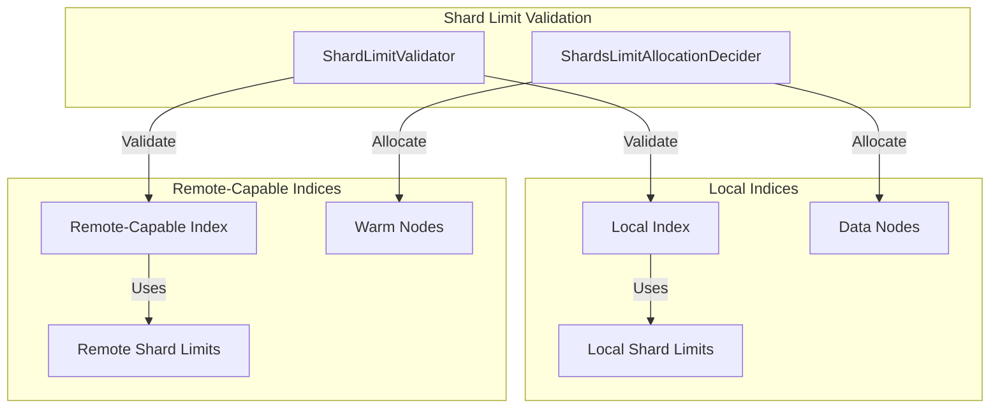

---
tags:
  - indexing
---

# Index Settings

## Summary

OpenSearch v3.4.0 introduces two significant enhancements to index settings: the ability to set custom `index.creation_date` during index creation and migrations, and separate shard limit validation for local and remote-capable indices. These changes improve migration workflows and enable better resource utilization in tiered storage architectures.

## Details

### What's New in v3.4.0

#### 1. Custom Creation Date Setting

The `index.creation_date` setting has been changed from a private setting to a final setting, allowing users to explicitly set the creation timestamp during index creation and snapshot restore operations.

**Key Changes:**
- `index.creation_date` can now be set during index creation
- The setting remains immutable after creation (final setting)
- Aligns behavior with snapshot restore for migration compatibility
- Supports plugin compatibility and data migration scenarios

**Use Cases:**
- Migrating indexes while preserving original creation timestamps
- Plugin compatibility requiring specific creation dates
- Data migration tools that need to maintain temporal metadata

#### 2. Tier-Aware Shard Limit Validation

New settings enable separate shard limit validation for local (hot) and remote-capable (warm) indices, allowing different shard limits per tier.



### Technical Changes

#### New Cluster Settings

| Setting | Description | Default |
|---------|-------------|---------|
| `cluster.max_remote_capable_shards_per_node` | Maximum remote-capable shards per warm node | `1000` |
| `cluster.routing.allocation.total_remote_capable_shards_limit` | Total cluster-wide limit for remote-capable shards | `-1` |
| `cluster.routing.allocation.total_remote_capable_shards_per_node` | Remote-capable shards per node for allocation decisions | `-1` |

#### New Index Settings

| Setting | Description | Default |
|---------|-------------|---------|
| `index.routing.allocation.total_remote_capable_shards_per_node` | Per-index remote-capable shards per node | `-1` |
| `index.routing.allocation.total_remote_capable_primary_shards_per_node` | Per-index remote-capable primary shards per node | `-1` |

#### Modified Settings

| Setting | Change |
|---------|--------|
| `index.creation_date` | Changed from `PrivateIndex` to `Final` property |

### Usage Example

#### Setting Custom Creation Date

```json
PUT /migrated-index
{
  "settings": {
    "index.creation_date": 1234567890000,
    "number_of_shards": 3,
    "number_of_replicas": 1
  }
}
```

#### Configuring Tier-Aware Shard Limits

```json
PUT _cluster/settings
{
  "persistent": {
    "cluster.max_remote_capable_shards_per_node": 2000,
    "cluster.max_shards_per_node": 1000
  }
}
```

#### Index-Level Remote-Capable Shard Limits

```json
PUT /warm-index
{
  "settings": {
    "index.routing.allocation.total_remote_capable_shards_per_node": 5
  }
}
```

### Migration Notes

- **Creation Date**: Existing indexes are unaffected. The setting can only be specified at creation time and cannot be updated afterward.
- **Shard Limits**: Existing clusters using `cluster.max_shards_per_node` continue to work as before. The new remote-capable settings only apply to warm/remote-capable indices.

## Limitations

- `index.creation_date` cannot be modified after index creation (final setting)
- Remote-capable shard limits only apply to clusters with remote store enabled
- Setting `index.routing.allocation.total_primary_shards_per_node` or `index.routing.allocation.total_remote_capable_primary_shards_per_node` requires remote store enabled clusters

## References

### Documentation
- [Index Settings Documentation](https://docs.opensearch.org/3.0/install-and-configure/configuring-opensearch/index-settings/): Official documentation

### Pull Requests
| PR | Description |
|----|-------------|
| [#19931](https://github.com/opensearch-project/OpenSearch/pull/19931) | Allow setting index.creation_date on index creation for plugin compatibility and migrations |
| [#19532](https://github.com/opensearch-project/OpenSearch/pull/19532) | Add separate shard limit validation for local and remote indices |

### Issues (Design / RFC)
- [Issue #19610](https://github.com/opensearch-project/OpenSearch/issues/19610): Feature request for tier-agnostic shard limit validation

## Related Feature Report

- [Full feature documentation](../../../features/opensearch/opensearch-index-settings.md)
