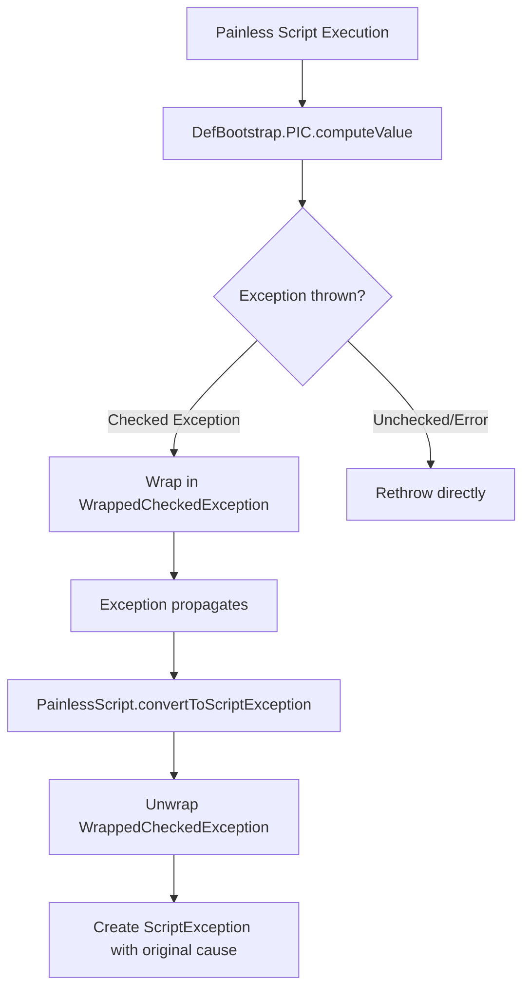

---
tags:
  - domain/core
  - component/server
  - search
---
# JDK 25 Support

## Summary

OpenSearch v3.4.0 adds compatibility with JDK 25 by addressing a behavioral change in `ClassValue::remove` that was introduced in JDK 25. This fix ensures that the Painless scripting engine continues to work correctly when running on JDK 25.

## Details

### What's New in v3.4.0

JDK 25 introduced a behavioral change in `ClassValue.getFromHashMap` ([JDK-8351996](https://bugs.openjdk.org/browse/JDK-8351996)) that wraps checked exceptions with `java.lang.Error`. This change broke backward compatibility for code that relies on exception handling within `ClassValue.computeValue`.

### Technical Changes

#### Problem

In JDK 25, when `ClassValue.computeValue` throws a checked exception, `ClassValue.getFromHashMap` wraps it with `java.lang.Error` instead of propagating the original exception. This caused issues in the Painless scripting engine's dynamic method invocation mechanism.

#### Solution

The fix introduces a `WrappedCheckedException` wrapper class in `DefBootstrap` to handle checked exceptions properly:



#### New Components

| Component | Description |
|-----------|-------------|
| `DefBootstrap.WrappedCheckedException` | RuntimeException wrapper for checked exceptions thrown during dynamic method lookup |

#### Code Changes

The `DefBootstrap.PIC` class now wraps checked exceptions:

```java
protected MethodHandle computeValue(Class<?> receiverType) {
    try {
        return lookup(flavor, name, receiverType).asType(type);
    } catch (Throwable t) {
        switch (t) {
            case Exception e -> throw new WrappedCheckedException(e);
            default -> Def.rethrow(t);
        }
        throw new AssertionError();
    }
}
```

The `PainlessScript.convertToScriptException` method unwraps the exception:

```java
final Throwable unwrapped = switch (originalThrowable) {
    case DefBootstrap.WrappedCheckedException w -> w.getCause();
    default -> originalThrowable;
};
```

### Usage Example

No user-facing changes are required. Painless scripts continue to work as expected:

```json
POST /my-index/_search
{
  "script_fields": {
    "my_field": {
      "script": {
        "lang": "painless",
        "source": "doc['field'].value * 2"
      }
    }
  }
}
```

### Migration Notes

- No migration required for existing Painless scripts
- OpenSearch can now run on JDK 25 without Painless scripting issues
- This is a prerequisite for the bundled JDK upgrade to JDK 25 ([#19698](https://github.com/opensearch-project/OpenSearch/pull/19698))

## Limitations

- This fix specifically addresses the `ClassValue` behavioral change in JDK 25
- Other JDK 25 compatibility issues may require separate fixes

## References

### Documentation
- [JDK-8351996](https://bugs.openjdk.org/browse/JDK-8351996): Behavioral updates for ClassValue::remove

### Pull Requests
| PR | Description |
|----|-------------|
| [#19706](https://github.com/opensearch-project/OpenSearch/pull/19706) | Wrap checked exceptions in painless.DefBootstrap to support JDK-25 |
| [#19698](https://github.com/opensearch-project/OpenSearch/pull/19698) | Update bundled JDK to JDK-25 (depends on this fix) |

### Issues (Design / RFC)
- [Issue #19314](https://github.com/opensearch-project/OpenSearch/issues/19314): JDK 25 support tracking issue

## Related Feature Report

- [Full feature documentation](../../../../features/opensearch/opensearch-jdk-25-support.md)
