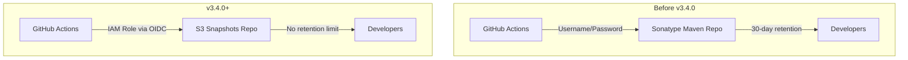

# Maven Snapshots Publishing

## Summary

OpenSearch v3.4.0 migrates Maven snapshot publishing from Sonatype to a self-hosted S3 repository at `ci.opensearch.org`. This change was driven by Sonatype's new policy of removing snapshots older than 30 days, which impacted the project's ability to maintain stable development dependencies.

## Details

### What's New in v3.4.0

The snapshot publishing infrastructure has been migrated from Sonatype's Maven repository to an AWS S3-backed repository hosted at `https://ci.opensearch.org/ci/dbc/snapshots/maven/`.

### Technical Changes

#### Architecture Changes



#### New Configuration

| Setting | Description | Value |
|---------|-------------|-------|
| `MAVEN_SNAPSHOTS_S3_REPO` | S3 repository URL | `https://ci.opensearch.org/ci/dbc/snapshots/maven/` |
| `MAVEN_SNAPSHOTS_S3_ROLE` | IAM role for publishing | Stored in 1Password |

#### Workflow Changes

The GitHub Actions workflow now uses AWS IAM role assumption via OIDC instead of username/password authentication:

```yaml
- name: Configure AWS credentials
  uses: aws-actions/configure-aws-credentials@v5
  with:
    role-to-assume: ${{ env.MAVEN_SNAPSHOTS_S3_ROLE }}
    aws-region: us-east-1
```

The Gradle build configuration uses AWS credentials for S3 publishing:

```groovy
maven {
  name = 'Snapshots'
  url = System.getenv("MAVEN_SNAPSHOTS_S3_REPO")
  credentials(AwsCredentials) {
    accessKey = System.getenv("AWS_ACCESS_KEY_ID")
    secretKey = System.getenv("AWS_SECRET_ACCESS_KEY")
    sessionToken = System.getenv("AWS_SESSION_TOKEN")
  }
}
```

### Usage Example

Consuming snapshots from the new repository:

```groovy
// build.gradle
repositories {
    maven {
        name = 'OpenSearch Snapshots'
        url = 'https://ci.opensearch.org/ci/dbc/snapshots/maven/'
    }
}

dependencies {
    implementation "org.opensearch:opensearch:3.4.0-SNAPSHOT"
}
```

### Migration Notes

For developers consuming OpenSearch snapshots:

1. Update repository URL from `https://central.sonatype.com/repository/maven-snapshots/` to `https://ci.opensearch.org/ci/dbc/snapshots/maven/`
2. No authentication required for consuming snapshots (read-only public access)
3. Existing snapshot versions have been migrated to the new location

## Limitations

- Publishing requires AWS IAM role assumption (internal CI only)
- The S3 repository does not support browsing via web interface like Sonatype

## Related PRs

| PR | Description |
|----|-------------|
| [#19619](https://github.com/opensearch-project/OpenSearch/pull/19619) | Onboarding new maven snapshots publishing to S3 (OpenSearch Core) |

## References

- [Issue #5360](https://github.com/opensearch-project/opensearch-build/issues/5360): Migration from Sonatype snapshots repo to ci.opensearch.org
- [Blog: OpenSearch plugin zips now in Maven repo](https://opensearch.org/blog/opensearch-plugin-zips-now-in-maven-repo/): Background on Maven publishing

## Related Feature Report

- [Full feature documentation](../../../../features/opensearch/maven-snapshots-publishing.md)
