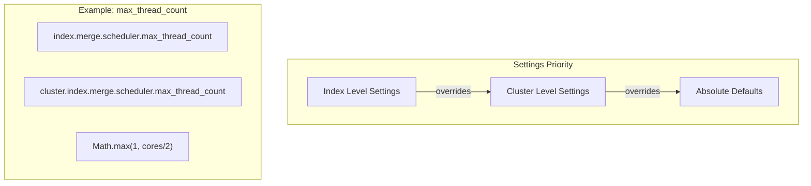

---
tags:
  - domain/core
  - component/server
  - indexing
---
# Merged Segment Warmer

## Summary

The Merged Segment Warmer feature graduates from experimental to GA in v3.4.0. The experimental feature flag has been removed, and the feature is now controlled entirely by dynamic cluster settings. This release also adds configurable resiliency features including segment size thresholds and cluster-level merge scheduler defaults.

## Details

### What's New in v3.4.0

1. **GA Graduation**: Removed `FeatureFlag.MERGED_SEGMENT_WARMER_EXPERIMENTAL_FLAG` - feature is now production-ready
2. **Dynamic Control**: Feature controlled by `indices.replication.merges.warmer.enabled` cluster setting (default: `false`)
3. **Segment Size Threshold**: Only warm segments larger than configurable threshold (default: 500MB)
4. **Cluster-level Merge Scheduler Settings**: New cluster defaults for merge thread count and merge count
5. **Min Version Check**: Warming only occurs when all nodes are v3.4.0+

### Technical Changes

#### Settings Hierarchy



#### New Configuration

| Setting | Description | Default |
|---------|-------------|---------|
| `indices.replication.merges.warmer.enabled` | Enable/disable merged segment warmer | `false` |
| `indices.replication.merges.warmer.min_segment_size_threshold` | Minimum segment size to trigger warming | `500mb` |
| `indices.replication.merges.warmer.max_bytes_per_sec` | Rate limit for segment transfer | - |
| `indices.replication.merges.warmer.timeout` | Timeout for warming operations | - |
| `cluster.index.merge.scheduler.max_thread_count` | Cluster default for merge threads | `Math.max(1, cores/2)` |
| `cluster.index.merge.scheduler.max_merge_count` | Cluster default for concurrent merges | `max_thread_count + 5` |
| `cluster.index.merge.scheduler.auto_throttle` | Cluster default for auto-throttle | `true` |

#### New Components

| Component | Description |
|-----------|-------------|
| `ClusterMergeSchedulerConfig` | Manages cluster-level merge scheduler settings with three-level hierarchy |
| `MergedSegmentTransferTracker` | Tracks transfer metrics for warming operations |
| `MergedSegmentWarmerStats` | Exposes warmer statistics via stats APIs |

#### Behavioral Changes

- `AsyncPublishReferencedSegmentsTask` only runs when warmer is enabled
- `shouldWarm()` checks minimum node version (V_3_4_0) before warming
- Setting names standardized with `indices.replication.merges.warmer.*` prefix

### Usage Example

Enable the feature at cluster level:

```json
PUT /_cluster/settings
{
  "persistent": {
    "indices.replication.merges.warmer.enabled": true,
    "indices.replication.merges.warmer.min_segment_size_threshold": "256mb"
  }
}
```

Configure cluster-level merge scheduler defaults:

```json
PUT /_cluster/settings
{
  "persistent": {
    "cluster.index.merge.scheduler.max_thread_count": 4,
    "cluster.index.merge.scheduler.max_merge_count": 9
  }
}
```

### Migration Notes

If upgrading from v3.3.0 or earlier with the experimental feature flag:

1. Remove `opensearch.experimental.feature.merged_segment_warmer.enabled` from `opensearch.yml`
2. Enable via cluster setting: `indices.replication.merges.warmer.enabled: true`
3. Feature will only activate after all nodes are upgraded to v3.4.0+

## Limitations

- Warming only occurs when all cluster nodes are v3.4.0+
- Feature disabled by default - must be explicitly enabled
- Only segments larger than threshold are warmed (default 500MB)

## References

### Documentation
- [Segment Replication Documentation](https://docs.opensearch.org/3.0/tuning-your-cluster/availability-and-recovery/segment-replication/index/)

### Pull Requests
| PR | Description |
|----|-------------|
| [#18929](https://github.com/opensearch-project/OpenSearch/pull/18929) | Add metrics for merged segment warmer flow |
| [#19629](https://github.com/opensearch-project/OpenSearch/pull/19629) | Add configurable resiliency features |
| [#19715](https://github.com/opensearch-project/OpenSearch/pull/19715) | Remove experimental feature flag |

### Issues (Design / RFC)
- [Issue #17528](https://github.com/opensearch-project/OpenSearch/issues/17528): RFC - Introduce Pre-copy Merged Segment

## Related Feature Report

- Full feature documentation
