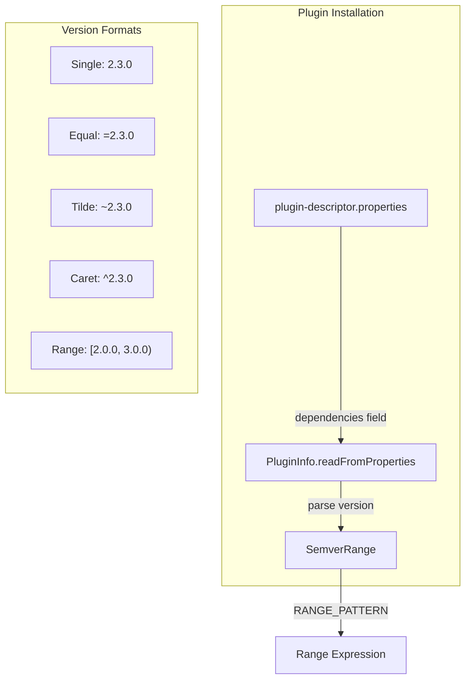

# Plugin Dependencies

## Summary

This release extends range semver support to the `dependencies` field in `plugin-descriptor.properties`. Previously, range version notation (e.g., `[2.0.0, 3.0.0)`) only worked for the `opensearch.version` field. Now plugins can specify compatible OpenSearch version ranges in their dependencies, enabling more flexible plugin compatibility declarations.

## Details

### What's New in v3.4.0

PR #19939 adds support for range semver notation in the `dependencies` field of plugin descriptor properties. This builds on the range semver support added in PR #18557 for `opensearch.version`.

### Technical Changes

#### Architecture Changes



#### Code Changes

The `SemverRange.RANGE_PATTERN` was made public to allow `PluginInfo` to detect range expressions:

```java
public static final Pattern RANGE_PATTERN = Pattern.compile("([\\[\\(])([\\d.]+)\\s*,\\s*([\\d.]+)([\\]\\)])");
```

The `PluginInfo.readFromProperties()` method now checks if the dependency version matches the range pattern before parsing:

```java
String opensearchDependencyVersion = dependenciesMap.get("opensearch");
String[] ranges = opensearchDependencyVersion.split(",");
String opensearchVersion = ranges[0];
if (RANGE_PATTERN.matcher(opensearchDependencyVersion).matches()) {
    opensearchVersion = opensearchDependencyVersion;
} else if (ranges.length != 1) {
    throw new IllegalArgumentException(
        "Exactly one range is allowed to be specified in dependencies for the plugin [" + name + "]"
    );
}
opensearchVersionRanges.add(SemverRange.fromString(opensearchVersion.trim()));
```

### Usage Example

Plugins can now specify version ranges in `plugin-descriptor.properties`:

```properties
name=my-plugin
description=My custom plugin
version=1.0.0
dependencies={ opensearch: "[2.0.0, 3.0.0)" }
java.version=21
classname=org.example.MyPlugin
```

This declares the plugin compatible with OpenSearch versions from 2.0.0 (inclusive) to 3.0.0 (exclusive).

#### Supported Range Notations

| Notation | Example | Description |
|----------|---------|-------------|
| Exact | `2.3.0` or `=2.3.0` | Compatible only with version 2.3.0 |
| Tilde | `~2.3.0` | Compatible with 2.3.x (patch variability) |
| Caret | `^2.3.0` | Compatible with 2.x.x (minor variability) |
| Range | `[2.0.0, 3.0.0)` | Explicit range with inclusive/exclusive bounds |

#### Range Bracket Notation

| Bracket | Meaning |
|---------|---------|
| `[` | Include lower bound |
| `(` | Exclude lower bound |
| `]` | Include upper bound |
| `)` | Exclude upper bound |

### Migration Notes

If you have plugins using the `dependencies` field with a single version, no changes are required. To adopt range notation:

1. Update `plugin-descriptor.properties` to use range syntax
2. Test plugin installation on target OpenSearch versions
3. Rebuild and redistribute the plugin

## Limitations

- Only one range can be specified in the `dependencies` field
- Only `opensearch` is allowed as a dependency key
- Cannot use both `opensearch.version` and `dependencies` properties simultaneously

## References

### Documentation
- [Documentation: Installing plugins](https://docs.opensearch.org/3.0/install-and-configure/plugins/): Plugin compatibility section

### Pull Requests
| PR | Description |
|----|-------------|
| [#19939](https://github.com/opensearch-project/OpenSearch/pull/19939) | Add RangeSemver for `dependencies` in `plugin-descriptor.properties` |
| [#18557](https://github.com/opensearch-project/OpenSearch/pull/18557) | Added support for range version support in semver (prerequisite) |

### Issues (Design / RFC)
- [Issue #1707](https://github.com/opensearch-project/OpenSearch/issues/1707): Cannot install old patch version of plugins on newer OpenSearch builds
- [Issue #18554](https://github.com/opensearch-project/OpenSearch/issues/18554): Add range support in SemVer

## Related Feature Report

- [Full feature documentation](../../../../features/opensearch/plugin-dependencies.md)
