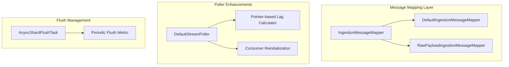

# Pull-based Ingestion Enhancements

## Summary

This release adds four significant enhancements to pull-based ingestion: offset-based consumer lag metrics for Kafka, time-based periodic flush support, message mapper framework with raw payload support, and dynamic consumer configuration updates. These improvements enhance monitoring capabilities, data durability, input format flexibility, and operational agility.

## Details

### What's New in v3.4.0

#### 1. Offset-based Consumer Lag Metric (PR #19635)

Adds a pointer-based lag metric that measures the difference between the latest available offset and the current consumer position. This provides more accurate lag monitoring than time-based metrics, especially for Kafka sources.

**New Configuration:**

| Setting | Description | Default |
|---------|-------------|---------|
| `ingestion_source.pointer_based_lag_update_interval` | Interval for updating pointer-based lag metric | `10s` |

**New Metric:**

| Metric | Description |
|--------|-------------|
| `pointer_based_lag` | Offset difference between latest available and current position (Kafka only) |

#### 2. Time-based Periodic Flush (PR #19878)

Introduces an async periodic flush task for pull-based ingestion indexes. This ensures stream offsets are regularly committed to Lucene, improving data durability and recovery time after failures.

**New Configuration:**

| Setting | Description | Default |
|---------|-------------|---------|
| `index.periodic_flush_interval` | Interval for periodic flush | `10m` for pull-based indexes, `-1` (disabled) for regular indexes |

**Key Implementation Details:**

- `AsyncShardFlushTask` runs on the FLUSH thread pool
- Flush only triggers when `batchStartPointer` has changed since last commit
- Prevents concurrent flushes using `flushOrRollRunning` flag
- Tracks periodic flush count via `periodicFlushMetric`

#### 3. Message Mapper Framework (PR #19765)

Adds a pluggable message mapper framework that transforms incoming messages to the internal format. Includes a `raw_payload` mapper for ingesting raw JSON payloads without the standard `_id`/`_source` wrapper.

**New Configuration:**

| Setting | Description | Default |
|---------|-------------|---------|
| `ingestion_source.mapper_type` | Message mapper type (`default` or `raw_payload`) | `default` |

**Mapper Types:**

| Type | Description | Document ID |
|------|-------------|-------------|
| `default` | Expects `_id`, `_op_type`, `_source` fields | From `_id` field or auto-generated |
| `raw_payload` | Uses entire payload as document source | `{shardId}-{pointer}` (e.g., `0-100`) |

**Raw Payload Example:**

Input message:
```json
{"name": "alice", "age": 30}
```

Indexed document:
```json
{
  "_id": "0-100",
  "_source": {"name": "alice", "age": 30}
}
```

#### 4. Dynamic Consumer Configuration (PR #19963)

Enables updating Kafka consumer parameters without recreating the index. When `ingestion_source.param.*` settings are updated, the consumer is reinitialized with new configuration.

**Dynamic Settings:**

All `ingestion_source.param.*` settings are now dynamic, including:
- `auto.offset.reset`
- `max.poll.records`
- Other Kafka consumer properties

**Behavior:**

1. Settings update triggers consumer reinitialization
2. Consumer restarts from the latest committed `batchStartPointer`
3. Blocking queues are cleared before reinitialization
4. No index recreation required

### Technical Changes

#### Architecture Changes



#### New Components

| Component | Description |
|-----------|-------------|
| `IngestionMessageMapper` | Interface for message transformation with factory method |
| `DefaultIngestionMessageMapper` | Standard mapper expecting `_id`/`_source` format |
| `RawPayloadIngestionMessageMapper` | Raw payload mapper using pointer as document ID |
| `AsyncShardFlushTask` | Periodic flush task running on FLUSH thread pool |

#### New Configuration

| Setting | Description | Default |
|---------|-------------|---------|
| `ingestion_source.mapper_type` | Message mapper type | `default` |
| `ingestion_source.pointer_based_lag_update_interval` | Lag metric update interval | `10s` |
| `index.periodic_flush_interval` | Periodic flush interval | `10m` (pull-based) / `-1` (regular) |

### Usage Example

**Index with Raw Payload Mapper and Periodic Flush:**
```json
PUT /my-index
{
  "settings": {
    "ingestion_source": {
      "type": "kafka",
      "pointer.init.reset": "earliest",
      "mapper_type": "raw_payload",
      "pointer_based_lag_update_interval": "5s",
      "param": {
        "topic": "my-topic",
        "bootstrap_servers": "localhost:9092",
        "auto.offset.reset": "earliest"
      }
    },
    "index.periodic_flush_interval": "5m",
    "index.number_of_shards": 3,
    "index.replication.type": "SEGMENT"
  }
}
```

**Dynamic Configuration Update:**
```json
PUT /my-index/_settings
{
  "ingestion_source.param.auto.offset.reset": "latest",
  "ingestion_source.param.max.poll.records": "200"
}
```

### Migration Notes

- **Raw Payload Mapper**: Does not support document versioning. Use for append-only workloads where eventual consistency is acceptable.
- **Dynamic Config Updates**: Consumer reinitialization may cause brief message reprocessing from the last committed offset.
- **Periodic Flush**: Enabled by default for new pull-based indexes. Set to `-1` to disable.

## Limitations

- Pointer-based lag metric only available for Kafka (not Kinesis)
- Raw payload mapper does not support external versioning
- Dynamic configuration updates require consumer reinitialization, causing brief reprocessing

## Related PRs

| PR | Description |
|----|-------------|
| [#19635](https://github.com/opensearch-project/OpenSearch/pull/19635) | Add Kafka offset based consumer lag |
| [#19878](https://github.com/opensearch-project/OpenSearch/pull/19878) | Add time based periodic flush support |
| [#19765](https://github.com/opensearch-project/OpenSearch/pull/19765) | Support message mappers and raw payloads |
| [#19963](https://github.com/opensearch-project/OpenSearch/pull/19963) | Update ingestion stream params to be dynamic |

## References

- [Documentation](https://docs.opensearch.org/3.0/api-reference/document-apis/pull-based-ingestion/): Pull-based ingestion
- [Documentation](https://docs.opensearch.org/3.0/api-reference/document-apis/pull-based-ingestion-management/): Pull-based ingestion management

## Related Feature Report

- [Full feature documentation](../../../features/opensearch/pull-based-ingestion.md)
