---
tags:
  - search
---

# Query Bugfixes

## Summary

OpenSearch v3.4.0 includes six critical bug fixes for query and aggregation processing. These fixes address crashes and exceptions that occurred with wildcard queries, aggregations, highlighters, and script score queries, improving overall search stability and reliability.

## Details

### What's New in v3.4.0

This release fixes several query-related crashes:

1. **Case-insensitive wildcard + aggregation crash** - Fixed `ArrayIndexOutOfBoundsException` when combining case-insensitive wildcard queries with aggregations
2. **Terms aggregation include/exclude crash** - Fixed `IndexOutOfBoundsException` when using include/exclude with non-existent prefix patterns
3. **Unified highlighter for nested fields** - Fixed missing highlights when using `match_phrase_prefix` with nested fields and unified highlighter
4. **ScriptScoreQuery NPE** - Fixed `NullPointerException` when script score query filter returns no matching documents
5. **Aggregation array out of bounds** - Fixed static comparator issue causing array out of bounds when running multiple aggregations
6. **Wildcard query with escaped backslash** - Fixed wildcard query parsing when escaped backslash is followed by wildcard character

### Technical Changes

#### Architecture Changes

```mermaid
graph TB
    subgraph "Query Processing"
        WQ[Wildcard Query] --> AQ[AutomatonQueries]
        AQ --> |determinize| DFA[Deterministic Automaton]
        DFA --> LE[Lucene Execution]
    end
    
    subgraph "Aggregation Processing"
        TA[Terms Aggregation] --> IE[IncludeExclude]
        IE --> |bounds check| PF[Prefix Filter]
        RA[Range Aggregation] --> RG[Ranges]
        RG --> |instance comparator| RC[Range Collector]
    end
    
    subgraph "Highlighting"
        UH[Unified Highlighter] --> CUH[CustomUnifiedHighlighter]
        CUH --> |rewriteCustomQuery| NQ[Nested Query Support]
        NQ --> BJQ[BlockJoinQuery]
    end
    
    subgraph "Script Score"
        SSQ[ScriptScoreQuery] --> SS[ScorerSupplier]
        SS --> |null check| SC[Scorer]
    end
```



#### Bug Fix Details

| Bug | Root Cause | Fix |
|-----|------------|-----|
| Wildcard + aggregation crash | Non-deterministic automaton from case-insensitive wildcard | Explicitly determinize automaton before query execution |
| Terms aggregation crash | Missing bounds check before ordinal lookup | Add bounds check before `lookupOrd()` call |
| Nested field highlighting | `OpenSearchToParentBlockJoinQuery` not handled in rewriter | Add handling for nested queries in `rewriteCustomQuery()` |
| ScriptScoreQuery NPE | Null scorer from `ScorerSupplier.get()` | Check for null `ScorerSupplier` before creating scorer |
| Aggregation array OOB | Static comparator shared across aggregations | Convert comparator to instance variable |
| Escaped backslash wildcard | Incorrect parsing of `\\*` pattern | Fix wildcard query parsing logic |

#### Modified Components

| Component | File | Change |
|-----------|------|--------|
| AutomatonQueries | `AutomatonQueries.java` | Add `Operations.determinize()` call for case-insensitive wildcards |
| IncludeExclude | `IncludeExclude.java` | Add bounds check before `lookupOrd()` in prefix filter |
| CustomUnifiedHighlighter | `CustomUnifiedHighlighter.java` | Handle `OpenSearchToParentBlockJoinQuery` in `rewriteCustomQuery()` |
| ScriptScoreQuery | `ScriptScoreQuery.java` | Return null from `scorerSupplier()` when subquery returns null |
| Ranges | `Ranges.java` | Change `comparator` from static to instance variable |

### Usage Example

```json
// Case-insensitive wildcard with aggregation (now works)
POST hits/_search
{
  "query": {
    "wildcard": {
      "URL": {
        "wildcard": "*google*",
        "case_insensitive": true
      }
    }
  },
  "aggregations": {
    "count": {
      "value_count": { "field": "_index" }
    }
  }
}

// Terms aggregation with non-existent prefix (now works)
POST test/_search
{
  "aggs": {
    "filtered_terms": {
      "terms": {
        "field": "category",
        "include": "zzz.*"
      }
    }
  }
}

// Nested field highlighting with match_phrase_prefix (now works)
POST test/_search
{
  "query": {
    "nested": {
      "path": "nested_field",
      "query": {
        "match_phrase_prefix": {
          "nested_field.description": "searchable"
        }
      }
    }
  },
  "highlight": {
    "type": "unified",
    "fields": {
      "nested_field.description": {}
    }
  }
}

// Script score with no matching filter (now returns empty results)
POST test/_search
{
  "query": {
    "script_score": {
      "query": {
        "bool": {
          "filter": [
            { "term": { "field": "non_existent_value" } }
          ]
        }
      },
      "script": { "source": "0" }
    }
  }
}
```

### Migration Notes

No migration required. These are bug fixes that improve stability without changing APIs.

## Limitations

- Complex wildcard patterns may still hit `TooComplexToDeterminizeException` if the automaton exceeds the determinization work limit
- The unified highlighter fix only applies to `match_phrase_prefix` queries on nested fields; other query types were already working

## References

### Pull Requests
| PR | Description |
|----|-------------|
| [#19489](https://github.com/opensearch-project/OpenSearch/pull/19489) | Fix case-insensitive wildcard + aggregation query crash |
| [#19637](https://github.com/opensearch-project/OpenSearch/pull/19637) | Fix IndexOutOfBoundsException when running include/exclude on non-existent prefix in terms aggregations |
| [#19442](https://github.com/opensearch-project/OpenSearch/pull/19442) | Fix Unified highlighter for nested fields when using matchPhrasePrefixQuery |
| [#19650](https://github.com/opensearch-project/OpenSearch/pull/19650) | Fix NPE of ScriptScoreQuery |
| [#20204](https://github.com/opensearch-project/OpenSearch/pull/20204) | Fix array out of bounds during aggregation |
| [#19719](https://github.com/opensearch-project/OpenSearch/pull/19719) | Fix wildcard query with escaped backslash followed by wildcard character |

### Issues (Design / RFC)
- [Issue #19319](https://github.com/opensearch-project/OpenSearch/issues/19319): Error when use both wildcard + aggregation
- [Issue #19636](https://github.com/opensearch-project/OpenSearch/issues/19636): Include/Exclude on terms aggregation can cause IndexOutOfBoundsException
- [Issue #19106](https://github.com/opensearch-project/OpenSearch/issues/19106): Unified highlighter does not highlight nested fields when match_phrase_prefix is used
- [Issue #18446](https://github.com/opensearch-project/OpenSearch/issues/18446): Null pointer exception on a term filter nested inside a script score
- [Issue #19365](https://github.com/opensearch-project/OpenSearch/issues/19365): array_index_out_of_bounds_exception on aggregations with unsigned_long

## Related Feature Report

- [Full feature documentation](../../../features/opensearch/query-bug-fixes.md)
