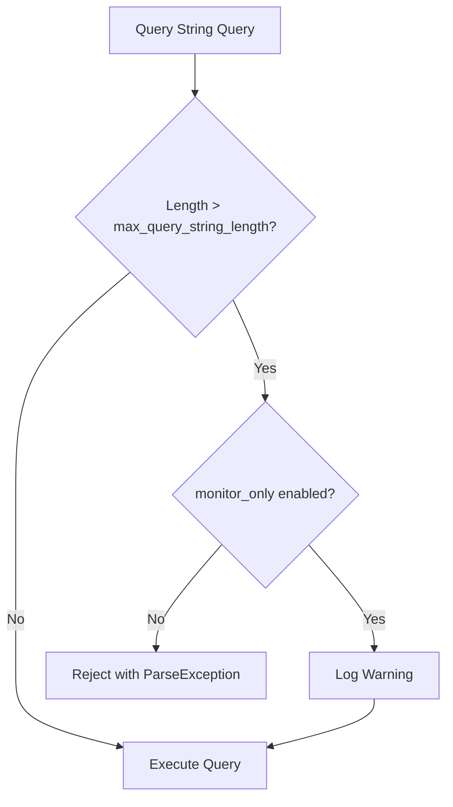

---
tags:
  - domain/core
  - component/server
  - search
---
# Query String Monitoring

## Summary

This release introduces a new cluster setting `search.query.max_query_string_length_monitor_only` that enables monitoring mode for query string length validation. When enabled, queries exceeding the maximum length limit are executed with a warning logged instead of being rejected, allowing administrators to assess the impact of enforcing query string length limits before enabling strict enforcement.

## Details

### What's New in v3.4.0

A new boolean cluster setting `search.query.max_query_string_length_monitor_only` has been added to complement the existing `search.query.max_query_string_length` setting. This provides a non-disruptive way to monitor query string lengths in production environments.

### Technical Changes

#### New Configuration

| Setting | Description | Default |
|---------|-------------|---------|
| `search.query.max_query_string_length_monitor_only` | When `true`, queries exceeding `max_query_string_length` are executed with a warning instead of being rejected | `false` |

#### Behavior



When monitoring mode is enabled:
- Queries exceeding the configured maximum length are still executed
- A warning is logged with the message: `Query string length exceeds max allowed length {limit} ({setting_key}); actual length: {actual_length}`
- No error is returned to the client

When monitoring mode is disabled (default):
- Queries exceeding the maximum length are rejected with a `ParseException`

### Usage Example

Enable monitoring mode to assess impact before enforcing limits:

```json
PUT _cluster/settings
{
  "persistent": {
    "search.query.max_query_string_length": 10000,
    "search.query.max_query_string_length_monitor_only": true
  }
}
```

After reviewing logs and confirming acceptable query patterns, disable monitoring mode to enforce limits:

```json
PUT _cluster/settings
{
  "persistent": {
    "search.query.max_query_string_length_monitor_only": false
  }
}
```

### Migration Notes

This feature is additive and requires no migration. Existing clusters using `search.query.max_query_string_length` will continue to enforce limits as before. Enable `search.query.max_query_string_length_monitor_only` only when you want to switch to monitoring mode.

## Limitations

- Monitoring mode only applies to `query_string` and `simple_query_string` queries
- Warning logs may impact log volume in high-traffic environments with many oversized queries
- The setting is cluster-wide; per-index configuration is not supported

## References

### Documentation
- [Query String Query Documentation](https://docs.opensearch.org/3.0/query-dsl/full-text/query-string/): Official query string documentation
- [PR #19539](https://github.com/opensearch-project/OpenSearch/pull/19539): Main implementation
- [PR #19491 Discussion](https://github.com/opensearch-project/OpenSearch/pull/19491#issuecomment-3362082746): Feature request discussion

### Pull Requests
| PR | Description |
|----|-------------|
| [#19539](https://github.com/opensearch-project/OpenSearch/pull/19539) | Introduced monitoring mode for query string query max length |
| [#19491](https://github.com/opensearch-project/OpenSearch/pull/19491) | Original implementation of `search.query.max_query_string_length` setting |

## Related Feature Report

- Full feature documentation
