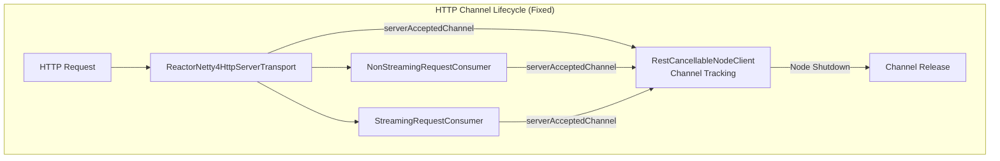

# Reactor Netty Transport

## Summary

This release fixes a resource leak issue in the Reactor Netty 4 Transport plugin where HTTP channels were not being properly tracked and released during node shutdown. The fix ensures that accepted HTTP channels are registered with `RestCancellableNodeClient` and properly cleaned up, resolving flaky test failures in `DetailedErrorsDisabledIT`.

## Details

### What's New in v3.4.0

The Reactor Netty 4 Transport now properly tracks and releases accepted HTTP channels during node shutdown. Previously, after executing Multi Search API requests, the `HttpChannel` could remain registered with `RestCancellableNodeClient` because the underlying channel was not always closed properly.

### Technical Changes

#### Architecture Changes



#### New Components

| Component | Description |
|-----------|-------------|
| `serverAcceptedChannel()` override | Public method in `ReactorNetty4HttpServerTransport` to track accepted channels |
| Channel close listener | Proper close context handling in `close()` methods |

#### Code Changes

The fix involves several key modifications:

1. **ReactorNetty4HttpServerTransport**: Added `serverAcceptedChannel()` override to enable channel tracking by request consumers
2. **ReactorNetty4NonStreamingRequestConsumer**: Now calls `transport.serverAcceptedChannel(channel)` when processing requests
3. **ReactorNetty4StreamingRequestConsumer**: Now calls `transport.serverAcceptedChannel(httpChannel)` in constructor
4. **ReactorNetty4NonStreamingHttpChannel**: Enhanced `close()` method to properly handle close context
5. **ReactorNetty4StreamingHttpChannel**: Enhanced `close()` method to properly handle close context

### Usage Example

No configuration changes required. The fix is automatically applied when using the Reactor Netty 4 Transport plugin.

```yaml
# opensearch.yml - Enable reactor-netty4 transport
http.type: reactor-netty4
```

### Migration Notes

No migration required. This is a bug fix that improves resource management without changing the API or configuration.

## Limitations

- The Reactor Netty 4 Transport remains an experimental feature
- Requires explicit plugin installation: `./bin/opensearch-plugin install transport-reactor-netty4`

## Related PRs

| PR | Description |
|----|-------------|
| [#20106](https://github.com/opensearch-project/OpenSearch/pull/20106) | Keep track and release Reactor Netty 4 Transport accepted Http Channels during the Node shutdown |

## References

- [Issue #20034](https://github.com/opensearch-project/OpenSearch/issues/20034): Flaky Test Report for DetailedErrorsDisabledIT
- [Network Settings Documentation](https://docs.opensearch.org/3.0/install-and-configure/configuring-opensearch/network-settings/): Official configuration guide
- [Streaming Bulk API](https://docs.opensearch.org/3.0/api-reference/document-apis/bulk-streaming/): Streaming bulk documentation

## Related Feature Report

- [Full feature documentation](../../../../features/opensearch/reactor-netty-transport.md)
